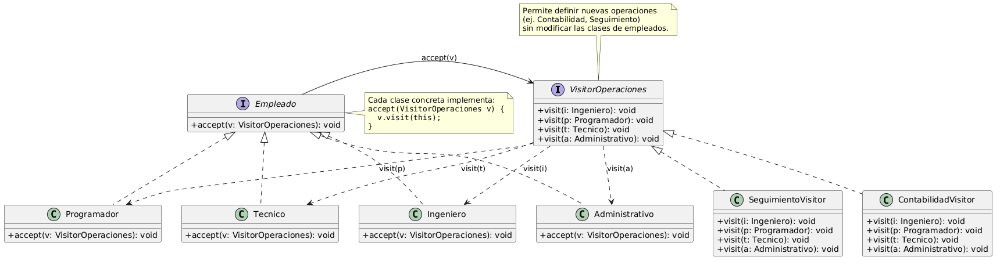

# Diseño de Sistemas Software

## Ingeniería en Informática Universidad de Cádiz

### Ejercicio: Contabilidad de Empleados

Todos los empleados de una empresa informática se pueden tipificar según las clases que muestra la figura 1.


Figura 1: Diagrama de clases de los empleados de la empresa

Cada uno de los tipos de empleados incluye información que mantiene actualizada acerca de toda su actividad en la empresa, aunque esta información varía entre los distintos tipos de empleados ya que cada uno tiene distintas atribuciones. En lo que se refiere a datos contables, por ejemplo:

- los ingenieros guardan información sobre los presupuestos y gastos de los proyectos que llevan
- los programadores mantienen información sobre sus horas de trabajo en la empresa y sobre los servicios a clientes por separado ya que éstos últimos incluyen desplazamientos y dietas
- los técnicos que integran el servicio de informática de la propia empresa, cuya labor es la de dar servicio al resto del personal, facturan su trabajo por horas incluyendo las piezas que utilizan para las reparaciones y que obtienen del almacén
- los administrativos se encargan de abastecer de piezas el almacén y de material informático y ofimático las oficinas.

La empresa desea poder llevar a cabo un control sobre su líquido disponible en cualquier momento, para lo que necesita poder solicitar los datos relativos a contabilidad (datos contables) a cada uno de ellos, pero teniendo en cuenta que dicha información estará disponible de una forma distinta en cada caso.

Una vez implementada esta funcionalidad, la empresa desea añadir otras como, por ejemplo, disponer de un mecanismo que le permita llevar a cabo un seguimiento de las actividades de todos sus empleados, aunque, por ejemplo, el seguimiento que se hace de un ingeniero tiene más que ver con sus resultados y la de un administrativo con su horario, por lo que esta operación se llevará a cabo también de forma distinta para cada tipo de empleado.

Se pide:

- (a) (1 punto) Proponer un diseño que le permita a la empresa solicitar las operaciones mencionadas a sus empleados y que permita la inclusión de nuevas operaciones sin necesidad de hacer nuevos cambios en los empleados. Se supone que los tipos de empleados de la empresa son categorias bastante estables. En cambio, el tipo de operaciones que hay que solicitar sobre los mismos puede variar en el tiempo: por ejemplo, calcular datos contables, llevar un registro de dedicación a actividades, etc.
- (b) (1 punto) Supóngase que la estructura en la que la empresa tiene almacenados a sus empleados es de tipo Composite, como muestra la figura 2. Para solicitar cualquier operación a sus empleados, la empresa necesita poder recorrerlos. Se pide describir cada una de las soluciones posibles que permiten a la empresa llevar a cabo ese recorrido combinado el patrón Composite con el que vd. ha propuesto en el apartado anterior. Indicar claramente cual es el cometido del objeto Empresa en cada una de las soluciones propuestas.


Figura 2: Composite de los empleados de la empresa

(c) (1 punto) Incluir el código de al menos dos de las soluciones planteadas en el apartado anterior.

## Solución propuesta: Contabilidad de Empleados

### (a) Patrón de diseño elegido

El patrón de diseño ideal para este problema es el patrón **Visitor** (Visitante)

El enunciado indica explícitamente que los tipos de empleados (la estructura de objetos) son "categorías bastante estables", pero que las operaciones que se realizan sobre ellos (contabilidad, seguimiento) "pueden variar en el tiempo" y deben poder añadirse "sin necesidad de hacer nuevos cambios en los empleados".

Esta es exactamente la definición y el propósito del patrón Visitor: permite definir nuevas operaciones sin modificar las clases de los elementos sobre las que opera, siendo un requisito clave que las clases visitadas sean estables

#### Diseño propuesto

- **Interfaz `Empleado` (Elemento)**: Definirá un método `accept(Visitor v)`.
- **Clases Concretas de Empleados**: `Ingeniero`, `Programador`, `Tecnico`, `Administrativo`. Implementarán el método `accept` ejecutando `v.visit(this)` para habilitar el double dispatch (despacho doble)
- **Interfaz `Visitor`**: Declarará un método visit sobrecargado para cada tipo de empleado concreto (ej. `visit(Ingeniero i)`, `visit(Programador p)`).
- **Visitantes Concretos (Operaciones)**: Clases como `ContabilidadVisitor` o `SeguimientoVisitor` implementarán la interfaz `Visitor`. Si la empresa necesita una nueva operación, solo se crea un nuevo visitante sin tocar el código de los empleados

El diseño quedaría como muestra la figura 3.



Figura 3: Patrón Visitor aplicado a la empresa

### (b) Recorrido sobre la estructura Composite

Puesto que los empleados están almacenados en una estructura Composite (un árbol que permite tratar agrupaciones y objetos individuales de forma uniforme), necesitamos una forma de iterar sobre este árbol para que el Visitor procese cada empleado. Existen principalmente tres soluciones de diseño para realizar este recorrido:

#### Solución 1: Recorrido gestionado por el propio Composite (dentro de accept)

- El método `accept` de la clase compuesta (por ejemplo, `GrupoEmpleados` o `Departamento`) no solo recibe al visitante, sino que itera automáticamente sobre su lista de hijos y llama al método `accept` de cada uno de ellos.

- Cometido del objeto `Empresa`: Actúa simplemente como cliente inicial. Instancia la operación (ej. `new ContabilidadVisitor()`) y llama a `raiz.accept(visitante)`. La recursividad del Composite se encarga del resto.

#### Solución 2: Recorrido gestionado por el Visitor

- El método `accept` del objeto compuesto simplemente invoca `v.visit(this)`. Es en la implementación concreta del `Visitor` donde se recupera la lista de hijos del grupo y se itera explícitamente sobre ellos, llamando a `hijo.accept(this)`.

- Cometido del objeto `Empresa`: Igual que en la solución 1, delega la ejecución llamando a `raiz.accept(visitante)`.

#### Solución 3: Recorrido gestionado por el cliente (`Empresa`)

- Ni el Composite ni el Visitor asumen la responsabilidad de iterar. La clase `Empresa` proporciona un iterador que aplana o recorre el árbol Composite.

- Cometido del objeto `Empresa`: Es el controlador principal de la iteración. Su código incluye un bucle que recorre todos los empleados obtenidos del árbol y para cada uno llama a `empleado.accept(visitante)`.

### (c) Implementación en código de las soluciones

A continuación, se detalla el código en Java de las soluciones descritas en el apartado anterior, mostrando cómo interactúa el Composite con el Visitor

#### Código Base Común (Interfaces y Elementos Hoja)

```java
// Interfaz Visitor (Nuevas Operaciones)
public interface VisitorOperaciones {
    void visit(Ingeniero i);
    void visit(Programador p);
    void visit(GrupoEmpleados g); // Nodo del composite
}

// Interfaz Empleado (Elemento base del Composite)
public interface Empleado {
    void accept(VisitorOperaciones v);
}

// Empleado Concreto (Hoja)
public class Ingeniero implements Empleado {
    @Override
    public void accept(VisitorOperaciones v) {
        v.visit(this); // Double dispatch
    }
    public String getDatosProyectos() { return "Datos de presupuestos..."; }
}
// (Implementaciones similares para Programador, Tecnico, etc.)
```

#### Código Solución 1: Recorrido en el Composite

```java
// Nodo compuesto: delega iteración en su propio accept()
public class GrupoEmpleados implements Empleado {
    private List<Empleado> subordinados = new ArrayList<>();

    public void add(Empleado e) { subordinados.add(e); }

    @Override
    public void accept(VisitorOperaciones v) {
        // 1. Opcionalmente visitamos el nodo grupo en sí
        v.visit(this); 
        // 2. El Composite gestiona el recorrido delegando en los hijos
        for (Empleado e : subordinados) {
            e.accept(v); 
        }
    }
}

// El Visitor solo se preocupa de la lógica, no de iterar
public class ContabilidadVisitor implements VisitorOperaciones {
    @Override
    public void visit(Ingeniero i) {
        System.out.println("Calculando contabilidad Ingeniero: " + i.getDatosProyectos());
    }
    @Override
    public void visit(Programador p) {
        System.out.println("Calculando horas y dietas del Programador...");
    }
    @Override
    public void visit(GrupoEmpleados g) {
        // No hace falta iterar aquí, el GrupoEmpleados ya lo hace en su accept()
    }
}
```

**Ventajas de la solución 1:**

- **Fuerte Encapsulamiento**: En esta solución, la clase compuesta (`GrupoEmpleados`) no necesita hacer pública su lista interna de subordinados mediante métodos como `getSubordinados()`. Al ocultar los detalles de cómo se estructuran los datos, se respeta estrictamente el principio de encapsulamiento.

- **Alta Cohesión en el Visitor (Cumplimiento de SRP)**: Una de las ventajas del patrón Visitor es separar los datos y las operaciones de los elementos visitados. Al liberar al Visitor de la carga de tener que navegar por el árbol, las clases como `ContabilidadVisitor` quedan enfocadas en una única responsabilidad (el Principio SRP): ejecutar la lógica de negocio de la contabilidad.

- **Tratamiento Uniforme Implícito**: Mantiene la filosofía esencial del patrón Composite, permitiendo que el código cliente trate a todos los objetos (hojas o compuestos) de la misma forma. El cliente solo llama a `raiz.accept(visitante)` y la propia naturaleza de la estructura se encarga de propagar la llamada automáticamente.

**Desventajas de la solución 1:**

- **Inflexibilidad del recorrido (Riesgo frente al OCP)**: El mayor inconveniente es que el algoritmo de recorrido queda "cableado" (hardcoded) dentro del método `accept` del Composite. Si el día de mañana se necesita un nuevo visitante que requiera un tipo de recorrido distinto (por ejemplo, recorrer el árbol en un orden diferente, o detener la ejecución tempranamente si se cumple una condición), no se podrá hacer sin modificar el código de la clase `GrupoEmpleados`. Esto supone un riesgo de violar el Principio Abierto-Cerrado (OCP), ya que la clase no estaría cerrada frente a ese tipo de modificaciones

- **Sobrecarga de responsabilidad en la Estructura**: El patrón Composite busca construir estructuras de objetos en forma de árbol
, pero al forzar que también gestione la propagación transversal de cualquier visitante, se le está añadiendo una responsabilidad de "control de flujo" que podría llegar a generar un acoplamiento si los requisitos de navegación se vuelven complejos.

#### Código Solución 2: Recorrido en el Visitor

```java
// Nodo compuesto: solo expone a sus hijos
public class GrupoEmpleados implements Empleado {
    private List<Empleado> subordinados = new ArrayList<>();

    public List<Empleado> getSubordinados() { return subordinados; }

    @Override
    public void accept(VisitorOperaciones v) {
        // El Composite NO itera, solo se expone al visitor
        v.visit(this); 
    }
}

// El Visitor asume la responsabilidad de iterar por el Composite
public class ContabilidadVisitor implements VisitorOperaciones {
    @Override
    public void visit(Ingeniero i) {
        System.out.println("Calculando contabilidad Ingeniero: " + i.getDatosProyectos());
    }
    // ... otros visit ...
    
    @Override
    public void visit(GrupoEmpleados g) {
        // El Visitor es responsable de continuar el recorrido
        for(Empleado hijo : g.getSubordinados()) {
            hijo.accept(this);
        }
    }
}
```

A continuación se detallan las razones, ventajas e inconvenientes de la decisión de implementar un único método `visit(GrupoEmpleados g)` en lugar de métodos específicos como `visit(Departamento d)` o `visit(Seccion s)`:

El diagrama de clases proporcionado en el enunciado (Figura 2) define explícitamente un único nodo compuesto llamado `GrupoEmpleados`. En la teoría del patrón Composite, la intención es permitir manipular **uniformemente** todos los objetos contenidos en el árbol. Es decir, estructuralmente, un departamento, una sección o un equipo son exactamente lo mismo: contenedores lógicos de empleados.

**Ventajas de usar `visit(GrupoEmpleados g)`**

- Estabilidad de la jerarquía (Requisito del Visitor): El patrón Visitor tiene una gran limitación: los tipos de elementos visitados deben ser estables. Si defines métodos específicos para `visit(Departamento)` y `visit(Seccion)`, y el día de mañana la empresa crea una nueva unidad organizativa llamada Division, estarías obligado a modificar la interfaz `VisitorOperaciones` y todas las clases concretas de visitantes (`Contabilidad`, `Seguimiento`, etc.) para añadir el método `visit(Division d)`. Al usar uno abstracto `GrupoEmpleados`, mantienes la jerarquía estable y cumples con el **Principio Abierto-Cerrado** (OCP), ya que puedes crear nuevas agrupaciones sin modificar el código existente.

- Uniformidad y Simplicidad (Requisito del Composite): El patrón Composite busca que el cliente trate a todos los objetos (hojas o compuestos) de la misma forma. Un `visit(GrupoEmpleados g)` permite que el algoritmo de recorrido (en la opción 2, gestionado por el Visitor) sea muy simple: recibe un grupo, extrae sus hijos (sean quienes sean) y continúa la iteración recursiva.

- Reducción de código repetitivo: Si un `Departamento` y una `Sección` no tienen un comportamiento contable distinto a nivel de grupo (por ejemplo, la contabilidad de ambos es simplemente la suma de la contabilidad de sus empleados subordinados), tener métodos separados solo generaría código duplicado en los visitantes.

**Inconvenientes de esta aproximación:**

- Pérdida de operaciones específicas por tipo de grupo: La principal desventaja es que, si un `Departamento` requiere una lógica de negocio distinta a la de una `Seccion` (por ejemplo, a los departamentos se les asigna un presupuesto fijo que hay que auditar en el ContabilidadVisitor, mientras que las secciones no tienen presupuesto propio), el genérico `visit(GrupoEmpleados g)` se queda corto.

- Ruptura del polimorfismo: Si usas el genérico `visit(GrupoEmpleados g)` pero internamente necesitas distinguir si el grupo es un departamento o una sección para aplicar lógicas distintas, te verías obligado a usar bloques condicionales con `instanceof` dentro del método del `Visitor`. Esto es un "code smell" y rompe la elegancia del double dispatch propio del patrón Visitor
.
Se utiliza `visit(GrupoEmpleados g)` porque asume que cualquier agrupación de empleados se trata de forma idéntica en cuanto a su estructura de navegación (Composite). Es la decisión de diseño óptima de momento, a menos que existan reglas de negocio estrictamente diferentes para cada tipo de agrupación que fuercen a tratarlos como elementos distintos en el Visitor.

#### Código Solución 3: Recorrido gestionado por el cliente (`Empresa`)

El recorrido del patrón Composite no recae ni en el método accept() de los elementos ni en los métodos visit() del Visitor, sino que es la propia estructura de objetos (la clase Empresa) la responsable de navegar por el árbol y aplicar la operación

En este enfoque, los elementos del Composite solo se exponen a sí mismos, y el Visitor se limita estrictamente a la lógica de la operación. La clase Empresa actúa como el controlador que itera (generalmente de forma recursiva o mediante un **Iterador** externo) sobre todos los nodos.

```java
// 1. Nodos del Composite: NINGUNO asume la responsabilidad de iterar
public class GrupoEmpleados implements Empleado {
    private List<Empleado> subordinados = new ArrayList<>();

    public void add(Empleado e) { subordinados.add(e); }
    public List<Empleado> getSubordinados() { return subordinados; }

    @Override
    public void accept(VisitorOperaciones v) {
        // Solo se acepta a sí mismo, delegando su propia ejecución al visitor
        v.visit(this); 
    }
}

public class Ingeniero implements Empleado {
    @Override
    public void accept(VisitorOperaciones v) {
        v.visit(this);
    }
    public String getDatosProyectos() { return "Datos de presupuestos..."; }
}

// 2. El Visitor: NINGUNO de sus métodos itera sobre los hijos
public class ContabilidadVisitor implements VisitorOperaciones {
    @Override
    public void visit(Ingeniero i) {
        System.out.println("Calculando contabilidad Ingeniero: " + i.getDatosProyectos());
    }
    
    @Override
    public void visit(Programador p) {
        System.out.println("Calculando horas de Programador...");
    }
    
    @Override
    public void visit(GrupoEmpleados g) {
        System.out.println("Consolidando contabilidad del Grupo/Departamento...");
        // Nótese que aquí NO hay un bucle for iterando sobre los hijos de 'g'
    }
    
    // ... otros métodos visit ...
}

// 3. El cliente (la Empresa): RESPONSABLE DEL RECORRIDO
public class Empresa {
    private GrupoEmpleados raiz; // Nodo principal del composite

    public Empresa(GrupoEmpleados raiz) {
        this.raiz = raiz;
    }

    // Método que el cliente llama para ejecutar la operación global
    public void procesarContabilidad() {
        VisitorOperaciones visitante = new ContabilidadVisitor();
        System.out.println("--- Iniciando proceso de contabilidad ---");
        
        // Inicia el recorrido transversal desde la raíz
        recorrerArbol(raiz, visitante);
    }

    // El algoritmo de recorrido pertenece a la estructura de la Empresa
    private void recorrerArbol(Empleado nodo, VisitorOperaciones visitante) {
        // 1. Aplica la operación al nodo actual
        nodo.accept(visitante);

        // 2. Si el nodo es un compuesto, la Empresa continúa la navegación
        if (nodo instanceof GrupoEmpleados) {
            GrupoEmpleados grupo = (GrupoEmpleados) nodo;
            for (Empleado hijo : grupo.getSubordinados()) {
                // Llamada recursiva para bajar por el árbol
                recorrerArbol(hijo, visitante);
            }
        }
    }
}
```

**Ventajas de la solución 3:**

- Separación de responsabilidades radical: El Visitor solo tiene la lógica de negocio (contabilidad, seguimiento) y el Composite solo almacena la estructura jerárquica. Ninguno de los dos sabe cómo se navega el árbol.

- Flexibilidad en la navegación: Si la Empresa decide mañana que necesita un recorrido diferente (por ejemplo, iterar solo sobre los ingenieros, o hacer un recorrido en anchura en lugar de profundidad), solo se modifica el método `recorrerArbol` en la Empresa sin tocar las clases del Composite ni del Visitor.

**Desventajas de la solución 3:**

- Ruptura leve del encapsulamiento (Type checking): Como se puede ver en el método `recorrerArbol`, la Empresa necesita hacer uso de `instanceof` (o devolver un iterador nulo en las hojas) para saber si un nodo puede tener hijos y continuar iterando, lo que va un poco en contra del tratamiento completamente uniforme que busca el patrón Composite.
