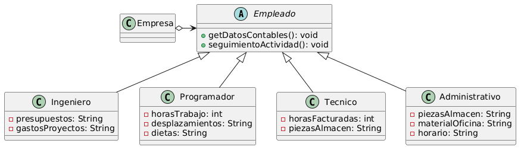
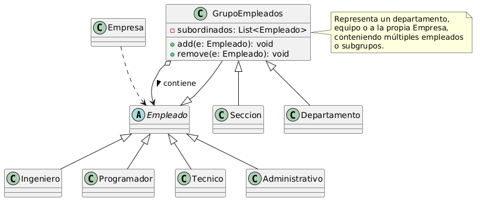

# Diseño de Sistemas Software

## Ingeniería en Informática Universidad de Cádiz

### Ejercicio: Contabilidad de Empleados

Todos los empleados de una empresa informática se pueden tipificar según las clases que muestra la figura 1.

Figura 1: Diagrama de clases de los empleados de la empresa

Cada uno de los tipos de empleados incluye información que mantiene actualizada acerca de toda su actividad en la empresa, aunque esta información varía entre los distintos tipos de empleados ya que cada uno tiene distintas atribuciones. En lo que se refiere a datos contables, por ejemplo:

- los ingenieros guardan información sobre los presupuestos y gastos de los proyectos que llevan
- los programadores mantienen información sobre sus horas de trabajo en la empresa y sobre los servicios a clientes por separado ya que éstos últimos incluyen desplazamientos y dietas
- los técnicos que integran el servicio de informática de la propia empresa, cuya labor es la de dar servicio al resto del personal, facturan su trabajo por horas incluyendo las piezas que utilizan para las reparaciones y que obtienen del almacén
- los administrativos se encargan de abastecer de piezas el almacén y de material informático y ofimático las oficinas.

La empresa desea poder llevar a cabo un control sobre su líquido disponible en cualquier momento, para lo que necesita poder solicitar los datos relativos a contabilidad (datos contables) a cada uno de ellos, pero teniendo en cuenta que dicha información estará disponible de una forma distinta en cada caso.

Una vez implementada esta funcionalidad, la empresa desea añadir otras como, por ejemplo, disponer de un mecanismo que le permita llevar a cabo un seguimiento de las actividades de todos sus empleados, aunque, por ejemplo, el seguimiento que se hace de un ingeniero tiene más que ver con sus resultados y la de un administrativo con su horario, por lo que esta operación se llevará a cabo también de forma distinta para cada tipo de empleado.

Se pide:

- (a) (1 punto) Proponer un diseño que le permita a la empresa solicitar las operaciones mencionadas a sus empleados y que permita la inclusión de nuevas operaciones sin necesidad de hacer nuevos cambios en los empleados. Se supone que los tipos de empleados de la empresa son categorias bastante estables. En cambio, el tipo de operaciones que hay que solicitar sobre los mismos puede variar en el tiempo: por ejemplo, calcular datos contables, llevar un registro de dedicación a actividades, etc.
- (b) (1 punto) Supóngase que la estructura en la que la empresa tiene almacenados a sus empleados es de tipo Composite, como muestra la figura 2. Para solicitar cualquier operación a sus empleados, la empresa necesita poder recorrerlos. Se pide describir cada una de las soluciones posibles que permiten a la empresa llevar a cabo ese recorrido combinado el patrón Composite con el que vd. ha propuesto en el apartado anterior. Indicar claramente cual es el cometido del objeto Empresa en cada una de las soluciones propuestas.

Figura 2: Composite de los empleados de la empresa

(c) (1 punto) Incluir el código de al menos dos de las soluciones planteadas en el apartado anterior.