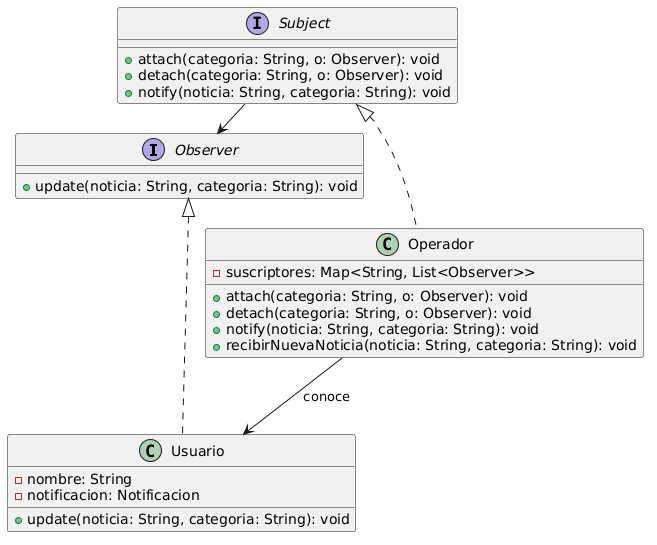
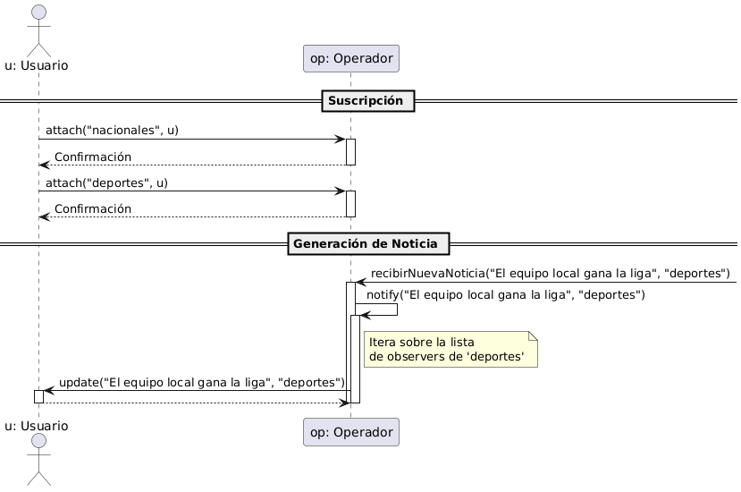
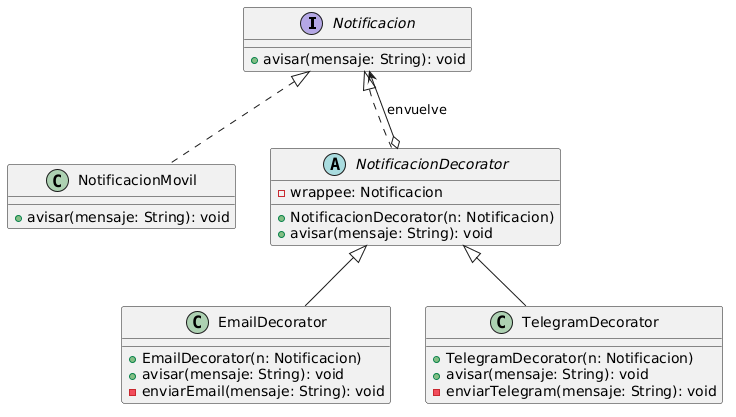

# Diseño de Sistemas Software

## Ingeniería en Informática Universidad de Cádiz

### Ejercicio: Noticias

Un sistema de información de una empresa de servicios permite a los usuarios de su red mantenerse informados de diferentes servicios de información de noticias: nacionales, internacionales, deportes, ocio y cultura, música, etc.

Se pide:

- (a) Un usuario de este sistema puede solicitar al operador el aviso de uno o de varios de los eventos de dichos servicios independientemente, sin más que solicitarlo. Mostrar el diagrama de clases del patrón que mejor refleja esta relación entre el operador telefónico y el usuario.
- (b) Dibujar el diagrama de secuencia que muestre cómo un usuario solicita, consecutivamente, que se le avise de las noticias nacionales y de las de deportes. Mostrar, además, qué ocurre cuando el operador avisa de una noticia deportiva al usuario.
- (c) Una vez que el usuario ha solicitado el envío de uno o más tipos de noticias, hará uso de un objeto de tipo Notificación, que incluye el método avisar y cuyo cometido es el de enviar las noticias recibidas a la persona por uno o varios medios. Por ejemplo, el usuario puede solicitar que se le envíen al teléfono móvil (opción por defecto), por correo electrónico, etc. Las notificaciones (por uno o varios medios) se deben enviar de la forma más transparente posible para el emisor. Mostrar el diagrama de clases que lo hace posible.
- (d) Implementación en Java de el/los métodos necesarios para la función de avisar.

## Solución propuesta: Noticias

(a) El patrón que representa mejor el servicio de suscripción a los distintos servicios es un **Observer** en el que el sistema de información juega el papel de subject y los usuarios son los observers concretos. Dado que cada usuario puede solicitar un tipo de información u otro, será necesario diseñar un tipo de suscripción que permita seleccionar en cada caso el tipo de evento elegido por el observador. La figura 1 muestra el diseño pedido.



Figura 1: Diagrama de clases del patrón Observer solicitado

(b) El diagrama de secuencia aparece en la figura 2. Hay dos subscipciones por parte del usuario a dos servicios de información diferentes. Después, en un momento dado, se produce algún cambio que es necesario notificar pero solo a los usuarios suscritos al tipo de evento que ha cambiado. Tras recibir la notificación, el usuario solicita al sistema de información el nuevo estado, que incluirá el titular de la nueva noticia deportiva.



Figura 2: Diagrama de secuencia del apartado b)

(c) El patrón **Decorator** es el más adecuado en este caso ya que los métodos a utilizar no son excluyentes. La figura 3 muestra el diagrama solicitado.



Figura 3: Diagrama del patrón Decorator para el apartado c)

(d) Los métodos `avisar` presentes en el patrón Decorator son de dos tipos. En el caso de `NotificacionMovil`, que es el caso por defecto y en consecuencia el objeto que se decora siempre, el código solamente implementará el aviso al móvil. En el resto de métodos avisar, que se encuentran en los decoradores el método, además, deberá encargarse de invocar el método en el elemento que decora.

A continuación se incluye el código pedido.

```java
// 1. Componente Base (Interfaz)
public interface Notificacion {
    void avisar(String mensaje);
}

// 2. Componente Concreto (Opción por defecto)
public class NotificacionMovil implements Notificacion {
    @Override
    public void avisar(String mensaje) {
        System.out.println("Enviando SMS al teléfono móvil: " + mensaje);
    }
}

// 3. Decorador Base
public abstract class NotificacionDecorator implements Notificacion {
    protected Notificacion wrappee; // Objeto envuelto

    public NotificacionDecorator(Notificacion wrappee) {
        this.wrappee = wrappee;
    }

    @Override
    public void avisar(String mensaje) {
        // Delega la ejecución al objeto envuelto
        wrappee.avisar(mensaje);
    }
}

// 4. Decoradores Concretos (Nuevas responsabilidades añadidas dinámicamente)
public class EmailDecorator extends NotificacionDecorator {
    public EmailDecorator(Notificacion wrappee) {
        super(wrappee);
    }

    @Override
    public void avisar(String mensaje) {
        super.avisar(mensaje); // Ejecuta el envío previo (ej. Móvil)
        enviarEmail(mensaje);  // Añade su propia responsabilidad
    }

    private void enviarEmail(String mensaje) {
        System.out.println("Enviando copia por Correo Electrónico: " + mensaje);
    }
}

// EJEMPLO DE USO (Transparente para el emisor):
public class Main {
    public static void main(String[] args) {
        // El usuario solo quiere móvil (por defecto)
        Notificacion notificacionBasica = new NotificacionMovil();
        
        // El usuario quiere móvil + email
        Notificacion notificacionMultiple = new EmailDecorator(new NotificacionMovil());
        
        // Para el emisor (el Operador), la llamada es exactamente igual:
        notificacionMultiple.avisar("Noticia deportiva importante"); 
        // Salida:
        // Enviando SMS al teléfono móvil: Noticia deportiva importante
        // Enviando copia por Correo Electrónico: Noticia deportiva importante
    }
}
```