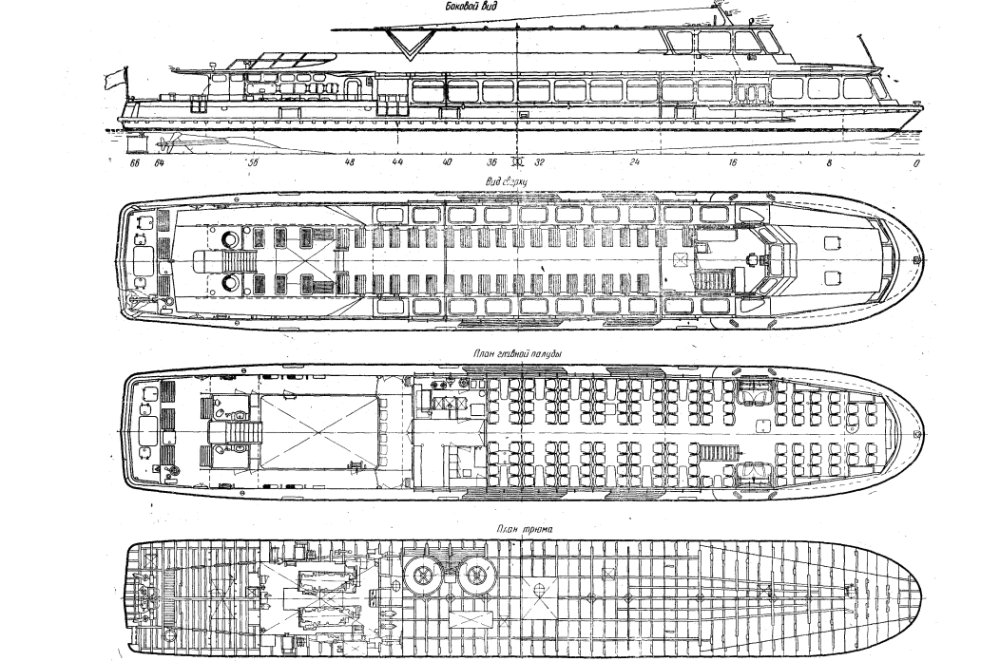
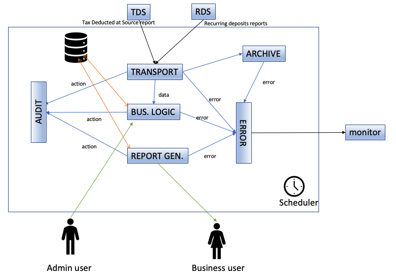
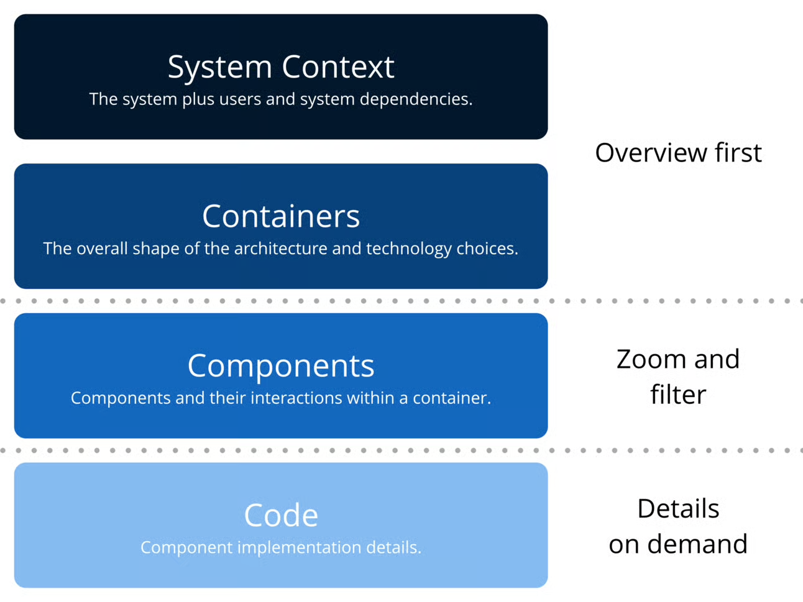
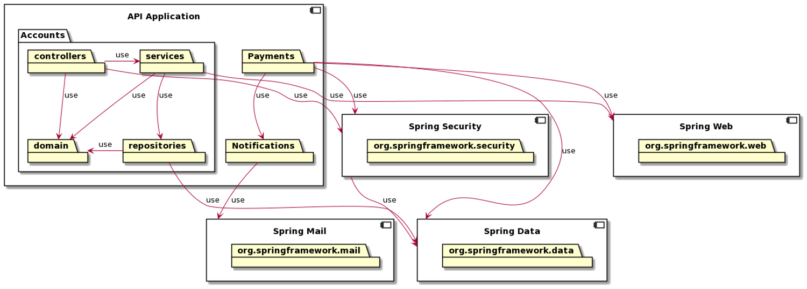

<!-- size: 16:9 -->

<!-- paginate: false -->

# DISEÑO DE SISTEMAS SOFTWARE

<style scoped>
h2 {
  text-align: left;
}
</style>

## Bloques

1. Principios de diseño OO
2. Patrones de diseño
3. <emph>Arquitectura de software</emph>

---

# SOFTWARE ARCHITECTURE

## Module contents

1. Introduction to software architectures
2. Communicating architectures
3. Architectural principles
4. Architectural patterns

<!--3. Architectural tactics-->

---
<!-- _class: lead -->

## INTRODUCTION TO SOFTWARE ARCHITECTURES

---

## Introduction to software architectures

### Lesson contents

Definitions
Architecture design process
Process inputs
Process outputs
The role of the software architect
Benefits

---
<!-- _class: lead -->

## Definitions

---
<!-- _class: invert -->

<style scoped>
section {
  display: flex;
  flex-direction: column;
  justify-content: flex-start;  /* alinea al inicio (arriba) */
}
</style>

### Architecture

The **process** and the **product** of planning, designing, and constructing buildings or **other physical** structures.


<br><br><br><br><br>

The **style of design** and **method** of construction of buildings and other physical structures.

---



### Architecture applies to several **disciplines**

- landscape architecture
- interior architecture,
- urban design,
- mechanical engineering,
- naval architecture,
- etc.

---
<!-- _class: lead -->

### **Buildings** ≈ **Software**?

Both are developed by teams using **tools**, **patterns** and **tactics** and are affected by **trends**

---
<!-- _class: lead -->

### **Buildings** ≠ **Software**?

Buildings are **stable** environments with **physical** limits and many difficulties to change, software is a **virtual** artifact with evolving nature and it is easier to **change**

---
<!-- _class: lead -->

### The architecture of **anything**

> Fundamental organization embodied in its **components** and their **relationships** to each other and their environment. The **principles** of its design and evolution.

-- *ISO/IEC/IEEE 42010*
-- *Samuel Holcman*

---
<!-- _class: lead -->

### Architecture of a **system**

> A **system architecture** makes use of elements of both **software** and **hardware** and is used to enable the design of such a composite system.

-- *ISO/IEC/IEEE 42010*

---
<!-- _class: lead -->

### The architecture of a **software system**

> It is the shape given to that system by those who build it. The form of that shape is in the division of that system into **components**, the **arrangement** of those components, and the ways in which those components **communicate** with each other.

-- *Bob Martin*

---

### **Software** architecture

> The **set of significant decisions** about the **organization of a software system**, the selection of the **structural elements and their interfaces** ...together with their **behavior** ..., the **composition** of these ... elements ..., and the **architectural style**

-- *Kruchten: The Rational Unified Process*

> Architecture represents the **significant decisions**, where significance is measured by **cost of change**.

--*Grady Booch*

---
<!-- _class: lead -->

### The **software architecture** can be considered the **blueprint** to build and maintain a software system.

---

### **Reference** architecture

The **set of design decisions** that can be simultaneously applied to **several related systems** within an application **domain** and with explicitly defined **variation points**.

<br><br><br>  

<small>A **Software Product Line** is a set of software-intensive systems that share a **common**, managed set of **features** satisfying the specific needs of a particular **market segment** or mission.</small>

---
<!-- _class: lead -->

## Architecture design process

---
<style scoped>
section {
  display: flex;
  flex-direction: column;
  justify-content: flex-start;  /* alinea al inicio (arriba) */
}
</style>

### Waterfall development


---

### Waterfall development

- **Requirements** should be **fixed** before the coding phase began.
- **Big design up front**: Software architecture ought to be developed and completed before writing the first line of code.
- Creating a perfect software design blueprint can be a waste of time and resources because it could be **changed** many times.

---

### Agile development


<small>The *Scrum* framework</small>

---

### Agile development

- Agile manifesto values:

   - **Individuals and interactions** over *processes and tools*
   - **Customer collaboration** over *contract negotiation*
   - **Responding to change** over *following a plan*
   - **Working software** over *comprehensive documentation*

- Many organizations started to not create any design at all, causing long-term maintainability issues.

---

### How much up front design should you do?

#### **0\%** ... **100\%**?

---

### How much up front design should you do?

#### **0\%** ... **100\%**?

### Up front design

> Big design up front is dumb.
> Doing no design up front is even dumber.

-- *Dave Thomas*

---

### Evolutionary architecture (I)

- An approach to architecture that embraces **change** in an agile manner.
- The key is to create **enough** pieces of architectural design before coding.
- The software architecture represents the set of **significant decisions**, where significance is measured by the cost of changes.
- Major **decisions** have to do with **technology** choices, selection of the proper **infrastructure**, application of certain **tactics** and design **patterns**, etc

---

### Evolutionary architecture (II)

- Propose **hypotheses** and then write some code to validate whether the solution posed is feasible and fulfills the expected requirements.
- Prove the architecture with concrete **experiments**, and proof of concepts.
- Identify and control **risks** and tackle the highest priority ones in the early stages.
- However, not all decisions have to be made in the beginning. It is much better to defer decisions until they are strictly needed. We should **keep the options open** for as long as possible.

---

### Laws of Software Architecture

#### **1. Everything in software architecture is a trade off**

All meaningful decisions have advantages and downsides

#### **2. 'Why' is more important than 'How'**

Question everything


---
<!-- _class: lead -->

## Process inputs

---

### Process inputs

The creation process of the software architecture starts with a set of inputs:

- Business objectives
- Functional requirements
- Information requirements
- Non-functional requirements
- Constraints

---

### Business objectives

What are the **goals** (measurable) of the system to develop or maintain?

- What are the stakeholders' **expectations**?
- How **critical** will the software be?
- What is the **time-to-market**?
- Are the project **calendar** and costs well established?
- How **variable** are the rules that will govern the software?

---


### Functional requirements

Some requirements engineering techniques should be conducted prior to designing the architecture, to capture and analyze the behavior of the software to develop.

---


### Information requirements

The static nature of the system is modeled with a conceptual model considering the business vocabulary.

---


### Non-functional requirements

Quality attribute requirements, namely performance efficiency, compatibility, operability, reliability, security, portability, and maintainability.

---

### Constraints

- Both the **customer** and **development organization** can make certain technical or organizational decisions.
- These constraints limit the number of potential **alternatives**
- **Software** constraints: programming languages, development frameworks, database providers, etc.
- **Hardware** constraints: sensor and actuator manufacturers, execution platforms, etc.

---
<!-- _class: lead -->

## Process outputs

---

### Process outputs

- Software architecture is **embedded** in the **source code** itself,

- However, there are other aspects that are **not** directly (easily) **observable** in the code.

---

### Alternatives for describing architectures

- **Architectural Decision Records (ADR)**, by using structured templates
- **Textual representations**, by using Architecture Description Languages (ADL)
- **Visual models**, according to well-known specifications like UML or SysML

---
<!-- _class: lead -->

## The role of the software architect

---

### Skills

- This role is usually assumed by a **senior** developer.
- Good **interpersonal skills** to deal with stakeholders who may have different (even contradictory) needs
- Solid knowledge of the **business domain**.
- Aware of **new** development techniques, practices, and tools.
- **Self-experience** for correctly applying best practices, design principles, and patterns.

---

### Responsibilities (I)

- Software architects usually **code** as other developers and perform **code reviews**, so code low-level understanding is mandatory.
- Architects must **help** developers understand the overall system architecture.
- They must continually **analyze** the architecture and ensure **compliance** of the code with existing decisions during software evolution.

---

### Responsibilities (II)

- Define **guidelines** and checklists to ensure the technical success of the project.
- Analyze the **pros** and **cons** of the different alternatives and keep decision records.
- Explicitly **document** the software architectures by means of visual models or textual representations.

---
<!-- _class: lead -->

## Benefits

---

### Benefits (I)

- The way of programming should always be the same and follow the same structure, the resulting code will be easily recognizable and ...

- facilitates the development and maintenance of the software.
- simplifies the deployment and operation of the systems.

---

### Benefits (II)

- The software architecture documentation provides...
  - a clear vision and roadmap for the team to follow.
  - a common language to express, negotiate and resolve the stakeholder's expectations.
  - a valuable resource to be used as the basis for the training of new project members.

---
<!-- _class: lead -->

## Key ideas

---

## Key ideas

- **Definition**: *the set of significant decisions, the style of design, the organization into components and the way of communication.*
- **Process**: *evolutionary, addressing risks, proofs of concepts*
- **Inputs**: *business objectives, software requirements and know-how*
- **Outputs**: *source code, decision records and textual/visual representations*
- **Skills**: *interpersonal, business and technical knowledge and experience*
- **Responsabilities**: *code, review, help, analyze, define, document.*
- **Benefits**: *code easy to maintain, documentation helpful for all.*

---
<!-- _class: lead -->

## COMMUNICATING ARCHITECTURES

---

## Communicating architectures

### Lesson contents

Architecture description
Architectural decision records: *Y-statement and MADR*
Architecture description languages: *AADL*
Architecture models: *UML*
Frameworks for creating architectures: *C4 model*

---

### Architecture description (I)

**Documenting** software architectures helps us understand the **big picture** of the systems, providing a **shared** vision and a common **vocabulary** for all stakeholders.

---

### Architecture description (II)

- In the **building** industry, architecture is usually documented with site plans, floor plans, elevation views, cross-section views, and detailed drawings.
- In **Software Engineering**, architecture description is the explicit work product expressing an architecture of a system, usually via code, texts and graphics.

---

### Missing aspects...

- Why certain **technologies** were chosen?
- Which **tactics**, **principles**, and **patterns** have been used?
- How the structural **elements** are **deployed** at runtime?
- How they **communicate** themselves?

---
<!-- _class: lead -->

## Architectural decision records

---

### Architectural decision records (ADR)

- The architecture of a software system can be seen as the set of **major design decisions** on the system.

- It is very common to **forget** why certain decisions were made. That may lead to **problems** when the work team changes.

- Architectures can **evolve** to satisfy further requirements, so not all decisions have to be made in the beginning. We should **keep the options open** for as long as possible.

Let's see some examples of decisions...

---

#### Examples of **feature** decisions

- *Create a system from scratch or extend a base platform?*

- *Authentication via a biometric scanner or authentication based on login and password?*

---

#### Examples of **technology** decisions

- *C++ or Java for programming the system?*

- *Qt or GTK for developing the user interface?*

- *Eclipse IDE, Visual Studio Code or Qt Creator as development environment?*

---

#### Examples of **infrastructure** decisions

- *A relational database (e.g., Oracle, MySQL, PostgreSQL, etc.) or a NoSQL database (MongoDB, Redis, Neo4J, etc.)*

- *ZeroMQ, RabbitMQ, and ActiveMQ for messaging?*

- *WebSocket, HTTP, DDS, MQTT as communication data protocol?*

---

#### Examples of decisions on tactics for improving **availability** and **performance**

- *Using ping/echo or heartbeat strategy for detecting faults with external systems?*

- *In case of system exhaustion when receiving external events, do we reduce the sampling rate or prioritize the source events?*

---

#### Examples of decisions on **patterns/styles**

- *Model View Controller (MVC) or Pipe and Filters for structuring our software components?*

- *Monolith N-tier application or a microservice architecture?*

---

#### Examples of decisions on **coding**

- *Google/Microsoft/Epic C++ coding styles?*

- *Code organization by domain responsibilities or technical responsibilities?*

---

### Architectural decision log

- It is very important to **document** the **architecture decisions** on a repository (e.g.: document, wiki page, plain file, structured data store, etc.) that collects them.

- These decisions must be defined using a proper **format** and **structure**, for example, using Y-statements or MADRs.

---

### Y-statement template

1. **In the context of** <inverse>use case/user story/functional req/component</inverse>,
2. **facing** <inverse>non-functional req/quality concern</inverse>,
3. **we decided for** <<inverse>selected option</inverse>,
4. **and neglected** <inverse>alternative options</inverse>,
5. **to achieve** <inverse>benefit/quality attributes/desired consequences</inverse>,
6. **accepting** <inverse>drawbacks/downside/undesired consequences</inverse>,
7. **because** <inverse>additional rationale</inverse>.

---

#### Example of a Y-statement template

*In the context of the <inverse>Web shop service</inverse>, facing the need to <inverse>keep user session data consistent and current across shop instances</inverse>, we decided for the <inverse>Database Session State pattern</inverse> and against <inverse>Client Session State</inverse> or <inverse>Server Session State</inverse> to achieve <inverse>data consistency and cloud elasticity</inverse>, accepting that <inverse>a session database needs to be designed and implemented</inverse>.*

---
<!-- _class: lead -->

### Markdown Architecture Decision Records (MADR)

- This is a proposal for documenting Architecture Decision Records using Markdown, a lightweight markup language for creating formatted text using a plain-text editor.

---

#### Example of a MADR

```madr
# Choose a format and structure for managing ADRs

## Context and Problem Statement

We want to record architectural decisions made in this project.
Which format and structure should these records follow?

## Considered Options

* [MADR]
(https://adr.github.io/madr/) 2.1.0 - The Markdown Architectural Decision Records
* [Y-Statements] (https://www.infoq.com/articles/sustainable-architectural-design-decisions)
* [Michael Nygard's template]
(http://thinkrelevance.com/blog/2011/11/15/documenting-architecture-decisions)
* [Other templates listed at] (https://github.com/joelparkerhenderson/architecture_decision_record)
* Formless - No conventions for file format and structure
```

---

### Example of a MADR (cont.)

```madr
## Decision Outcome

Chosen option: "MADR 2.1.0", because

* Implicit assumptions should be made explicit.
  Design documentation is important to enabling people to understand the decisions later on.
  See also
  [A rational design process: How and why to fake it](https://doi.org/10.1109/TSE.1986.6312940).
* The MADR format is lean and fits our development style.
* The MADR structure is comprehensible and facilitates usage & maintenance.
* The MADR project is vivid.
* Version 2.1.0 is the latest one available when starting to document ADRs.
```

---
<!-- _class: lead -->

## Architecture description languages

---

### Architecture Description Languages (**ADL**)

- **Formal languages** targeted at designing software architectures

- Define the **components** conforming to our system, the **arrangement** of those structural elements, and the ways they **communicate** with each other.

- Examples: AADL, ABACUS, ACME, or xADL.

---

### Architecture Analysis and Design Language (**AADL**)

- A specification dedicated to the modeling and analysis of **real-time, safety-critical, embedded systems**.

- This standard provides software, hardware, and system component **abstractions** to specify and analyze the **systems** and map onto computational **hardware elements**.

---

#### AADL example

```aadl
package Hello_World                                 -- Entities are attached to a package
public
  subprogram Hello_Spg_1
   properties                 --  Simple subprogram: actual behavior, not modeled in AADL
    Source_Language => (C);                              --  Implementation language is C
    Source_Name     => "user_hello_spg_1";       --  Name of the corresponding C function
    Source_Text     => ("hello.c");                               --  Implementation file
  end Hello_Spg_1;

  thread Task                                  --  A task: a concurrent flow of execution
   properties
    Priority                => 1;     --  Priority, interpretation given by the processor
    Dispatch_Protocol       => Periodic;                                     --  Periodic
    Period                  => 1000 ms;                            --  Period of the task
    Compute_Execution_Time  => 0 ms .. 3 ms;                           --  Execution time
    Compute_Entrypoint      => classifier (Hello_Spg_1);      --  Hello_Spg_1 is executed
  end Task;                                                           -- at each dispatch
```

---

```aadl
  process node_a
                                  --  A process, gathers several threads as subcomponents
  end node_a;

  process implementation node_a.impl
   subcomponents
    Task1 : thread Task;
  end node_a.impl;

  processor cpu                              --  A processor provides execution resources
   properties                       -- Threads are given access to the CPU according to a
    Scheduling_Protocol => (RMS);           -– Rate-Monotonic Scheduling: a shorter cycle
  end cpu;                                   –- duration results in a higher job priority

  system rma
                                --  A system combines both hardware and software elements
  end rma;
```

---

```aadl
  system implementation rma.impl
   subcomponents
    node_a : process node_a.impl;
    cpu    : processor cpu;
   properties
    Actual_Processor_Binding           -- Binding relations between hardware and software
       => (reference (cpu)) applies to node_a;    -- node_a is allocated resources on cpu
  end rma.impl;

end Hello_World;
```

---
<!-- _class: lead -->

## Architecture models

---

### Sketches

The first approach to software architecture


---

### Diagrams

Sketches are later beautified with diagramming tools (*PowerPoint*).



---

### Problems with sketches

- Boxes and arrows with inconsistent notation: colors, shapes
- Ambiguous naming,
- Unlabelled relationships,
- Mixed abstractions,
- etc.

---

### Modeling languages

- Provide well-defined **semantics** and unambiguous **understanding**.
- Examples: **UML** and **SysML**
- **Model-Based** Software/System Engineering (MBSE)
- **Model-Driven** Software/System Engineering (MDSE)
- Architectural **models** created with those languages capture totally or partially the **design decisions** during the creation of the system architecture.

---

### Unified Modeling Language (UML)

- **Open** standard for software development **lifecycle modeling**.
- Supported by many open and proprietary (web/desktop) **tools**.
- Provides a set of **visual** notations to represent system  **structure** and **behavior**.
- **Use case diagrams** or **class diagrams** are commonly used for requirements engineering purposes.

---

### Tool support

#### Graphical modeling environments

- Creation of visual models by dragging and dropping modeling elements
- Examples: *ArgoUML, Enterprise Architect, Visual Paradigm, Modelio, etc.*

---

#### Modelio


---

### Tool support

### Textual modeling environments

- Creation of visual models by writing code
- Examples: *PlantUML or yUML*

---

<style scoped>
section {
  display: flex;
  flex-direction: column;
  justify-content: flex-start;  /* alinea al inicio (arriba) */
}
</style>

#### PlantUML


---

### Problems with models

- One only representation is **not** usually **enough** to correctly represent the static and dynamic nature of the architecture
   <!-- - Harmonize the models at different levels of abstraction and points of view.-->

- They are often **not in sync** with the code.
  <!--Source code rapidly changes to address changes in requirements, visual models are not updated at the same pace.-->

- There are tools for generating visual models directly from the source code via reverse engineering, but they generally include too many **details**.
  <!-- However, the diagrams generated usually include too many details, hiding seeing the overall architecture.-->

---


### UML diagrams

There are 14 types of diagrams. We need for guidelines regarding the number and type of notations to use.

---
<!-- _class: lead -->

## Frameworks for creating architectures

---

### Approaches for conducting the architecture design process

- Propose the use of a specific set of models and textual descriptions for representing different software **views** at different levels of **abstraction** and **viewpoints**.
- The most prominent ones:
  - **4+1 architectural view model**, by *Philippe Kruchten*;
  - **Arc42 templates**, by *Starke, Hruschka and Müller*;
  - and ...

---

### Simon Brown's C4 model

- Approach for describing and **communicating** software architectures to different types of **audiences**.

- View the system as a **map** at various levels of detail.

- **Abstraction**-first approach and **notation**-independent

- Simple diagrams based on **boxes** and **lines**, but can be also created with **UML/SysML** using packages, components and stereotypes.



---


---

### Level 1: System Context diagram

This diagram focuses on **people** (actors, roles, personas, etc) and **software systems** rather than technologies, protocols, and other low-level details. It's the sort of diagram that you could show to **non-technical people**. This includes the software system you are modeling, and the other software systems upon which your software system **depends** (or vice versa).

---
<!-- _class: lead -->

#### Software System

The highest level of abstraction and describes something that delivers value to its users, whether they are human or not.

---

#### Example of a System Context diagram


---

### Level 2: Container Diagram

This diagram shows the **high-level shape** of the software architecture and how **responsibilities** are distributed across it. It is useful for software developers and support/operations staff alike. The diagram shows the **major technology choices** and how the containers **communicate** with one another.

---

### Container

A separately runnable/deployable unit

- Not *Docker*!
- **GUI apps**: desktop apps, mobile apps, web apps
- **Non-GUI apps**: console apps, shell scripts, serverless functions, etc.
- **Datastores**: database, blob or content stores, file systems.

---

#### Example of a Container Diagram


---

### Level 3: Component Diagram

This diagram shows how a container is made up of **components** (the major structural building blocks), their **responsibilities**, and the **technology/implementation details**.

Its intended audience is software architects and developers.

Alternatively, we can use **UML component diagrams or UML package diagrams**.

---

### Component

> A software component is a **unit of composition with contractually specified interfaces and explicit context dependencies**. A software component can be **deployed independently** and is subject to **third-party composition**.

-- *Clemens Szyperski*

> Software components are libraries, i.e., **things that are independently replaceable and upgradeable**. Examples: Java's jars, C#'s assemblies, Ruby's gems, and Javascript's modules.

-- *Martin Fowler*

---

#### Example of a Component diagram  (Jar files)


<small>UML component diagram</small>

---

### Component <small>(alternative definition)</small>

> A component is a **grouping of related functionality (classes) encapsulated behind a well-defined interface**.
> Aspects such as how those components are organized (packages, modules, JAR file, DLL, namespaces, shared library, etc) is a separate and orthogonal concern. In the C4 model, components are not separately deployable units.

-- *Simon Brown, C4 model*

---

#### Example of a Component diagram</small>


<small>C4 version</small>

---

#### Example of a Component diagram


*UML component diagram*

---

#### Example of a Component diagram



<small>UML package diagram</small>

---
<!-- _class: lead -->

### Code

Code elements (e.g. classes, interfaces, objects, functions, database tables, etc) within the component in scope.

---

### Level 4: Code Diagram

This level of detail shows how each component is implemented as code, using **UML class diagrams**.

Ideally, these diagrams would be **automatically generated** using tooling (e.g. an IDE or UML modeling tool). This diagram is not recommended for the whole codebase but for the most important or complex components.

---

#### Example of a Code Diagram (UML class diagram)


---
<!-- _class: lead -->

### More diagrams?

---

### System Landscape diagram

This diagram shows the system landscape from an IT perspective. It is a high-level map of the software systems at the **enterprise-level**, considering the **organizational boundary**, **internal/external users**, and **internal/external systems**.

---

#### Example of a System Landscape diagram


---

### Dynamic diagram

This diagram can be useful when you want to show how elements in a static model **collaborate at runtime** to implement a **user story, use case, feature**, etc.

The diagram is based upon *UML communication diagram*.

---

#### Example of a Dynamic diagram


---

### Deployment diagram

This diagram illustrates how software systems and/or containers in the static model are mapped to **deployment nodes**. They are something like **physical infrastructure** (e.g. a physical server or device) or **virtualized/containerized infrastructure** (e.g. IaaS, PaaS, a virtual machine, a Docker container).

This deployment diagram is based upon *UML deployment diagram*.

---

#### Example of a Deployment diagram


---

### Tooling for C4 model

- Diagramming tools:
  - Visual: *Microsoft Visio, Visual Paradigm*
  - Textual: *C4-PlantUML, c4builder*

- Modeling tools:
  - Visual: *IcePanel, Enterprise Architect, Gaphor*
  - Textual: *Structurizr*

---

<style scoped>
section {
  display: flex;
  flex-direction: column;
  justify-content: flex-start;  /* alinea al inicio (arriba) */
}
h3 {
  text-align: center;
}
</style>

### Let's practise..

## Software architecture as code


---

### Practical activity

1. Create a user and a new workspace in Structurizr to design the architecture of the "*ACME Access Control System*".
2. Create the **C4 context diagram** to show that the security staff is in charge of registering and authorizing new users in the system and providing them with ID cards based on NFC technology. Both external users and invited will be able to enter ACME's premises using their cards.

---

### Practical activity (cont.)

3. Create the **C4 container diagram** to depict that the system is based on a headless app written in Python that reads NFC cards and communicates with an Oracle database to authorize users and log user activity. In addition, there is a Qt-desktop application for managing users stored in the database.
4. Create the **deployment diagram** to depict that the Python apps will run on two PLC Raspberry Pi, the database will be hosted and replicated in two machines on the ACME datacenter, and the desktop application will be running on the Security staff's computer.

---

# REFERENCES

- Mark Richards: Software Architecture Monday, https://www.developertoarchitect.com/lessons/
- Simon Brown: The C4 model for software architecture, https://c4model.com/
- Markdown Architectural Decision Records, https://adr.github.io/madr/
- AADL standard, https://www.aadl.info/
- Structurizr, https://structurizr.com/
- PlantUML, https://plantuml.com/
