<!-- _class: lead -->

# SOFTWARE ARCHITECTURE

Introduction to software architectures
Communicating architectures
<emph>Architectural principles</emph>
<emph>Architectural patterns</emph>

---
<!-- _class: lead -->
<!-- paginate: false -->

# ARCHITECTURAL DESIGN PRINCIPLES

---
<!-- _class: lead -->

## Architectural Design Principles

Introduction
Software components
Component cohesion principles
Component coupling principles

---
<!-- paginate: true -->

## Introduction

- The quality of a system is the degree to which the system satisfies the stated and implied **needs** of its various **stakeholders**, and thus provides value.

- **Team members** (developers, testers, etc.) are also stakeholders in the project.
  
- This section is about principles to improve system **maintainability**, which is key to the success of good software architecture.

---

### Maintainability

- **Modularity**: Degree to which a system or computer program is composed of discrete components such that a change to one component has minimal impact on other components.

- **Reusability**: Degree to which an asset can be used in more than one system, or in building other assets.

- **Analysability**: Degree of effectiveness and efficiency with which it is possible to assess the impact on a product or system of an intended change to one or more of its parts.
  
---

### Maintainability (cont.)

- **Modifiability**: Degree to which a product or system can be effectively and efficiently modified without introducing defects or degrading existing product quality.

- **Testability**: Degree of effectiveness and efficiency with which test criteria can be established for a system, product or component and tests can be performed to determine whether those criteria have been met.

---
<!-- _class: lead -->
<!-- paginate: false -->

## Software Components

---
<!-- paginate: true -->

### Achieving modularity...

- The **class** is too fine-grained as a unit of organization.

- Components are **logical groupings** of statements that can be imported into other programs.

- Pieces of software providing a set of **responsibilities**: Each component must have an **interface** describing how to use it and the body with its **implementation**.

---

### A definition of components?

- The word **component** is a hugely overloaded term in the software development industry,

- Szyperski defined as: a *unit of composition (binary) with contractually specified interfaces and explicit context dependencies only. A software component can be deployed independently and is subject to composition by third parties.*

- C4 model: *grouping of related functionality encapsulated behind a well-defined interface, and it is not separately deployable*.
  
---

### A common terminology?

- Each programming language and each developer community have their own terminology to define the mechanisms to create and reuse components.
- Examples:
  - Java: source code is organized into packages. Source code can be packed into JAR files.
  - C++: source code is organized via namespaces. Source code can be packed into C++ libraries (.a, .dll, .dylib files).

---

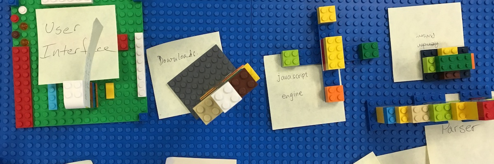

### Component-based Software Engineering

Connecting bricks together and following certain rules about how they can and cannot be interconnected is not unlike writing program code and using software interfaces.

---
<!-- _class: lead -->
<!-- paginate: false -->

## Component cohesion principles

---
<!-- paginate: true -->

### Cohesion principles

- **High cohesion** and **low coupling** as the main design drivers for simple system architectures, which have to be easy to understand, change, and maintain.

- **Cohesion** represents the degree to which a part of a codebase forms a **logically single, atomic software unit** (a method, a class, a group of classes, a component, etc.).

- Low cohesion makes components more difficult to maintain, test, and reuse.

---
<!-- _class: lead -->

### REP: Reuse/Release Equivalence Principle

> _The granule of reuse is the granule of release. In other words, either all of the classes inside the package are reusable, or none of them are._
>
> — Robert C. Martin

---

#### Releasing software components

- Reusing software components is **not copying and pasting** source code
- Developers of the reusable code must **package** source code, **distribute** them as products and **maintain** them.
- The release process must produce the appropriate notifications and release documentation.
- These processes can be automated by using **DevOps** strategies.

---

#### Reusing software components

- Components must be shared via specific (public/private) repositories.

- Developers to use these components must only download and import the required dependencies and start to use them.

- There are lots of dependencies management tools to help developers reuse software components:
  - CMake and Conan, for the C/C++ language
  - Maven and Gradle, for the Java language  
  - etc.

---

#### Semantic versioning

- The components should be tracked through a release process and are given release numbers like MAJOR.MINOR.PATCH-LABEL,
- Increment the version...

  - MAJOR: when you make incompatible changes on its API
  - MINOR: when you add functionality (backward-compatible)
  - PATCH: when you make backward-compatible bug fixes.
  - LABEL: Optional metadata for pre-release.
- Example: *1.0.0-alpha < 1.0.0 < 2.0.0 < 2.1.0 < 2.1.1*

---
<!-- _class: lead -->

### CCP: Common Closure Principle

> _Gather into components those classes that change for the same reasons and at the same times. Separate into different components those classes that change at different times and for different reasons._
>
> — Robert C. Martin

---

#### High cohesive components

- Components must be responsible for a **single mission** (maybe one only thing...) Components should **not have multiple reasons to change**.
  
- Thus, we should gather together into the same component those classes that are **closed to the most common types of changes** that we expect or have experienced.

- If we need to alter our code and the changes are confined to a single component, then we **redeploy only the one changed component** whilst other components do not need to be revalidated or redeployed.

---
<!-- _class: lead -->

### CRP: Common Reuse Principle

> _Don’t force users of a component to depend on things they don’t need._
>
> — Robert C. Martin

---

#### High cohesive components

- **Those classes that are not tightly bound to each other should not be in the same component**.
- When we depend on a component, we want to make sure we depend on every class in that component.

- Suppose that the *using* component uses only one class within the *used* component. Every time the *used* component is changed, the *using* component will likely still need to be recompiled, revalidated, and redeployed. This is true even if the *using* component doesn’t care about the change made in the *used* component.
  
---

#### Example of low cohesive component

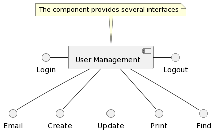

---

#### Example of high cohesive components

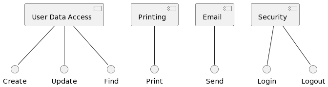

---
<!-- _class: lead -->
<!-- paginate: false -->

## Component coupling principles

---
<!-- paginate: true -->

### Coupling principles

- **Coupling** refers to the degree of interdependence that two software units have on each other, again meaning by software unit: classes, subtypes, methods, modules, functions, libraries, etc.

- If two software units are completely independent of each other, we say that they are decoupled. Although this is the ideal situation, it rarely occurs. Therefore, the aim is to **achieve the lowest possible level of coupling**.

---

#### High coupling vs Low coupling

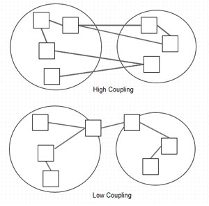

---

### Code dependencies

- **A component *Comp1* depends on another component *Comp2*** when one of *Comp1*'s classes has a dependency with a *Comp2*'s class.

- In turn, **a class *Class1* depends on a class *Class2*** when:

  - *Class1* inherits from the base class *Class2*
  - *Class1* has an attribute of class *Class2*
  - *Class2* is used as an input or output parameter of one the *Class1*'s functions or their functions' body.

---
<!-- _class: lead -->

### ADP: Acyclic Dependencies Principle

> _There must be no cycles in the component dependency graph._
>
> — Robert C. Martin

---

#### Components as units of work

- The components can be the responsibility of a single developer, or a team of developers.
  
- When developers get a component working they release it for use by the other developers.

- As new releases of a component are made available, other teams can decide whether they will immediately adopt the new release.
  
- The dependency structure of the components of a software project can be visualized as a dependency graph, but this graph should be a **Directed Acyclic Graph** (DAG), i.e., there can be no cycles.

---

#### Component diagram of a sample system

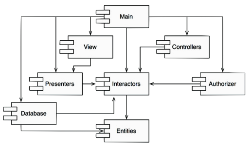

---

#### Component diagram with a dependency cycle

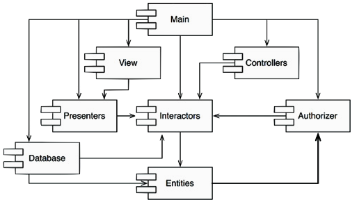

---

#### Breaking the cycle with the **Dependency Inversion Principle**

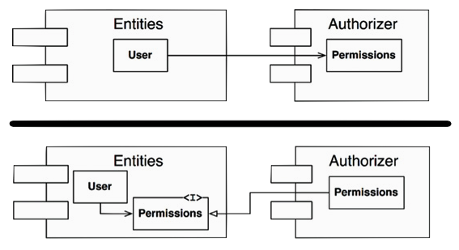

---

#### Extracting the new classes into a new component

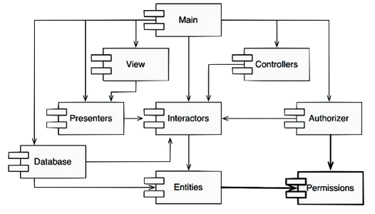

---
<!-- _class: lead -->

### SDP: Stable Dependencies Principle

> _Depend in the direction of stability._
>
> — Robert C. Martin

---

#### Code stability

- The software architect should mold a component dependency graph to **protect stable high-value components from volatile components**.
  
- We must **isolate that volatile code**. For example, we don’t want that our business rules (highest-level policies) are affected by...
  - cosmetic changes to the graphical user interfaces
  - changes on data persistence technologies
  - mechanisms to communicate with external systems

---
<!-- _class: lead -->

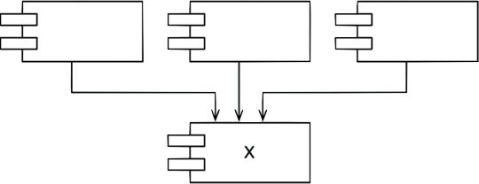

A component with lots of incoming dependencies is very **stable** because it requires a great deal of work to reconcile any changes with all the dependent components

---
<!-- _class: lead -->

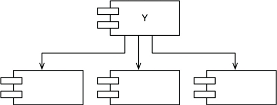

A component with a lot of outgoing dependencies is very **unstable**, because changes may come from many external sources

---
<!-- _class: lead -->

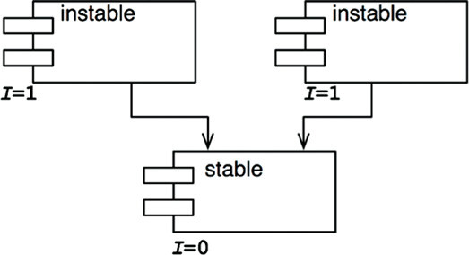

**Ideal configuration** of component dependencies

---
<!-- _class: lead -->

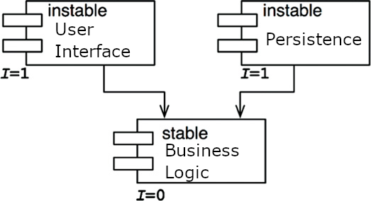

Modules that are intended to be easy to change are not dependent on modules that are harder to change.

---
<!-- _class: lead -->

### SAP: Stable Abstractions Principle

> _A component should be as abstract as it is stable_
>
> — Robert C. Martin

---

#### Providing controlled flexibility to our components...

- Business logic and policy decisions of the system should **not change** very often due to technological **details**.
- The code that encapsulates those pieces of the software should be placed into **stable** components.
- However, this would make the overall **architecture inflexible** and the high-level policies would be difficult to change.
- The solution is using **interfaces/abstract classes** for the stable elements. So we will be able to modify the policies by implementing new classes.

---

##### Open-Closed Principle

Open for extension, but
Closed for modification

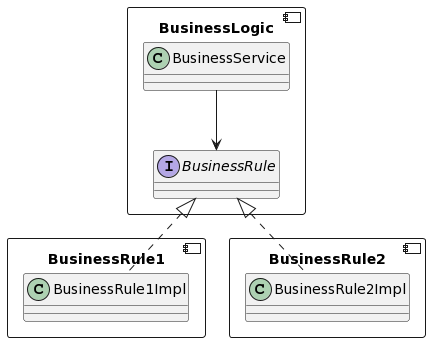

---
<!-- _class: lead -->
<!-- paginate: false -->

# ARCHITECTURAL PATTERNS

---
<!-- _class: lead -->

## Architectural Patterns

Introduction
Architectural patterns for development
Architectural patterns for deployment
Architectural patterns for software integration

---
<!-- _class: lead -->

## Introduction

---
<!-- paginate: true -->

### Evolving software systems

- All long-lived systems evolve, so the **code** and the **architecture** both **evolve**.
- Code evolves in an **ad hoc** manner due to business pressures and developer turnover.
- It allows us to obtain results **quickly**, and maybe it is a cheap solution for **short-term** projects.
- This phenomenon is quite **common** in practice.

---

### Big ball of mud (I)

- Systems that lacks a perceivable architecture and highlights its haphazardly structured, sloppy, duplicated spaghetti-code jungle.  
- Significant loss of the system's quality.
- High maintenance costs, and it may even be very expensive to introduce new changes to the system.

---

### Big ball of mud (II)

- This kind of software is an **anti-pattern** we must avoid.
- To avoid that, it is really important to apply the principles, tactics and patterns of good software design.
- We must keep continuous attention to architecture’s quality, which implies the need to maintain architectural conformance.

---

### Pattern (software development)

- A **solution** to a **problem** in a **context** and codifies specific knowledge collected from **experience** in a domain.
- These patterns form a **catalog** of predefined successful solution **skeletons** that architects can use for their new software solutions.

---

### Pattern scopes

- **Idiom**: low-level patterns specific to a programming language. Describes how to implement particular aspects of components using the features of the given language.
- **Design patterns**: provide a scheme for refining the subsystems or components of a software system, or the relationships between them.
- **Architectural patterns**: express a fundamental structural organization schema for software systems.

---

### Architectural Pattern

- Collection of **architectural design decisions** that are applicable to a **recurrent design problem** in different software development contexts.

- Provides a set of predefined **architectural elements**, specifies their **responsibilities**, and includes rules and guidelines for organizing the **relationships** between them.

- Patterns are **not** mutually **exclusive**, so they can be **combined**.

- Applicating architectural patterns provides systems with an **architectural style**.

---
<!-- _class: lead -->
<!-- paginate: false -->

## Architectural patterns for development

---
<!-- paginate: true -->

### Conway’s Law

> _Organizations which design systems are constrained to produce designs which are copies of the communication structures of these organizations._
>
> — Melvin Conway

 

> _Team assignments are the first draft of the architecture_
>
> — Michael Nygaard

<!-- Architecture is influenced by the organizational structure of the development team.-->

---

### Classification schemes

- Language-Based Systems
- Runtime behaviour Patterns
- Repository-Based Systems
- Adaptable Systems
- ...

---

### Language-Based Systems

The programming paradigm of the language selected to develop the software system has a significant influence on the resulting architectural style.

- Main Program and Subroutine
- Object-Oriented Systems
- Aspect-Oriented Systems
- Event-Driven Architectures

---

#### Main program and subroutine

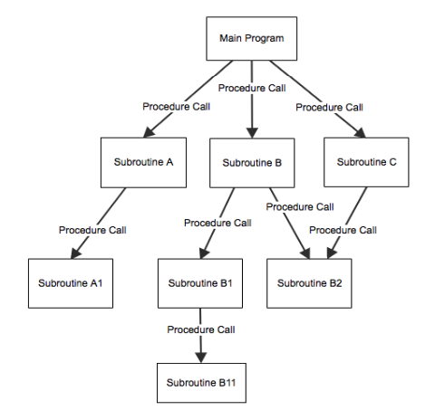

- Used with **procedural** programming languages as C.
- Each **subroutine** may have its own local variables; to access data out of its scope, data may be passed into the subroutines as parameters.
- This style is best suited for **computation-focused systems** and promotes modularity and function reuse.

---

#### Object-oriented systems

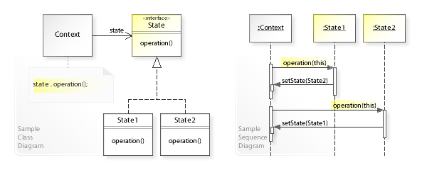

---

#### Object-oriented systems

- Systems to support real-world processes are commonly **complex problems** and require the use of **abstract data types** (e.g.: classes),

- Systems are composed of **objects** that are instances of certain classes. Objects interact with each other through the use of their **methods**.

- Our pieces of source code can be **named** using meaningful names in the domain context. However, not all situations will have easily identifiable classes.

- Use of **object-oriented languages**, such as C++, Java, C#.

---

#### Aspect-oriented systems

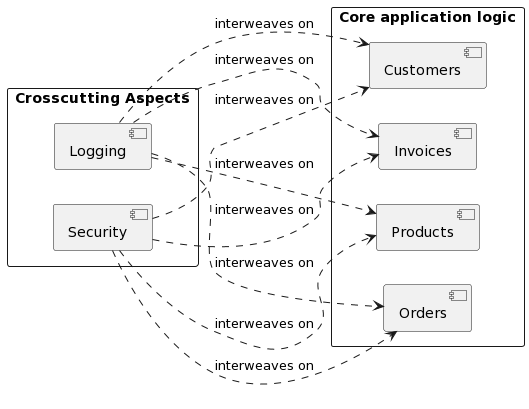

---

#### Aspect-oriented systems

- Aspect-oriented programming (AOP) enables to add behavior to existing code **without modifying** the code itself.

- Separation of **cross-cutting concerns**: logging, monitorization, security, internationalization, transaction management.

- So, instead of including these features in every required module, we include them in a special module that later is mixed with the production code in **compilation** time.

- This **interweaving** process is done by means of language extensions, such as AspectC++ or Java Spring.

---

#### Event-driven architectures

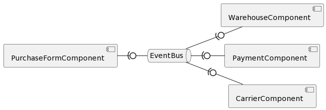

---

#### Event-driven architectures

- **Asynchronous** communication via an **event bus** (message channel).
  
- This follows the **event-driven programming paradigm**, in which functions take the form of event generators and even consumers.
  
- **Events** are signals, user inputs, commands, messages, or data.

- **Low coupling**: the event producers do not know anything about the consumers.

- **High efficiency**: events are published without waiting for the termination of any process.

- **Complexity**: race conditions and more difficult to debug.
  
<!--
---
#### EDA: *related patterns*

##### Command Query Responsibility Segregation (CQRS)

 - Different models to update and to read information from a datastore, so a command bus and query bus are needed.
 - Recommendable for handling high-performance applications

##### Event Sourcing (ES)
- Every change to the state of an application is captured in an event object and stored in the sequence they were applied
- This leads to a number of facilities, such as event replies or temporal queries.

-->

---

### Runtime behavior patterns

Under this umbrella, we consider the patterns that show components and connectors:

- Pipes and Filters
- Model View Controller
- Process control systems.

---
<!-- _class: lead -->

#### Pipes and filters

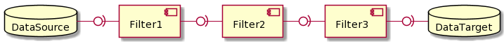

---

#### Pipes and filters

- Suitable for systems of data **flow processing**, compilers, unix pipelines, etc.
- Components (filters) **read** from an input source, **transform** data, and **write** to an output store by means of buffers (pipes)
- **Agreement** on the exchange data format and comms. protocol  
- Easy to **change** filters without altering the rest of the components.
- It enables **concurrent** execution and **unit testing** in an easy way.
- These systems do **not** provide any kind of **user interaction**
- They can suffer **backpressure**

---

#### Model View Controller (MVC)

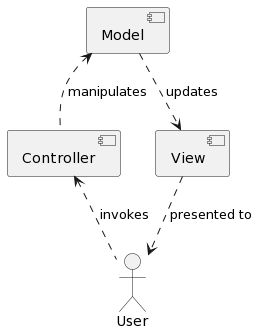

---

##### Separation of concerns

- **models** contain the data and the business logic
- **views** present data and the set of available actions for the user,
- **controllers** handle user events.

We can provide **multiple views** for the same model.

The most popular architecture style used on the **web**, and most common **web development frameworks**.

**Variants**: Model View Presenter, Model View ViewModel, Model View Update, Presentation-Abstraction-Control, etc.

---

#### Process Control Systems

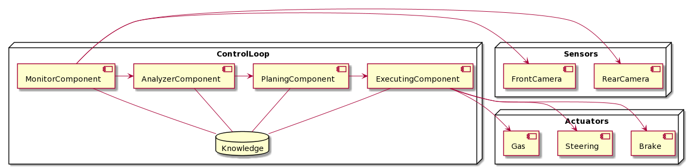

Feedforward control: MAPE-K structure

---

#### Process Control Systems

- Used for managing **processes** with impact on the **physical** world and video game development.
- **Feedback loop** is the most basic form of process control.  
  - a sensor monitoring an external measurement or data input,
  - a controller (running continuously) managing the system logic,
  - and an actuator in charge of manipulating the process.
- **Feedforward control**: processes in series in which information from an upstream process can be used to control a downstream process.

---

### Repository-based Systems

Modern software systems require sharing data among their components. These systems commonly use a data store to keep persistent the state of the components.

- Blackboard
- Share data architecture
- Layered architecture
- Clean architectures

---

#### Blackboard

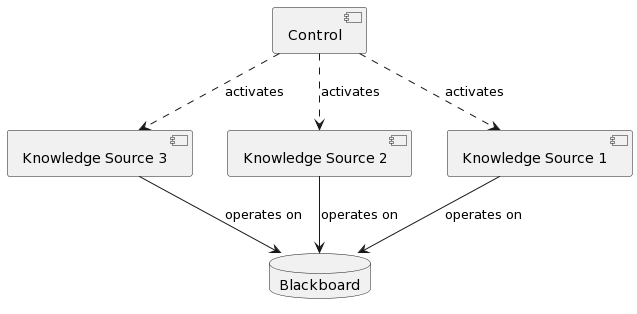

---

#### Blackboard

- Useful for complex problems (AI) for which **no deterministic** solution strategies are known: artificial vision, natural language processing, or voice recognition. This pattern does not provide warranties to find the right solution.

- **Knowledge sources** are subsystems that run algorithms that read outside information and solve part of the problem.

- The **blackboard** is a central data repository that aggregates data from the sources and provides approximate solutions that continually are getting better.

- The **control** component to manage tasks and check the work state.

---

#### Share data architecture

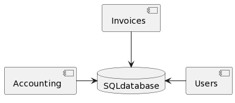

---

#### Share data architecture

- Data is often stored in a **centralized** repository, usually a database management system.
- The repository is in charge of maintaining **data consistency**.
- The software components are **independent** of each other, avoiding any coupling, and interact among themselves not directly, but through the data store.
- The components launch queries and transactions against the data repository.

---

#### Layered architecture

Linux architecture

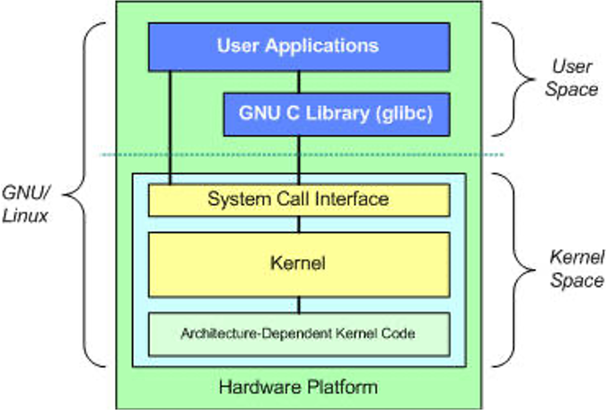

Virtual Box architecture

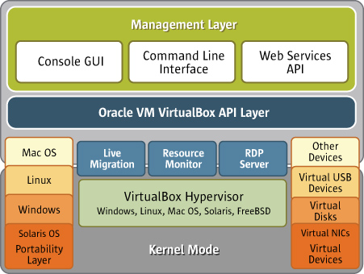

---

Three-layer

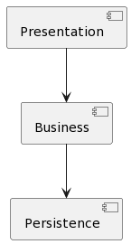

Three-layer

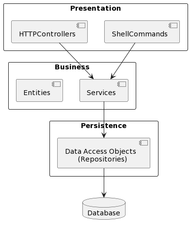

Three-layered + MVC

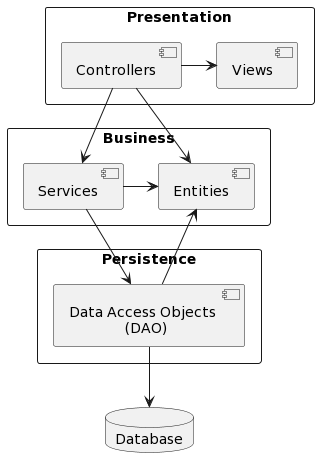

---

#### Layered architecture

- One of the most **widely used** architectural patterns.
- Divide the software into (relaxed/strict) **layers** so that each layer exposes an interface to be used from the above layers.
- A layer is a **conceptual separation** of the software, which may be composed of several modules.
- Easy layer **replaceability**
- Good **testability**
- This style can lead to the **sinkhole anti-pattern**
  
---

#### **Clean** architectures

**Hexagonal** architecture

**Hexagonal**/**Ports and adapter** pattern

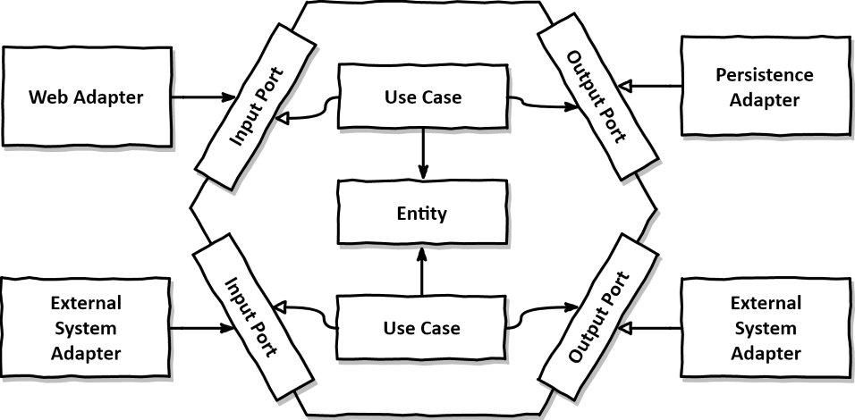

**Onion** architecture

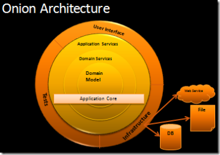

---

#### Clean architectures

- **Domain-driven design**:
  - Intensive usage of a common vocabulary for both the software documentation and source code.
  - Organization by domain rather than by technological capabilities.
  - Domain classes must be responsible for implementing the business logic, not only being mere data containers.

- **Dependency inversion**:
  - Domain model must not have dependencies with any kind of technology, infrastructure or external systems.

---

#### Clean architectures

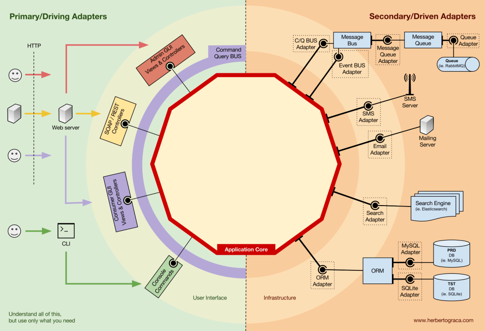

---
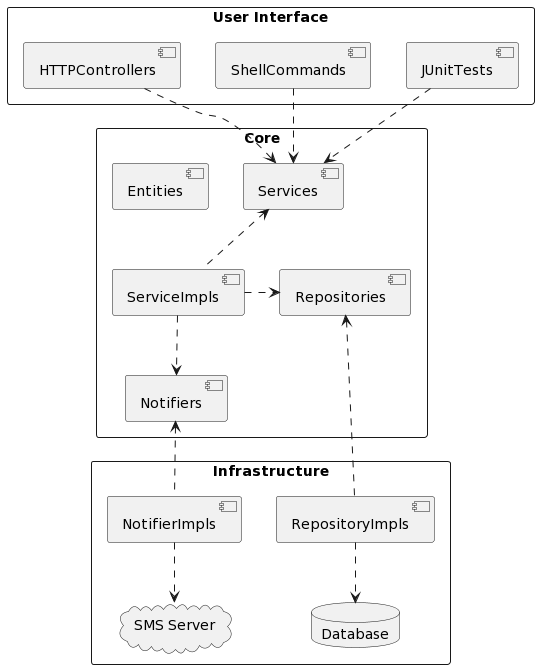

*Dependency diagram* of a Clean Architecture (DSS-style)

---

### Adaptable systems

Adaptable systems are those whose architectures can dynamically adapt to changing requirements. We consider the folllowing:

- Plugin architecture
- Metaprogramming systems

---

#### Plugin architecture

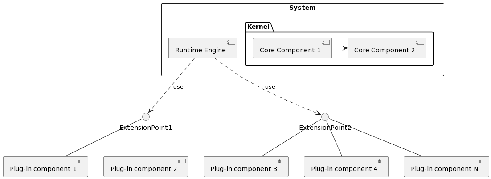

---

#### Plugin architecture

- a.k.a *microkernel architecture*.
  
- The **kernel** only provides the basic features, whereas the rest are provided by the external components (**plugins**).

- Enables **extending** our systems to provide new features initially not foreseen by the developers.

- The base system must include a **runtime** **engine** in charge registrating, removing, starting, and stoping the plugins.
  
- The global system may be affected by security vulnerabilities coming from external plugins.

- Used on IDEs, ERPs, LMSs, browsers, etc.

---

#### Metaprogramming systems

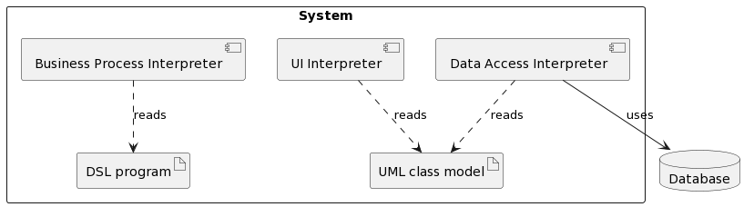

---

#### Metaprogramming systems

- Reflective programming or metaprogramming is the ability of a process to examine, introspect, and modify its own structure and behavior.
  
- Most programming languages support reflection.

- Systems able to adapt their behavior without changing  code.

- Related to Model-Driven Development (MDD): automatically generate code from a (visual/textual) model created with a general-purpose (UML/SysML) o Domain-Specific Language.
  - Non-technical expert users can write their own programs (or part of them) by using DSLs

---
<!-- _class: lead -->
<!-- paginate: false -->

## Architectural patterns for deployment

---
<!-- paginate: true -->

### Designing the deployment architecture

- Selecting the **hardware** instances (physical or virtualized) where software components will be deployed and run.
- Decide the **number** of nodes and their **characteristics**, namely: *CPU, memory, storage, and network bandwidth, among other features*.

---

#### Centralized architecture

- The most **simple** architecture for software deployment
  
- The software is installed on a single computer (laptop or desktop).
  
- Applications can be based on a command-line interface or on a graphical user interface.

- With portable languages, we can create OS-independent apps.

- **Good performance**: there is not any network delay.
  
- Software **updates** are more complicated to perform.

- Rarely operate in **isolation**.

---

#### Centralized architecture

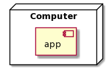

---

#### Peer to Peer (P2P) architecture

- **Distributed** application architecture that partitions tasks or workloads between peers.
- There is no main node, but all nodes are **equally privileged** and autonomous.
- This approach **avoids** having a single point of **failure**.
- It may be more complex to maintain the system **state**.
- Successfully used in s*ensor networks, collaborative systems, video conferencing systems, blockchain, file exchanging systems, etc*.

---

#### Peer to Peer (P2P) architecture

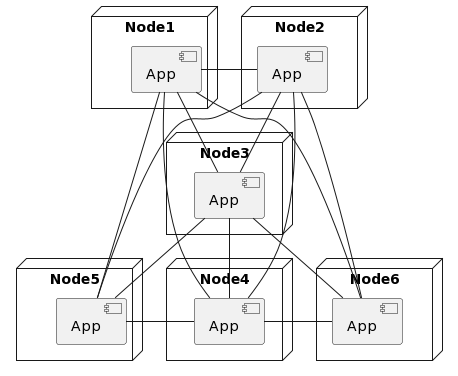

---

#### Master-slave architecture

- This pattern  promotes dividing the work in **identical subtasks** deployed on different nodes (slaves).
- The **main node** (master) is in charge of coordinating execution, collecting results and combining them.
- This enables **parallel computation** and improves **fault tolerance**.
- This deployment architecture can be suitable for process control systems, embedded systems, search systems, etc.

---

#### Master-slave architecture

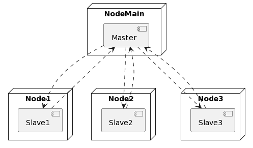

---

#### Client-server architecture

- Very common in **legacy** applications and the most recent **apps**.
- Systems are split into several **physical tiers**, so
- Typically, a client launches **requests** to the server that processes them and returns a **response** through the **network** protocol.  

- Common technologies are CORBA, RMI, **HTTP**, SOAP, REST, etc.

- **Easy software distribution**
  
- It exposes a **single point of failure** that must be protected.
  
- Unpredictable performance, because it depends on the network **quality of service**.

---

##### Client-server architecture (2-tiers)

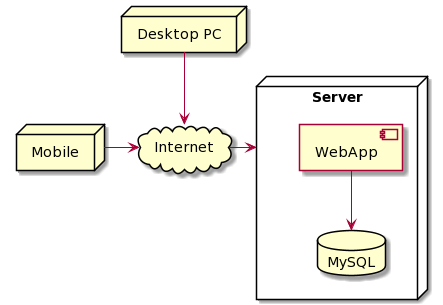
Classic architecture for web apps. With **vertical scaling**, we can cope with new demands by adding more power (CPU, memory, etc.)

---

##### Client-server architecture (4-tiers)

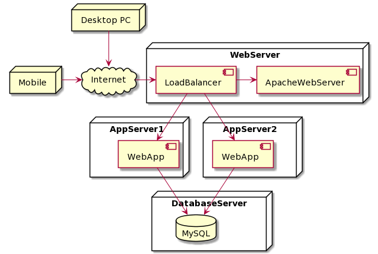

Architecture for high-demand environments with  **horizontal scaling** to increase resilience, fault tolerance, and performance.

---

#### Monoliths

- The previous systems can be considered **monoliths**: the app servers run the **same program** in all of them.

- They are relatively **easy to develop and deploy**.

- **No suitable for very big projects** with enormous workloads and lots of features developed by many functional areas.
  
- It forces the use of the **same technology stack** for the project lifetime, **hinders scaling** the application effectively,
  
- The code base may **grow** dramatically, slowing IDEs, making continuous deployment difficult, and intimidating new devolopers.

---

#### Microservices

- Martin Fowler defined **microservices** as *small, autonomous services that work together*.

- Promotes creating applications based on **independent services** written in **different languages** running on different **machines** and using separate **databases**.

- Microservices brought us **new problems** and a set of solutions in the form of **design patterns**, such as *Service Registration, Service Discovery, Circuit Breaker, API Composition, etc.*

---

#### Microservices

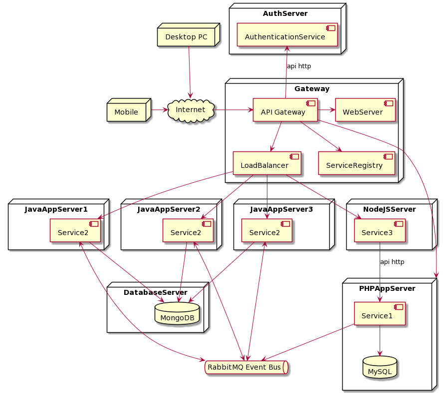

---
<!-- _class: lead -->
<!-- paginate: false -->

## Architectural patterns for software integration

---
<!-- paginate: true -->

### Interoperability

> _Interoperability is the degree to which two or more systems, products, or components can exchange information and use the information that has been exchanged._
>
> — ISO/IEC 25000

---

### System integration purposes

- Create new applications by combining existing ones (software mashups)
- Provide a unique, curated data repository by unifying data coming from heterogeneous sources;
- Maintain data consistency among different systems;
- Orchestrate business process deployed on different applications.

---

### Interoperability strategies

- Interoperability can be visualized from different dimensions:
  - **Organizational**: collaboration among different stakeholders involved.
  - **Semantic**: meaning of the exchanging data.
  - **Syntactic**: data formats and structure.

- From the syntactic interoperability perspective, we can distinguish some **integration styles**. These styles result from the application of the existing **architectural patterns** for single systems.

---

#### File transfer

- One application **generates** a data file (XML, JSON, CSV, or a binary file) which is later **consumed** by another application.
- Applications can be developed regardless of one another.
- They have only to **agree** with the format of the **file to exchange**.
- The import/export processes can be developed by using the **pipes and filters pattern**.

---

#### Shared database

- **To maintain data consistency among different systems**
  - Using the **same database** for the different applications.  
  - **Conflicts** may arise among the different development teams.
  - **Bottleneck** when multiple applications access the same data.
  - It is the **shared data pattern** but for independent systems.

- **To provide a unique, curated data repository**

  - Data warehouses (DWH) that unifies data coming from heterogeneous source for analytical purposes
  - The **pipes and filters pattern** is commonly used to create the integration process for populating DWHs.

---

#### Remote procedure call (RPC)

- Applications (probably created with different technologies) **expose** services that are **consumed** by other applications by issuing calls through a network.
  
- That is also called a **service-oriented architecture**, which shares the idea and the technology with the **microservices architecture**, but is targeted to different systems.

- There are two alternatives to enable RPC communication:
  - **Direct** connection: using SOAP WS, REST, gRPC, etc,
  - Indirect communication: using an **Enterprise Service Bus** (ESB) middleware, such as Open ESB, Mule ESB, etc.

---

#### Messaging

- It is an **event-driven architecture** for multiple systems.
- Applications communicate **asynchronously** with each other by producing and consuming messages to/from a message channel.
- The message channel can be implemented via messaging platforms such as ZeroMQ, RabbitMQ, and ActiveMQ, or with data distribution services for real-time systems, such as OpenDDS.  

---

# REFERENCES

- Mark Richards: Software Architecture Monday, <https://www.developertoarchitect.com/lessons/>
