## Índice

- [Principios de Diseño](#principios-de-diseño)
- [Patrones de Diseño](#patrones-de-diseño)

<!-- Source: principios.md -->
# DISEÑO DE SISTEMAS SOFTWARE


## INTRODUCCIÓN


### Problemáticas

- Variabilidad
- Acoplamiento
- Complejidad
- Robustez
- Reutilización
- Flexibilidad


### Principios

- Ocultación: OCP, ISP, LSP
- Cohesión: SRP
- Ortogonalidad: DIP


### Técnicas

- Refactoring
- Bibliotecas y frameworks
- Contratos
- Inyección de dependencias
- Patrones


### Paradigmas

- Estructurado (E. W. Dijsktra)
- Orientado a Objetos (O. J. Dahl & K. Nygaard)
- Funcional (J. McCarthy)
- Orientado a Aspectos (G. Kiczales)
- [Orientado a Datos](https://www.dataorienteddesign.com/dodbook/) (R. Fabian)


#### Preguntas

_¿De qué fecha data cada paradigma?_
_Ordenar cronológicamente_


#### Respuesta


_¿De qué fecha data cada paradigma?_

- Funcional (1958)
- Orientado a Objetos (1966)
- Estructurado (1968)
- Orientado a Aspectos (1997)
- Orientado a Datos (2018)


### Bloques

I. Principios de diseño OO
II. Patrones de diseño
III. Arquitectura de software


# PRINCIPIOS DE DISEÑO

## Orientado a objetos


<div class="cols">
<div>

## Casos prácticos

Caso 1. Identificadores
Caso 2. Framework de pruebas unitarias
Caso 3. Caballeros de la mesa redonda
Caso 4. Figuras geométricas

</div>
<div>


## Conceptos teóricos

- Bibliotecas y frameworks
- Inyección de dependencias
- Reutilización
- Principios SOLID

</div>
</div>


## CASO PRÁCTICO 1

### Identificadores


¿Cómo diseñar la identificación de los empleados de una empresa?


### Versión inicial: Identificadores v0.1

<div class="cols">
<div>

```java
class Empleado implements Comparable<Empleado> {
  private final int dni;

  Empleado(String dni) {
    this.dni = Integer.parseInt(dni);
  }

  public int getDni() {
    return dni;
  }

  @Override
  public String toString() {
    return Integer.toString(dni);
  }
```

</div>
<div>

```java
  @Override
  public int compareTo(Empleado otro) {
    return Integer.compare(this.dni,
                           otro.getDni());
  }

  @Override
  public boolean equals(Object o) {
    if (this == o) return true;
    if (!(o instanceof Empleado otro))
      return false;
    return dni == otro.dni;
  }

  @Override
  public int hashCode() {
    return Integer.hashCode(dni);
  }
}
```

</div>
</div>


#### Nuevos requisitos:

- El Real Decreto 338/1990 regula el uso de NIFs en lugar de DNIs. ¡Hay que cambiar toda la implementación!

### Implementación alternativa: Identificadores v0.2

<div class="cols">
<div>

```java
class Empleado implements Comparable<Empleado> {
  private final String nif;

  Empleado(String nif) {
    this.nif = nif;
  }

  public String getNif() {
    return nif;
  }

  @Override
  public String toString() {
    return nif;
  }
```

</div>
<div>

```java
  @Override
  public int compareTo(Empleado otro) {
    return this.nif.compareTo(otro.getNif());
  }

  @Override
  public boolean equals(Object o) {
    if (this == o) return true;
    if (!(o instanceof Empleado otro)) return false;
    return nif.equals(otro.nif);
  }

  @Override
  public int hashCode() {
    return nif.hashCode();
  }
}
```

</div>
</div>


#### Críticas:

- __Flexibilidad__ / __Reutilización__: Posiblemente haya más situaciones (algunas futuras) donde hagan falta _identificadores_ que incluso pueden cambiar.
- Ejemplo: UUID, números de la seguridad social, tarjetas de identidad, números de cuenta corriente, IBAN, etc.

### Hacemos refactoring: patrón _handler_

- Manejo de _identificadores_ de forma independiente de la implementación del objeto identificado.

- Cambio fácil de implementación de los identificadores (`int`, `String`, etc.) hacia cualquier tipo básico o clase primitiva, sencilla o compuesta.


## Diseño de un Handler

<div class="cols">
<div>


<details>
<summary>PlantUML source</summary>

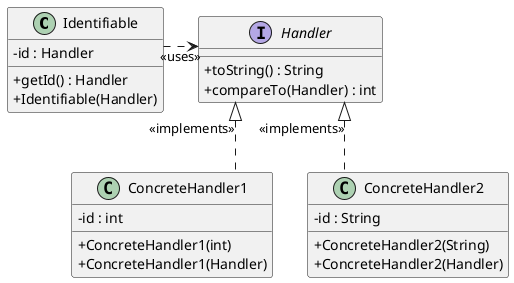

</details>

</div>
<div>

- __Identifiable__: Clase cliente que necesita identificar a sus objetos a través de algún atributo identificador

- __Handler__: Interfaz para declarar los identificadores de los objetos de la clase `Identifiable`

- __ConcreteHandler__: Implementación concreta de la interfaz `Handler`

</div>
</div>


<div class="cols">
<div>

### Implementación del diseño en Java

```java
interface Handler<T extends Comparable<? super T>>
    extends Comparable<Handler<T>> {
  T getId();

  @Override
  public boolean equals(Object o);

  @Override
  default int compareTo(Handler<T> otro) {
    return getId().compareTo(otro.getId());
  }
}
```

</div>
<div>

```java
final class IdentificadorNumerico
    implements Handler<Integer> {
  private final Integer id;

  IdentificadorNumerico(String id) {
    this.id = Integer.valueOf(id);
  }

  @Override
  public boolean equals(Object o) {
    if (this == o) return true;
    if (!(o instanceof IdentificadorNumerico otro))
      return false;
    return id.equals(otro.id);
  }

  @Override
  public Integer getId() {
    return id;
  }

  @Override
  public String toString() {
    return id.toString();
  }
}
```

</div>
</div>


### Conceptos de diseño

- __Responsabilidad única__: La lógica de generación de identificadores (ej. limpiar caracteres, validar formato) debe estar aislada de la lógica de negocio principal.

- __Acoplamiento__ (bajo): El sistema principal debe usar interfaces para generar IDs, sin depender de si se usa un UUID, una secuencia o un algoritmo custom.

- __Cohesión__ (alta): Agrupar métodos relacionados con la manipulación de IDs en un único componente.

- __Encapsulamiento__: Ocultar los detalles algorítmicos de la construcción del identificador tras los métodos públicos.

- __Reutilización y flexibilidad__: Permitir la reutilización del componente de identificación en otros sistemas y facilitar la adaptación a futuros cambios.


### Implementación en los lenguajes

#### Java: Identificadores con `java.lang.Comparable`

`Comparable<T>` es una interfaz que define el orden natural entre objetos del mismo tipo. La implementan `String`, `File`, `Date`, etc. y las _clases de envoltura_ del JDK (i.e. `Integer`, `Long`, etc.)

__Método de la interfaz__:

```java
  public int compareTo(T o)
```

El tipo `T` garantiza seguridad de tipos: un `Comparable<Empleado>` solo se compara con `Empleado`, evitando casts y errores en tiempo de ejecución.


__Invariantes:__ las debe asegurar cualquier implementación de `compareTo`

`sgn(x.compareTo(y)) = -sgn(y.compareTo(x))`

`(x.compareTo(y)>0 and y.compareTo(z)>0)` $\Rightarrow$ `x.compareTo(z)>0`

`x.compareTo(y)=0` $\Rightarrow$ `sgn(x.compareTo(z))=sgn(y.compareTo(z))` $\forall$ `z`

__Consistencia con `equals`__: recomendable pero no exigible

`(x.compareTo(y)=0)` $\Leftrightarrow$ `(x.equals(y))`

> [!NOTE]
> En Java no se puede definir un método `default` en una `interface` que sea override‑equivalent a un método público de Object (como equals, hashCode, toString). Puedes declararlo de forma abstracta en la interfaz, pero no darle implementación default.


#### C++: Comparación de identificadores

Cómo implementar la interfaz de comparación de un Handler en C++

¿Tienen sentido las siguientes implementaciones?

```c++
   static int compare(const Handler&, const Handler&);
   int compareTo(const Handler&); // member function
```

Ver __[stackoverflow](https://stackoverflow.com/questions/20005392/is-there-a-compareto-method-in-c-similar-to-java-where-you-can-use-opera)__


__Sobrecarga de operadores en C++__:

```c++
template <typename T>
struct Handler {
    T id;
    explicit Handler(T v) : id(std::move(v)) {}
    bool operator==(const Handler& other) const = default;
    auto operator<=>(const Handler& other) const = default;
};
using NumericHandler = Handler<int>;
using StringHandler  = Handler<std::string>;
```

```c++
int main() {
    StringHandler a{"EMP-001"};
    StringHandler b{"EMP-002"};
    auto ord = (a <=> b);  // OK
    NumericHandler c{123};
    // bool same = (a == c);  // ERROR: tipos distintos
}
```


<div class="cols">
<div>

## Reutilización y flexibilidad

- __Reutilización__: Construir software fácil de reutilizar sin tener que cambiar los módulos ya escritos (afecta a la fase de __desarrollo__)
- __Flexibilidad__: Adaptarse a cambios de requisitos y construir software fácil de cambiar (afecta a la fase de __mantenimiento adaptativo__)

</div>
<div>

### El árbol de la calidad del software


</div>
</div>


## CASO PRÁCTICO 2

### Pruebas unitarias


### jUnit: Framework de pruebas unitarias

- JUnit es un framework en Java que sirve para diseñar, construir y ejecutar __pruebas unitarias__
- Una prueba unitaria comprueba la corrección de un _módulo_ de software en cuanto a funcionalidades que ofrece.
- En el caso de Java, las pruebas unitarias comprueban la corrección de cada uno de los métodos de _cada clase_.


¿Por qué? ¿Cómo funciona?


### ¿Cómo se probaba `Saludo.java` sin bibliotecas de pruebas unitarias?

<div class="cols">
<div>

```java
class Saludo {
  /**
  * Imprime "Hola Mundo!"
  */
  void saludar() {
    System.out.println("Hola Mundo!");
  }

  /**
  * Imprime un mensaje
  */
  void saludar(String mensaje) {
    System.out.println(mensaje);
  }

```

</div>
<div>

Incluir un método `main` que pruebe la funcionalidad de la clase:

```java
  /**
  * Tests
  */
  public static void main( String[] args ) {
    Saludo saludo1 = new Saludo();
    saludo1.saludar();

    Saludo saludo2 = new Saludo("Hola caracola!");
    saludo2.saludar();
  }
}
```

</div>
</div>


#### Pegas

- Cuanto más grande sea la interfaz de la clase, mayor será el `main`

- El tamaño del código de la clase crece por las pruebas

- Poco fiable, porque `main` forma parte de la misma clase y tiene acceso a los elementos privados

- Difícil de automatizar las pruebas, incluso pasando argumentos a `main`


### Ejemplo: software _cliente_ del framework jUnit

#### Caso de prueba con jUnit 4

```java
import org.junit.*;
import static org.junit.Assert.*;

public class SaludoTest {
  public static void main(String args[]) {
    junit.textui.TestRunner.run(SaludoTest.class);
  }
  @Test
  public void saludar() {
    Saludo hola = new Saludo();
    assert( hola!=null );
    assertEquals("Hola Mundo!", hola.saludar() );
  }
}
```


#### Ejecución de los tests:

```java
import org.junit.runner.JUnitCore;
import org.junit.runner.Result;
import org.junit.runner.notification.Failure;

public class MyTestRunner {
  public static void main(String[] args) {
    Result result = JUnitCore.runClasses(SaludoTest.class);
    for (Failure failure : result.getFailures()) {
      System.out.println(failure.toString());
    }
  }
}
```


¿De qué están hechas las anotaciones como `@Test`?


<div class="cols">
<div>

#### Caso de prueba con jUnit 3

Veamos una versión anterior de jUnit, que expone más claramente las _tripas_ del framework

```java
import junit.framework.TestCase;
import junit.framework.Assert;

public class SaludoTest extends TestCase {
    public SaludoTest(String nombre) {
      super(nombre);
    }
    public void testSaludar() {
      Saludo hola = new Saludo();
      assert( hola!=null );
      assertEquals("Hola Mundo!", hola.saludar() );
    }
}
```

</div>
<div>

### Diseño del framework jUnit

<!--
 
-->


<details>
<summary>PlantUML source</summary>

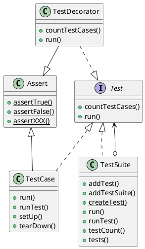

</details>

</div>
</div>


### Ejemplo: aplicación de comercio electrónico

Diseño de una aplicación de comercio electrónico:

- `ShoppingCart` - carrito de la compra
- `CreditCard` - tarjeta de crédito
- `Product`- artículos
- Etc.

Diseño de pruebas unitarias de `ShoppingCart` para:

- Probar carrito de la compra (añadir/eliminar artículos)
- Probar validación de tarjetas de crédito
- Probar manejo de varias monedas
- Etc.


<div class="cols">
<div>

#### Utilización del framework jUnit

<!--
 
-->


<details>
<summary>PlantUML source</summary>

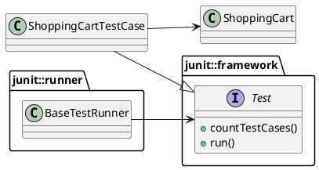

</details>

</div>
<div>

#### ShoppingCart

```java
public class ShoppingCart {
  private ArrayList items;
  public ShoppingCart() { ... }
  public double getBalance() { ... }
  public void addItem(Product p) { ... }
  public void removeItem(Product p)
      throws ProductNotFoundException { ... }
  public int getItemCount() { ... }
  public void empty() { ... }
  public boolean isEmpty() { ... }
}
```

</div>
</div>


#### ShoppingCartTestCase con jUnit 3

<div class="cols">
<div>

```java
import junit.framework.TestCase;
import junit.framework.TestSuite;
import junit.framework.Assert;

public class ShoppingCartTest extends TestCase {
  private ShoppingCart bookCart;
  private Product defaultBook;
  //...
  protected void setUp() {
      bookCart = new ShoppingCart();
      defaultBook = new Product("Extreme Programming", 23.95);
      bookCart.addItem(defaultBook);
  }
  protected void tearDown() {
      bookCart = null;
  }
  public void testEmpty() {
      bookCart.empty();
      assertTrue(bookCart.isEmpty());
  }
  public void testProductAdd() {
      Product book = new Product("Refactoring", 53.95);
      bookCart.addItem(book);
      double expectedBalance = defaultBook.getPrice() + book.getPrice();
      assertEquals(expectedBalance, bookCart.getBalance(), 0.0);
      assertEquals(2, bookCart.getItemCount());
  }
```

</div>
<div>

```java
  public void testProductRemove() throws ProductNotFoundException {
      bookCart.removeItem(defaultBook);
      assertEquals(0, bookCart.getItemCount());
      assertEquals(0.0, bookCart.getBalance(), 0.0);
  }
  public void testProductNotFound() {
      try {
          Product book = new Product("Ender's Game", 4.95);
          bookCart.removeItem(book);
          fail("Should raise a ProductNotFoundException");
      } catch(ProductNotFoundException success) {
          ...
      }
  }
  public static Test suite() {
      // Use reflection to add all testXXX() methods
         TestSuite suite = new TestSuite(ShoppingCartTest.class);
      // Alternatively, but prone to error when adding more
      // test case methods...
      // TestSuite suite = new TestSuite();
      // suite.addTest(new ShoppingCartTest("testProductAdd"));
      // suite.addTest(new ShoppingCartTest("testEmpty"));
      // suite.addTest(new ShoppingCartTest("testProductRemove"));
      // suite.addTest(new ShoppingCartTestCase("testProductNotFound"));
         return suite;
  }
}
```

</div>
</div>


Podemos agrupar varios casos de prueba en una misma _suite_:

```java
import junit.framework.Test;
import junit.framework.TestSuite;
import org.junit.runner.JUnitCore;
import org.junit.runner.Result;
import org.junit.runner.notification.Failure;

public class EcommerceTestSuite extends TestSuite {
    //...
    public static Test suite() {
        TestSuite suite = new TestSuite();
        suite.addTest(ShoppingCartTest.suite());
        return suite;
    }
}

public class MyTestRunner {
  public static void main(String[] args) {
    Result result = JUnitCore.runClasses(EcommerceTestSuite.class);
    for (Failure failure : result.getFailures()) {
      System.out.println(failure.toString());
    }
  }
}
```


#### ShoppingCartTestCase con jUnit 4

<div class="cols">
<div>

```java
import static org.junit.Assert.assertEquals;
import static org.junit.Assert.fail;

import org.junit.After;
import org.junit.Before;
import org.junit.Test;

public class ShoppingCartTest {
  private ShoppingCart bookCart;
  private Product defaultBook;
  //...
  @Before
  protected void setUp() {
      bookCart = new ShoppingCart();
      defaultBook = new Product("Extreme Programming", 23.95);
      bookCart.addItem(defaultBook);
  }
  @After
  protected void tearDown() {
      bookCart = null;
  }
```

</div>
<div>

```java
  @Test
  public void testEmpty() {
      bookCart.empty();
      assertTrue(bookCart.isEmpty());
  }
  @Test
  public void testProductAdd() {
      Product book = new Product("Refactoring", 53.95);
      bookCart.addItem(book);
      double expectedBalance = defaultBook.getPrice() + book.getPrice();
      assertEquals(expectedBalance, bookCart.getBalance(), 0.0);
      assertEquals(2, bookCart.getItemCount());
  }
  @Test
  public void testProductRemove() {
      bookCart.removeItem(defaultBook);
      assertEquals(0, bookCart.getItemCount());
      assertEquals(0.0, bookCart.getBalance(), 0.0);
  }
  @Test(expected = ProductNotFoundException.class)
  public void testProductNotFound() {
      Product book = new Product("Ender's Game", 4.95);
      bookCart.removeItem(book);
      fail("Should raise a ProductNotFoundException");
  }
}
```

</div>
</div>


#### EcommerceTestSuite con jUnit 3

```java
  public class EcommerceTestSuite extends TestSuite {
      //...
      public static Test suite() {
          TestSuite suite = new TestSuite();
          suite.addTest(ShoppingCartTest.suite());
          suite.addTest(CreditCardTest.suite());
          // etc.
          return suite;
      }
  }
```

#### EcommerceTestSuite con jUnit 4

```java
  @RunWith(Suite.class)
  @SuiteClasses({ ShoppingCartTest.class, CreditCardTest.class })
  public class EcommerceTestSuite {
      //...
  }
```


#### Pregunta

¿Qué hemos conseguido con las anotaciones `@Test` del JDK $\geq$ 1.5?


¿Qué hemos conseguido con las anotaciones `@Test`?

#### Respuesta:

- No necesitar de la incómoda herencia (i.e. mecanismo de implementación)


### Ejercicio propuesto: CreditCardTest

Diseñar y codificar una suite de casos de prueba unitaria para `CreditCard` usando jUnit versión 4.


### Arquitectura del framework jUnit

<div class="cols">
<div>


<details>
<summary>PlantUML source</summary>

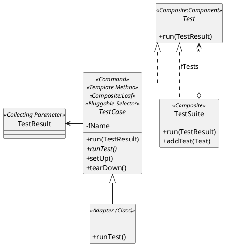

</details>

<!--
 
-->

</div>
<div>

En la arquitectura del framework se observan diversos patrones:

- Composite
- Command
- Adapter
- Factory
- Decorator
- etc.

</div>
</div>


## Bibliotecas y frameworks

#### Flujo de control en una biblioteca


#### Flujo de control en un framework


### Frameworks

#### Definición de *framework*

> Colección de clases e interfaces que cooperan para formar un diseño reutilizable de un tipo específico de software
>
> –– [E. Gamma et al.](bibliografia.html#gamma)

- El framework proporciona unas guías arquitectónicas (diseño empaquetado) para dividir el diseño en clases abstractas y definir sus _responsabilidades_ y _colaboraciones_.
- El framework se debe personalizar definiendo subclases y combinando instancias, o bien configurando valores que definen el comportamiento por defecto


### Principios de diseño de un framework OO

- Datos encapsulados
- Interfaces y clases abstractas
- Métodos polimórficos
- Delegación

### Herramientas de diseño OO

- __Patrones__: elementos reutilizables de diseño
- __Frameworks__: colecciones de patrones abstractos a aplicar


### Framework vs. biblioteca

- API orientado a objetos vs. API generalmente funcional
- Flujo de control invertido
- Programador _cliente_ (código específico) vs. programador de _API_ (código reutilizable)


### Principios y técnicas de un framework

- __Abstracción__
  - Clases y componentes abstractos
  - Interfaces abiertas
  - Uso de patrones de diseño
  - Componentes de un dominio específico

- Máxima __cohesión__, mínimo __acoplamiento__
  - Minimizar dependencias: Una clase A presenta una dependencia con otra clase B (A $\rightarrow$ B) si la primera usa una instancia de la segunda.
  - Cuando no se pueden eliminar las dependencias, mantener las abstractas e __inyectar__ las concretas.


> Coupling is the enemy of change, because it links together things that must change in parallel
>
> D. Thomas & A. Hunt, [The Pragmatic Programmer](https://pragprog.com/titles/tpp20/the-pragmatic-programmer-20th-anniversary-edition/), 20th Anniversary Edition, 2019


#### Inyección de dependencias

Una clase o módulo no debería configurar sus dependencias estáticamente, sino ser configurada desde fuera


## CASO PRÁCTICO 3

### Caballeros de la mesa redonda


## Ejemplo: tomado de [Spring in Action](bibliografia.html#spring)


Añadir pruebas unitarias al programa siguiente:

```java
public class KnightOfTheRoundTable {
  private String name;
  private HolyGrailQuest quest;

  public KnightOfTheRoundTable(String name) {
    this.name = name;
    quest = new HolyGrailQuest();
  }
  public HolyGrail embarkOnQuest()
      throws GrailNotFoundException {
    return quest.embark();
  }
}
```


```java
public class HolyGrailQuest {
  public HolyGrailQuest() { /*...*/ }

  public HolyGrail embark() throws GrailNotFoundException {
    HolyGrail grail = null;
    // Look for grail ...
    return grail;
  }

}
```


### Diseño de pruebas con jUnit 3


¿Dónde está el acoplamiento?

```java
import junit.framework.TestCase;

public class KnightOfTheRoundTableTest extends TestCase {
  public void testEmbarkOnQuest() throws GrailNotFoundException {
    KnightOfTheRoundTable knight =
        new KnightOfTheRoundTable("CruzadoMagico");
    HolyGrail grail = knight.embarkOnQuest();
    assertNotNull(grail);
    assertTrue(grail.isHoly());
  }
}
```


### Diagrama de clases


¿Dónde está el acoplamiento?


<details>
<summary>PlantUML source</summary>

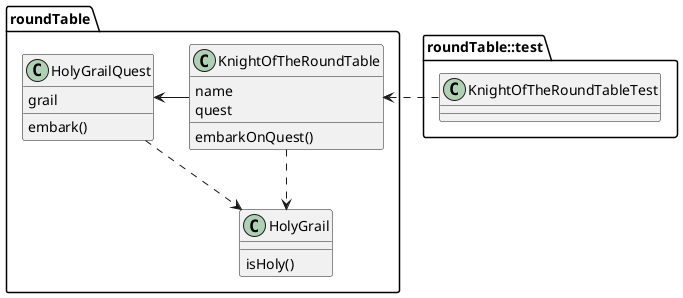

</details>


### Acoplamiento


No deseable


<details>
<summary>PlantUML source</summary>

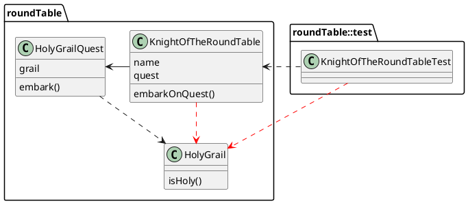

</details>


#### Pegas:

- Instanciación de `HolyGrail`

- Cada vez que se prueba `KnightOfTheRoundTable`, también se prueba `HolyGrailQuest`.

- No se puede pedir a `HolyGrailQuest` que se comporte de otra forma (v.g. devolver null o elevar una excepción)


Ocultar la implementación detrás de una interfaz:

```java
public interface Knight {
  Object embarkOnQuest() throws QuestFailedException;
}

public class KnightOfTheRoundTable implements Knight {
  private String name;
  private Quest quest;

  public KnightOfTheRoundTable(String name) {
    this.name = name;
    quest = new HolyGrailQuest();
  }
  public Object embarkOnQuest() throws QuestFailedException {
    return quest.embark();
  }
}
```


```java
public interface Quest {
  abstract Object embark()
    throws QuestFailedException;
}

public class HolyGrailQuest implements Quest {
  public HolyGrailQuest() { /*...*/ }
  public Object embark() throws QuestFailedException {
    // Do whatever it means to embark on a quest
    return new HolyGrail();
  }
}
```


#### Dependencias


<details>
<summary>PlantUML source</summary>

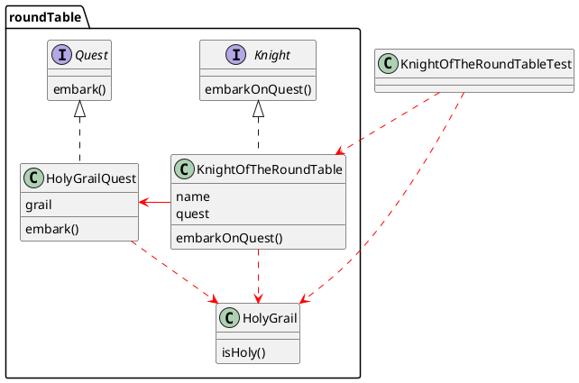

</details>


#### Pegas:

- El `KnightOfTheRoundTable` aún depende de un tipo específico de `Quest` (i.e. `HolyGrailQuest`) obtenido mediante `new`


¿Debe ser el caballero responsable de obtener un desafío?


```java
public class KnightOfTheRoundTable implements Knight {
  private String name;
  private Quest quest;

  public KnightOfTheRoundTable(String name) {
    this.name = name;
  }
  public Object embarkOnQuest() throws QuestFailedException {
    return quest.embark();
  }
  public void setQuest(Quest quest) {
    this.quest = quest;
  }
}
```


- El caballero sólo sabe del desafío a través de su interfaz `Quest`.

- Puede asignársele cualquier implementación de `Quest`
 (`HolyGrailQuest`, `KillDragonQuest`, etc.)


<details>
<summary>PlantUML source</summary>

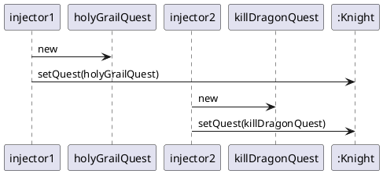

</details>

<!--

-->


- Parece que no hay dependencia entre `KnightOfTheRoundTable` y `HolyGrail` porque `embark()` se ha definido como que devuelve un `Object`

Ejercicio: Discutir el tipo de retorno `Object` de `embarkOnQuest`:

- Puede provocar `ClassCastException`
- Solución propuesta: rediseñar la interfaz `Quest`

<!--
## Inyección de dependencias


-->


### Inversión de control

Es la base de la inyección de dependencias

> The question is: _what aspect of control are they inverting?_ [...] Early __user interfaces__ were controlled by the application program. You would have a sequence of commands like "Enter name", "enter address"; your program would drive the prompts and pick up a response to each one. With __graphical__ (or even screen based) UIs the UI framework would contain this main loop and your program instead provided event handlers for the various fields on the screen. The main control of the program was inverted, moved away from you to the framework.
>
> –– Martin Fowler, [IoC containers and the DI pattern](http://martinfowler.com/articles/injection.html) [1]

[1] http://martinfowler.com/articles/injection.html


#### IoC–Inversion of Control / DI–Dependency Injection

- Una aplicación está compuesta por dos o más clases que colaboran.
- Los objetos deben recibir las dependencias en su creación, por parte de una entidad externa o __contenedor__ que los coordina.
- IoC = Inversión de la responsabilidad de cómo un objeto obtiene referencias a los objetos con los que colabora
- Ventaja = __bajo acoplamiento__: un objeto sólo sabe de sus dependencias por su _interfaz_, no por su _implementación_, ni por cómo fueron instanciados.
- Entonces la dependencia puede cambiarse por una implementación distinta (incluso en __tiempo de ejecución__)
- _Hollywood Principle: Don't call us, we'll call you"._


### Factorías

Una factoría proporciona un mecanismo de inyección de dependencias, visto desde el lado opuesto (los clientes adquieren las dependencias, no se les inyecta)

Ejemplo: [Spring FactoryBean](http://www.baeldung.com/spring-factorybean)


## Discusión sobre la reutilización

> We most likely would have been better off not attempting to create a reusable function in the first place
>
> –– Roger Sessions, [The Misuse of Reuse](http://simplearchitectures.blogspot.com.es/2012/07/misuse-of-reuse.html) [2]

[2] http://simplearchitectures.blogspot.com.es/2012/07/misuse-of-reuse.html


### Factorizar una función


### Ventajas (supuestas) de reutilizar:

__Ahorro__: Si $\exists$ $s$ sistemas $\wedge ~ coste(Function~1) = c$ $\Rightarrow$ ahorro = $c \times (s-1)$


### Amenazas (reales) a la reutilización:


- Realmente el ahorro depende de la __complejidad__. Y muchas veces, la complejidad de la función está exponencialmente relacionada con el número de sistemas.
- Con un único punto de fallo, si `Function 1` falla, todos los sistemas pueden fallar a la vez.
- La seguridad es inversamente proporcional a la complejidad del sistema.
<!--
 - Se incrementan los costes de llevar los sistemas a la nube.
-->


### Conclusión sobre la reutilización

- No crear funciones reutilizables en primer lugar

- Aplicar el principio __YAGNI__: __You Ain't Gonna Need It__


## CASO PRÁCTICO 4

### Figuras geométricas


## Principios SOLID

Los principios SOLID de [Uncle Bob Martin](https://en.wikipedia.org/wiki/SOLID_(object-oriented_design)) nos dicen:

- Cómo organizar en __módulos__ (en OO, __clases__) las estructuras de datos y las funciones
- Cómo deben quedar _interconectadas_ las clases (vía __dependencias__)

El objetivo de SOLID es crear estructuras software de nivel intermedio que sean:

- _flexibles_: tolerantes a los cambios
- _poco complejas_: fáciles de comprender
- _reutilizables_: la base de componentes útiles para muchos sistemas software

En C++: [Breaking Dependencies: The SOLID Principles](https://www.youtube.com/watch?v=Ntraj80qN2k) by Klaus Iglberger


## Principio de responsabilidad única

### SRP: *Single responsibility Principle*

> A class should have only one reason to change
> –– Bob Martin

- Una clase que modela múltiples aspectos genera acoplamiento entre los distintos aspectos
- Un cambio en algún aspecto obligará a cambios accidentales en los clientes que no dependen de dicho aspecto

SRP es lo mismo que el principio de __cohesión__ de [DeMarco](bibliografia.html#demarco)


<!--
**Notes**

 Los módulos enmarañados que nunca cambian no son problemáticos
-->

SRP es aplicación directa de la [ley de Conway](http://www.melconway.com/Home/Conways_Law.html):
> Any organization that designs a system (...) will produce a design whose structure is a copy of the organization's communication structure.
> –– M. Conway, _Datamation_, April 1968

- Cuando se diseña software, hace falta conocer los grupos/equipos/roles a los que éste sirve, y dividir el sistema en componentes separados, de forma similar a como estos grupos de personas se comunican normalmente en la vida real.

- Es necesario tener conocimiento del __dominio__ para poder dividir bien las responsabilidades

- Tiene que ver con la __variabilidad__ de los requisitos


### Ejemplo: Shapes versión 1 en Java

```java
package shapes;

interface Shape {
  double area();
  void draw();
}

class Point {
  double getX() {...}
  double getY() {...}
}

abstract class Polygon implements Shape {
  Point getVertex(index i) {...}
  void draw() {...}
  String toString() {...}
}

class Triangle extends Polygon {
  double area() {...}
}
abstract class RectParallelogram extends Polygon {
  double area() {...}
}
```


```java
class Square extends RectParallelogram {...}

class Rectangle extends RectParallelogram {...}

abstract class ClosedCurve implements Shape {...}

class Circle extends ClosedCurve {
  double getRadius() {...}
  Point getCenter() {...}
  double area() {...}
  void draw() {...}
  String toString() {...}
}

class Ellipse extends ClosedCurve {
  double getApogeeRadius() {...}
  double getPerigeeRadius() {...}
  Point getFocus1() {...}
  Point getFocus2() {...}
  Point getCenter() {...}
  double area() {...}
  void draw() {...}
  String toString() {...}
}
```


#### Preguntas

- ¿Cuántas responsabilidades tienen las clases que implementan la interfaz `Shape`?
- ¿Cuáles son estas responsabilidades?
- ¿Qué parte no cumple SRP en el ejemplo?


#### Respuestas

- Dos responsabilidades: geometría computacional + dibujo en pantalla
- Todas las figuras tienen métodos `draw` y `toString` (dibujar en pantalla) además del método `area` que calcula el área (geometría computacional) $\rightarrow$ Violación del SRP

#### Solución

Patrón de diseño __Visitor__


### Ejercicio

- Buscar información de los patrones _ActiveRecord_ y _Data Access Object (DAO)_.
- Discutir si cumplen o violan el SRP.

<!--
**Notes**

En general, ActiveRecord tiene la responsabilidad de modelar los datos en la base de datos, proporcionar una interfaz para acceder y manipular esos datos, y también puede incluir la lógica de negocio necesaria para trabajar con los datos.

Desde una perspectiva del principio de responsabilidad única (SRP), ActiveRecord no cumple completamente con este principio porque tiene varias responsabilidades. Específicamente, ActiveRecord tiene la responsabilidad de:

Representar y manipular datos en la base de datos
Proporcionar una interfaz para acceder y manipular esos datos
Incluir la lógica de negocio necesaria para trabajar con los datos
Sin embargo, a menudo se considera que ActiveRecord sigue una variante del principio de responsabilidad única, llamada "Principio de responsabilidad única de dominio" (Single Responsibility Principle of Domain, en inglés), que establece que una clase debe tener una única responsabilidad dentro del dominio de la aplicación. En este sentido, ActiveRecord tiene la responsabilidad de modelar los datos dentro del dominio de la aplicación.

El patrón Data Access Object (DAO) es un patrón de diseño de software que se utiliza comúnmente en el desarrollo de aplicaciones para separar la lógica de negocio de la lógica de acceso a datos.

El objetivo principal del patrón DAO es proporcionar una interfaz unificada para acceder a los datos desde una variedad de fuentes de datos, como una base de datos, un archivo o un servicio web, entre otros. La clase DAO encapsula la lógica de acceso a datos y proporciona métodos para realizar operaciones CRUD (Crear, Leer, Actualizar y Eliminar) en la fuente de datos correspondiente.

Desde una perspectiva del principio de responsabilidad única (SRP), el patrón DAO cumple con este principio. Esto se debe a que la clase DAO tiene una única responsabilidad, que es la de encapsular la lógica de acceso a datos y proporcionar una interfaz unificada para acceder a los datos. La lógica de negocio se encuentra en otra clase o conjunto de clases, lo que permite separar las responsabilidades y facilita la reutilización del código.
-->


### Example: Circle class

```cpp
class Circle
{
  public:
    explicit Circle (double rad )
      : radius { rad }
      , //... remaining data members
    {}

    double getRadius() const noexcept;
    //... getCenter(), getRotation(), ...

    void translate (Vector3D const& );
    void rotate ( Quaternion const& );

    void draw ( Screen& s, /*...*/ );
    void draw ( Printer& p, /*...*/ );
    void serialize ( ByteStream& bs, /*...*/ );
    //...

  private:
    double radius;
    ///... remaining data members
}
```


## Principio de Abierto-Cerrado

### OCP: *Open-Closed Principle*

> Toda clase, módulo, aspecto o función debe quedar abierto para extensiones pero cerrado para modificaciones
>
> ––B. Meyer, [Object Oriented Software Construction](#meyer)

Para que un sistema software sea fácil de cambiar, debe diseñarse para que permita cambiar su comportamiento añadiendo código, no cambiando código existente.

- Si un cambio en un sitio origina una cascada de cambios en otros puntos del sistema, el resultado es un sistema frágil y rígido
- Es difícil averiguar todos los puntos que requieren cambios
- Código cerrado para modificaciones, pero abierto para extensión mediante delegación en vertical (subclases) u horizontal (composición)


### Ejemplo: Shapes versión 2 en C++

¿Qué parte no cumple OCP en el ejemplo?


#### Versión imperativa (sin objetos):

```cpp
enum ShapeType {circle, square};
struct Shape
{
  ShapeType itsType;
};

struct Circle
{
  ShapeType itsType;
  double itsRadius;
  Point itsCenter;
};
void DrawCircle(struct Circle*);

struct Square
{
  ShapeType itsType;
  double itsSide;
  Point itsTopLeft;
};
```


```cpp
void DrawSquare(struct Square*);

typedef struct Shape *ShapePointer;

void DrawAllShapes(ShapePointer list[], int n)
{
  int i;
  for (i=0; i<n; i++)
  {
    struct Shape* s = list[i];
    switch (s->itsType)
    {
      case square:
        DrawSquare((struct Square*)s);
        break;
      case circle:
        DrawCircle((struct Circle*)s);
        break;
    }
  }
}
```

#### Problema:

- `DrawAllShapes` no está cerrado para modificaciones cuando aparecen nuevos tipos de `Shape`

#### Solución

- __Abstracción__ (ocultación de la implementación): clase abstracta y métodos polimórficos.
- __Patrones de diseño__: _template method_ y/o _strategy_


Aplicando el OCP...

```csharp
public interface Shape
{
  void Draw();
}

public class Square: Shape
{
  public void Draw()
  {
    //draw a square
  }
}

public class Circle: Shape
{
  public void Draw()
  {
    //draw a circle
  }
}
```


```csharp
public void DrawAllShapes(IList shapes)
{
  foreach(Shape shape in shapes)
    shape.Draw();
}
```

- Si queremos ampliar el comportamiento de `DrawAllShapes`, solo tenemos que añadir una nueva clase derivada de `Shape`
- Si se aplica bien OCP, los cambios de un cierto tipo obligan a añadir nuevo código, no a modificar el existente


### Ejercicio: Shapes and Circles

Arreglar para que cumpla OCP

```cpp
enum ShapeType
{
  circle,
  square,
  rectangle
};

class Shape
{
  public:
    explicit Shape ( ShapeType t )
      : type { t }
    {}
    virtual ~Shape() = default;
    ShapeType getType() const noexcept;

  private:
    ShapeType type;
};
```
```cpp
class Circle: public Shape
{
  public:
    explicit Circle ( double rad )
      : Shape{ circle }
      , radius { rad }
      , //... remaining data members
    {}

    virtual ~Circle() = default;
    double getRadius() const noexcept;
    //... getCenter(), getRotation(), ...

  private:
    double radius;
    ///... remaining data members
};

void translate ( Circle&, Vector3D const& );
void rotate ( Circle&, Quaternion const& ) ;
void draw ( Circle const& );
```
```cpp
class Square: public Shape
{
  public:
    explicit Square ( double s )
      : Shape{ square }
      , side { s }
      , // ... remaining data members
    {}

    virtual ~Square() = default;
    double getSide() const noexcept;
    //... getCenter(), getRotation(), ...

  private:
    double side;
    // ... remaining data members
};

void translate ( Square&, Vector3D const& );
void rotate ( Square&, Quaternion const& ) ;
void draw ( Square const& );
```
```cpp
void draw ( std::vector<std::unique_ptr<<Shape>>>) const & shapes )
{
  for ( auto const& s : shapes )
  {
    switch ( s-> getType() )
    {
      case circle:
        draw ( *static_cast<Circle const*>( s.get() ) );
        break;
      case square:
        draw ( *static_cast<Square const*>( s.get() ) );
        break;
      case rectangle:
        draw ( *static_cast<Rectangle const*>( s.get() ) );
        break;
    }
  }
}

int main()
{
  using Shapes = std::vector<std::unique_ptr<Shape>>;
  // Creating some shapes
  Shapes shapes;
  shapes.push_back (std::make:unique<Circle>( 2.0 ));
  shapes.push_back (std::make:unique<Square>( 1.5 ));
  shapes.push_back (std::make:unique<Circle>( 4.2 ));
  // Drawing all shapes
  draw ( shapes );
}
```


### Open-Closed Principle

> In general, no matter how _closed_ a module is, there will always be some kind of change against which it is not closed. There is no model that is natural to all contexts!
>
> Since closure cannot be complete, it must be strategic. That is, the designer must choose the kinds of changes against which to close the design, must guess at the kinds of changes that are most likely, and then construct abstractions to protect against those changes.
>
> –– Bob C. Martin

### Implicaciones arquitectónicas

OCP es un principio más arquitectónico que de diseño de clases y módulos.


### Solución al ejercicio: Shapes and Circles

Versión en C++ que cumple el OCP

```cpp
class Shape
{
  public:
    Shape() = default;
    virtual ~Shape() = default;

    virtual void translate ( Vector3D const& ) = 0;
    virtual void rotate ( Quaternion const& ) = 0;
    virtual void draw() const = 0; // check!
};
```


```cpp
class Circle : public Shape
{
  public:
    explicit Circle (double rad )
      : radius { rad }
      , //... remaining data members
    {}

    virtual ~Circle() = default;

    double getRadius() const noexcept;
    //... getCenter(), getRotation(), ...

    void translate ( Vector3D const& ) override;
    void rotate ( Quaternion const& ) override;
    void draw () const override;

  private:
    double radius;
    ///... remaining data members
}
```


```cpp
class Square : public Shape
{
  public:
    explicit Square (double s )
      : side { s }
      , //... remaining data members
    {}

    virtual ~Square() = default;

    double getSide() const noexcept;
    //... getCenter(), getRotation(), ...

    void translate ( Vector3D const& ) override;
    void rotate ( Quaternion const& ) override;
    void draw () const override;

  private:
    double side;
    ///... remaining data members
}
```


```cpp
void draw ( std::vector<std::unique_ptr<<Shape>>>) const & shapes )
{
  for ( auto const& s : shapes )
  {
      s->draw();
  }
}

int main()
{
  using Shapes = std::vector<std::unique_ptr<Shape>>;

  // Creating some shapes
  Shapes shapes;
  shapes.push_back (std::make:unique<Circle>( 2.0 ));
  shapes.push_back (std::make:unique<Square>( 1.5 ));
  shapes.push_back (std::make:unique<Circle>( 4.2 ));
  // Drawing all shapes
  draw ( shapes );
}
```


## OCP versus SRP

Cumple el OCP, pero ¿y el SRP?

```cpp
class Shape
{
  public:
    Shape() = default;
    virtual ~Shape() = default;

    virtual void translate ( Vector3D const& ) = 0;
    virtual void rotate ( Quaternion const& ) = 0;
    virtual void draw() const = 0; // drawing is again inside the Shapes
};
```


## Principo de segregación de interfaces

### ISP: *Interface Segregation Principle*

> Los clientes no deben depender de métodos que no usan.
>
> Bob C. Martin

- Las interfaces son para los __clientes__, no para hacer jerarquías
- Evitar interfaces __gruesas__ con muchos métodos (descohesionadas)
- Los cambios en los métodos ignorados pueden provocar cambios en un cliente que no los usa


- La interfaz de una clase puede dividirse en __bloques__ de métodos relacionados. Unos clientes usan un bloque y otros clientes usan otro bloque. Si un cliente necesita conocer una interfaz no cohesionada, debe hacerlo combinando una o más clases (o mejor, sus interfaces)
- ISP es a las interfaces lo que SRP es a clases y métodos
- Violar el ISP es muy común en lenguajes de tipos estáticos (C++, Java, C#). Los lenguajes dinámicos (Ruby, Scala) ayudan algo más a no violar el ISP (v.g. con los _mixins_)

<!--
**Notes**

En los lenguajes de tipos estáticos, los tipos deben ser declarados y especificados en tiempo de compilación. Esto significa que las interfaces deben ser definidas de antemano, antes de que se implementen las clases que las utilizan. En algunas ocasiones, esto puede llevar a la definición de interfaces grandes y complejas que contienen muchos métodos que no son necesarios para todos los clientes que utilizan la interfaz.

En cambio, en los lenguajes de tipos dinámicos, las interfaces pueden ser definidas en tiempo de ejecución. Esto permite que las interfaces sean más pequeñas y específicas para cada cliente, ya que solo contienen los métodos necesarios para cada caso de uso particular.
-->

<!--
### Ejemplo: acoplamiento contexto-strategy

- ¿Cómo se comunican _Strategy_ y _Context_ (acoplado/desacoplado)?
- _Context_ Puede definir una interfaz que le permita a _Strategy_ acceder a sus datos
-->


### Ejemplo: puertas de seguridad

Una implementación de puertas de seguridad con temporizador (`TimedDoor`) que hace sonar una alarma cuando la puerta está abierta durante un cierto tiempo.

#### Diseño:

<!--

-->


<details>
<summary>PlantUML source</summary>

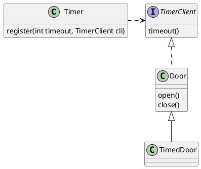

</details>


- `TimedDoor` se comunica con `Timer` para registrar un temporizador
- Cuando salta el temporizador, avisa a un `TimerClient`
- Con la solución diseñada, un `TimerClient` puede registrarse a sí mismo en un `Timer` y recibir de éste un mensaje mediante `timeout()`.


<details>
<summary>PlantUML source</summary>

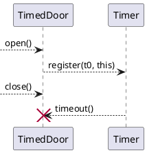

</details>


#### Implementación inicial

```csharp
public class Timer {
  public void register(int timeout, TimerClient client) {
    /*code*/
  }
}

public interface TimerClient {
    void timeout();
}
```

- Si se cierra la puerta antes de que venza el timeout $t_0$ y se vuelve a abrir, se registra uno nuevo $t_1$ antes de que el antiguo haya expirado.
- Cuando el primer temporizador $t_0$ expira, se produce la llamada a `timeout()` de `TimedDoor` y no debería.
- Así que cambiamos la implementación:


#### Implementación mejorada

```csharp
public class Timer {
  public void register(int timeout, int timeOutId, TimerClient client) {
    /*code*/
  }
}
public interface TimerClient {
  void timeout(int timeOutID);
}
```

¿En qué ha afectado el __cambio en la implementación__ de `TimerClient`?


<details>
<summary>PlantUML source</summary>

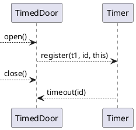

</details>


- El cambio afecta a los usuarios de `TimerClient`, pero también a `Door` y a los clientes de `Door` (y no debería)
- El problema es que `Door` depende de `TimerClient` y no todas las variedades de puerta son de seguridad (con temporizador)
- Si hacen falta más variedades de puerta, todas ellas deberán implementar implementaciones degeneradas de `timeout()`
- Las interfaces empiezan a engrosarse. Esto puede acabar violando también el LSP


#### Rediseño: puertas de seguridad

__Delegación__ a través del patrón adapter (de objetos o de clases)

- Versión adaptador de clases (por herencia):

   


- Versión adaptador de objetos (por composición):

  


### Example: Shapes and Circles (1 de 2)

```cpp
class Circle;
class Square;

class DrawStrategy
{
  public:
    virtual ~DrawStrategy() {}

    virtual void draw ( const Circle& circle ) const = 0;
    virtual void draw ( const Square& square ) const = 0;
};

class Shape
{
  public:
    Shape() = default;
    virtual ~Shape() = default;

    virtual void translate ( Vector3D const& ) = 0;
    virtual void rotate ( Quaternion const& ) = 0;
    virtual void draw() const = 0;
};
```


### Example: Shapes and Circles (2 de 2)

```cpp
class Circle : public Shape
{
  public:
    explicit Circle ( double rad, std::unique_ptr<DrawStrategy> ds )
      : radius { rad }
      , //... remaining data members
      , drawing { std::move(ds) }
    {}

    virtual ~Circle() = default;

    double getRadius() const noexcept;
    //... getCenter(), getRotation(), ...

    void translate ( Vector3D const& ) override;
    void rotate ( Quaternion const& ) override;
    void draw () const override;

  private:
    double radius;
    ///... remaining data members
    std::unique_ptr<DrawStrategy> drawing;
};

class Square: public Shape
{
  //...
}
```


## Aplicación de OCP y SRP

### Ejemplo: Shapes versión 1 en Java (misma versión que en SRP)

```java
interface Shape {
  double area();
  void draw();
}

class Point {
  double getX() {...}
  double getY() {...}
}

abstract class Polygon implements Shape {
  Point getVertex(index i) {...}
  void draw() {...}
  String toString() {...}
}

class Triangle extends Polygon {
  double area() {...}
}

abstract class RectParallelogram extends Polygon {
  double area() {...}
}
```


```java
class Square extends RectParallelogram {...}

class Rectangle extends RectParallelogram {...}

abstract class ClosedCurve implements Shape {...}

class Circle extends ClosedCurve {
  double getRadius() {...}
  Point getCenter() {...}
  double area() {...}
  void draw() {...}
  String toString() {...}
}

class Ellipse extends ClosedCurve {
  double getApogeeRadius() {...}
  double getPerigeeRadius() {...}
  Point getFocus1() {...}
  Point getFocus2() {...}
  Point getCenter() {...}
  double area() {...}
  void draw() {...}
  String toString() {...}
}
```


- Las funcionalidades para pintar (`draw`) y para imprimir (`toString`) pueden descohesionar las clases y atentar contra OCP y SRP.
- Saquémoslas fuera utilizando **aspectos**...


### Orientación a aspectos

La __orientación a aspectos__ (_AOD_/_AOP_) es un paradigma cuyo objetivo es incrementar la modularidad (__ortogonalidad__) de los componentes mediante la separación de aspectos __transversales__ (_cross-cutting concerns_).


#### Terminología:

- __aspect__ = modularización de un aspecto de interés (_concern_) que afecta a varias clases o módulos
- __joinpoint__ = especificación declarativa de un punto en la ejecución de un programa (por ejemplo, la ejecución de un método, el manejo de una excepción, etc.)
- __advice__ = acción a tomar por la especificación de un aspecto dado en un determinado _joinpoint_
- __pointcut__ = predicado que define cuándo se aplica un _advice_ de un aspecto en un _jointpoint_ determinado. Se asocia un _advice_ con la expresión de un _pointcut_ y se ejecuta el _advice_ en todos los _joinpoint_ que cumplan la expresión del _pointcut_.


### Ejemplo: Shapes versión 2 (misma versión que en OCP), pero con aspectos

```aspectj
// Ficheros <X>ToString.aj (uno por aspecto)
package shapes.tostring; // para todos los toString()
aspect PolygonToString {
  String Polygon.toString() {
    StringBuffer buff = new StringBuffer();
    buff.append(getClass().getName());
     //... añadir nombre y área...
     //... añadir cada línea desde un vértice al siguiente
    return buff.toString();
  }
}
aspect CircleToString {
  String Circle.toString() {...}
}
aspect EllipseToString {
  String Ellipse.toString() {...}
}

// Drawable.java
package drawing;
interface Drawable {
  void draw();
}
```


```aspectj
// Ficheros Drawable<X>.aj
package shapes.drawing; // para todos los draw()...
import drawing.Drawable;
abstract aspect DrawableShape {
  declare parents: Shape implements Drawable;
  void Shape.draw () //template method
  {
    String drawCommand = makeDrawCommand();
    // enviar orden al motor gráfico...
  }
  String Shape.makeDrawCommand() {
    return getClass().getName() + "\n" + makeDetails("\t");
  }
  abstract String Shape.makeDetails (String indent);
}
aspect DrawablePolygon extends DrawableShape {
  String Polygon.makeDetails (String indent){...}
}
aspect DrawableCircle extends DrawableShape {
  String Circle.makeDetails (String indent){...}
}
aspect DrawableEllipse extends DrawableShape {
  String Ellipse.makeDetails (String indent){...} }
```


## Principio de sustitución de Liskov

### LSP: *Liskov Substitution Principle*

> Un subtipo debe poder ser sustituible por sus tipos base
>
> ––Barbara Liskov,

Si una función $f$ depende de una clase base $B$ y hay una $D$ derivada de $B$, las instancias de $D$ no deben alterar el comportamiento definido por $B$ de modo que $f$ deje de funcionar

<!--
-   Posibilidad de sustitución depende del contexto: En otro programa
    P2, los objetos D pueden no ser sustituibles por objetos B
-->


### Ejemplo: Shapes versión 3

```csharp
struct Point {double x, y;}
public enum ShapeType {square, circle};

public class Shape {
  private ShapeType type;
  public Shape(ShapeType t){type = t;}
  public static void DrawShape(Shape s) {
    if(s.type == ShapeType.square)
      (s as Square).Draw();
    else if(s.type == ShapeType.circle)
      (s as Circle).Draw();
  }
}
```


```csharp
public class Circle: Shape {
  private Point center;
  private double radius;

  public Circle(): base(ShapeType.circle) {}
  public void Draw() {/* draws the circle */}
}

public class Square: Shape {
  private Point topLeft;
  private double side;
  public Square(): base(ShapeType.square) {}
  public void Draw() {/* draws the square */}
}
```


#### Problemas:

- `DrawShape` viola claramente el OCP
- Además `Square` y `Circle` no son sustuibles por `Shape`: no redefinen ninguna función de `Shape`, sino que añaden `Draw()` (violación del LSP)
- Esta violación de LSP es la que provoca la violación de OCP en `DrawShape`
- A continuación, una violación más sutil del LSP...


### Ejemplo: Rectángulos versión 1

De momento solo necesitamos rectángulos y escribimos esta versión:

```csharp
public class Rectangle {
  private Point topLeft;
  private double width;
  private double height;

  public double Width {
    get { return width; }
    set { width = value; }
  }

  public double Height {
    get { return height; }
    set { height = value; }
  }
}
```


Un día hace falta manejar cuadrados además de rectángulos.

Geométricamente, un cuadrado es un rectángulo, así que hacemos uso de la herencia (relación **es-un**):

```java
public class Square: Rectangle {
   ...
}
```


#### Problema: cuadrados como rectángulos

- Un cuadrado podría ser matemáticamente un rectángulo, pero definitivamente un objeto `Square` **no es un** objeto `Rectangle`

- Un `Square` no tiene propiedades `height`y `width`. Pero supongamos que no nos importa el desperdicio de memoria.
- `Square` heredará los métodos accesores de `Rectangle`.
- Así que hacemos lo siguiente...


### Ejemplo: rectángulos versión 2

```csharp
public class Square: Rectangle {
  public new double Width
  {
    set {
      base.Width = value;
      base.Height = value;
    }
  }
  public new double Height
  {
    set {
      base.Height = value;
      base.Width = value;
    }
  }
}
```

Nota: [Diferencia entre `new` y `override` en C#](https://docs.microsoft.com/en-us/dotnet/csharp/programming-guide/classes-and-structs/knowing-when-to-use-override-and-new-keywords)


- El comportamiento de un objeto `Square` no es consistente con el de un objeto `Rectangle`:

  ```csharp
  Square s = new Square();
  s.SetWidth(1);   // fija ambos
  s.SetHeight(2);  // fija ambos

  void f(Rectangle r)
  {
    r.SetWidth(32); // calls Rectangle.SetWidth
  }
  ```

- ¿Qué sucede si pasamos un `Square` a la función `f`?

  ¡No cambia `Height`!

- Podría argumentarse que el error era que los métodos `Width`y `Height` no se declararon `virtual` en `Rectangle`.


### Ejemplo: rectángulos versión 3

```csharp
public class Rectangle
{
  private Point topLeft;
  private double width;
  private double height;
  public virtual double Width
  {
    get { return width; }
    set { width = value; }
  }
  public virtual double Height
  {
    get { return height; }
    set { height = value; }
  }
}
```

Nota: [Métodos redefinibles con `virtual` en C#](https://docs.microsoft.com/en-us/dotnet/csharp/language-reference/keywords/virtual)


```csharp
public class Square: Rectangle
{
  public override double Width
  {
    set {
      base.Width = value;
      base.Height = value;
    }
  }
  public override double Height
  {
    set {
      base.Height = value;
      base.Width = value;
    }
  }
}
```


#### Extensión y ocultación de métodos

- La [diferencia entre `new` y `override` en un método en C#](https://docs.microsoft.com/en-us/dotnet/csharp/programming-guide/classes-and-structs/knowing-when-to-use-override-and-new-keywords) es que `new` oculta la implementación de la clase base y `override` la extiende.

Sin embargo, cuando la creación de una clase derivada provoca cambios en la clase base, es síntoma de un __mal diseño__.

El LSP pone en evidencia que la relación **es-un** tiene que ver con el comportamiento público extrínseco, del que los clientes dependen.


Ahora parece que funcionan `Square` y `Rectangle`, que matemáticamente quedan bien definidos.

Pero consideremos esto:

```csharp
void g(Rectangle r)
{
  r.Width = 5;    // cree que es un Rectangle
  r.Height = 4;   // cree que es un Rectangle
  if(r.Area() != 20)
    throw new Exception("Bad area!");
}
```


¿Qué pasa si llamamos a `g(new Square(3))`?

El autor de `g` asumió que cambiar el ancho de un rectángulo deja intacto el alto. Si pasamos un cuadrado esto no es así

__Violación de LSP__: Si pasamos una instancia de una clase derivada (`Square`), se altera el comportamiento definido por la clase base (`Rectangle`) de forma que `g` deja de funcionar.


¿Quién tiene la culpa?

- ¿El autor de `g` por asumir que "en un rectángulo su ancho y alto son independientes" (_invariante_)?
- ¿El autor de `Square` por violar el invariante?
- ¿De qué clase se ha violado el invariante? ¡De `Rectangle` y no de `Square`!

Para evaluar si un diseño es apropiado, no se debe tener en cuenta la solución por sí sola, sino en términos de los _supuestos razonables_ que hagan los usuarios del diseño.


### Ejercicios de LSP

- Robert C. Martin & Micah Martin: [Agile Principles, Patterns and Practices in C#](#unclebob), Prentice Hall, 2006
- Ejemplo de violación de LSP en [frameworks de videojuegos](https://medium.com/ingeniouslysimple/entities-components-and-systems-89c31464240d): Las interfaces HasPhysics, Collidable, Controllable incluyen una dependencia (por herencia) hacia Renderable, que no siempre es cierta (por ejemplo, para un objeto invisible). Solución: arquitectura Entity-Component-System.


### Diseño por Contrato

Relación entre LSP y el **_Design-By-Contract_** (DBC) de *Bertrand
Meyer*:

> A routine redeclaration [in a derivative] may only replace the original precondition by one equal or weaker, and the original post-condition by one equal or stronger
>
> –– ––B. Meyer

- Métodos de clase declaran *precondiciones* y *postcondiciones* al redefinir una operación en una subclase derivada
  - las **precondiciones** sólo pueden sustituirse por otras más débiles/laxas
  - las **postcondiciones** sólo pueden sustituirse por otras más fuertes/estrictas


#### Ejemplo: rectángulos

- Postcondición del _setter_ de `Rectangle.Width`
  (En C++ sería `Rectangle::SetWidth(double w)`):
    `assert((Width == w) && (Height == old.Height));`

- Postcondición del setter de `Square.Witdh`
  (En C++ sería `Square::SetWidth(double w)`):
    `assert(Width==w);`

- La postcondición de `Square::SetWidth(double w)` viola el  contrato de la clase base porque es más débil que la de `Rectangle`


## Principio de Inversión de Dependencias

### DIP: *Dependency Inversion Principle*

- Los módulos de alto nivel no deben depender de módulos de bajo nivel.
Ambos deben depender de abstracciones.

- Las abstracciones no deben depender de los detalles, sino los detalles de las abstracciones

> Depend on abstractions
>
> –– Robert C. Martin


### Ejemplo: estructura en capas

__Diseño inicial__:


- Las dependencias son transitivas
- _Policy_ depende de todo lo que depende _Mechanism_.


__Diseño invertido__:


- Cada nivel declara una interfaz para lo que necesita de otros niveles inferiores
- Los niveles inferiores dependen de interfaces definidas en los superiores
- El cliente puede definir la abstracción que necesita (ISP)
- Cada nivel es intercambiable por un sustituto


### Heurística _ingenua_

- Ninguna variable debería guardar una referencia a una clase concreta
- Ninguna clase debería ser derivada de una clase concreta
- Ningún método debería redefinir un método ya implementado de ninguna de sus clases base

Hay que violar alguna vez estas heurísticas, pues alguien tiene que crear las instancias de las clases concretas. El módulo que lo haga presentará una dependencia de dichas clases concretas.

Gracias a la __introspección__ o la carga dinámica de clases, los lenguajes de programación pueden indicar el nombre de la clase a instanciar (por ejemplo, en un fichero de configuración).

Hay clases concretas que no cambian, como `String`, así que no hace ningún daño depender de ellas.

<!--
# Para profundizar sobre patrones

- Martin Fowler – [Patterns in Enterprise Software](https://martinfowler.com/articles/enterprisePatterns.html): Catálogos de patrones a distintos niveles
    - Martin Fowler – [Patterns of Enterprise Application Architecture (EAA)](https://martinfowler.com/eaaCatalog/)
    - Hohpe y Woolf – [Enterprise Integration Patterns (EIP)](http://www.enterpriseintegrationpatterns.com/)
    - Buschmann y otros – [Pattern-Oriented Software Architecture (POSA)](http://www.amazon.com/exec/obidos/ASIN/0471958697) Volume 1: A system of patterns
- Peter Norvig – [Design Patterns in Dynamic Programming](http://www.norvig.com/design-patterns/design-patterns.pdf): Implementaciones más simples para los patrones de diseño del GoF en lenguajes dinámicos
- David Arno – [Are design patterns compatible with modern software techniques?](http://www.davidarno.org/2013/06/17/are-design-patterns-compatible-with-modern-software-techniques/)
- Implementaciones de los patrones de diseño del GoF en diversos lenguajes de programación:
    - Kamran Ahmed – [Design Patterns for Humans!](https://github.com/kamranahmedse/design-patterns-for-humans/blob/master/README.md): Explicación de los patrones de diseño del GoF implementados en PHP
    - Márk Török – [Design Patterns in TypeScript](https://github.com/torokmark/design_patterns_in_typescript)
    - Bogdab Vliv - [Design Patterns in Ruby](https://bogdanvlviv.com/posts/ruby/patterns/design-patterns-in-ruby.html)
- Lewis y Fowler – [Microservicios](https://martinfowler.com/articles/microservices.html)
-->
<!-- Source: patrones.md -->
# DISEÑO DE SISTEMAS SOFTWARE


## Bloques

1. Principios de diseño OO
2. **Patrones de diseño**
3. Arquitectura de software


# PATRONES DE DISEÑO

1. Introducción
2. Patrones del GoF
3. Otros patrones específicos


## Introducción


### Origen de los patrones de diseño


<!--
- Los patrones de diseño surgen a partir del libro *A Pattern Language: Towns, Buildings, Construction* de Cristopher Alexander.

- La inspiración del libro fueron las ciudades medievales, atractivas y armoniosas, que fueron construidas según regulaciones locales que requerían ciertas características, pero que permitían al arquitecto adaptarlas a situaciones particulares.

- En el libro se suministran reglas e imágenes y  se describen métodos exactos para construir diseños prácticos, seguros y atractivos a cualquier escala. También recopila modelos anteriores (con ventajas/desventajas) con el fin de usarlos en un futuro.

- El libro recomienda que las decisiones sobre la construcción de edificios se tomen de acuerdo al entorno preciso de cada proyecto.
-->

### Diseño de software con patrones


- Conocer un lenguaje OO no te hace un buen diseñador. ¿Qué diferencia hay entre los diseñadores expertos y los novatos? Que los primeros usan recetas exitosas para los problemas habituales y no reinventan la rueda continuamente.

- Un grupo de expertos (_Gang of Four_) se basó en el trabajo de Alexander y lo aplicó al diseño de software, presentando el libro *Design Patterns* con un total de 23 patrones.

### Patrones de diseño

- Patrón de diseño: Una **solución general** a un **problema general** que puede adaptarse a un problema concreto

- La aplicación de patrones depende del **contexto**.

- Ofrece un **vocabulario** de patrones (una jerga entre ingenieros de software)

- Los patrones **clásicos** son ampliamente conocidos: algunos muy aceptados y otros más discutidos...

- Deben usarse con cuidado. Deben simplificar el modelo, **no complicarlo**, por lo que deben surgir de manera natural.

- Han surgido nuevos patrones **específicos** de dominio: patrones de interfaces de usuario, patrones para la integración de aplicaciones empresariales, patrones de flujos de trabajo BPMN, patrones de concurrencia, etc.


## Patrones del Gang of Four


### Patrones creacionales

Corresponden a patrones de diseño de software que solucionan problemas de creación de instancias. Nos ayudan a encapsular y abstraer dicha creación. Vamos a ver:

- Factory Method
- Abstract Factory

Pero hay más...

- *Prototype*
- *Builder*
- *Singleton*


### Patrones estructurales

Son los patrones de diseño software que solucionan problemas de composición/agregación de clases y objetos. Vamos a ver:

- Composite
- Decorator
- Adapter

Pero hay más...

- *Facade*
- *Bridge*
- *Flyweight*
- *Proxy*


### Patrones de comportamiento

Son los relativos a la interacción y responsabilidades entre clases y objetos. Vamos a ver:

- Command
- Observer
- Strategy
- Visitor

Pero hay más...

- *Template method*, *Chain of Responsibility*, *Interpreter*
- *Iterator*, *Mediator*, *Memento*, *State*


### [Factory Method](https://refactoring.guru/es/design-patterns/factory-method)


#### Ejemplo: Juego de laberinto


<details>
<summary>PlantUML source</summary>

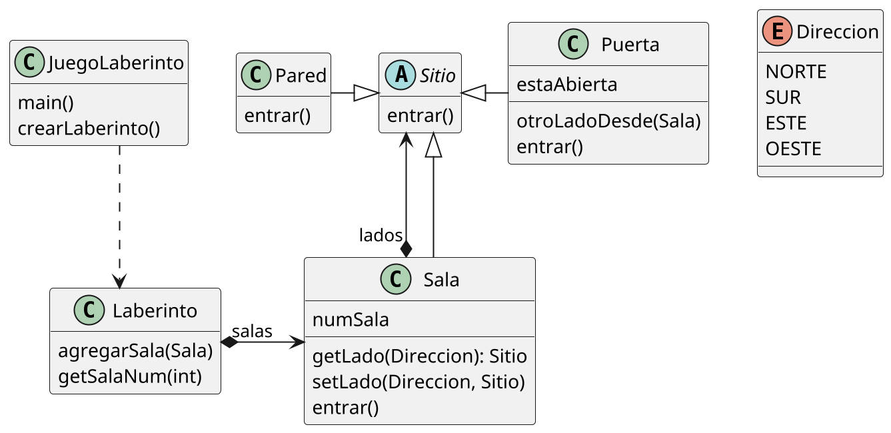

</details>


```java
public interface Direccion {   // Cuando no existía "enumerate" en Java
    int NORTE = 0;             // se implementaban así :-)
    int ESTE = 1;
    int SUR = 2;
    int OESTE = 3;
}

public class Laberinto {
    Laberinto() {};
    void agregarSala(Sala sala) {};
    Sala getSalaNum(int numSala) { ... };
}
```

```java
public abstract class Sitio {  // Podría ser una interfaz
    boolean entrar() {};
}

public class Sala extends Sitio {
    private Sitio lados[];
    int numSala;

    Sala() {};
    Sala(int numSala) {};
    Sitio getLado(int dir) { return lados[dir]; };
    void setLado(int dir, Sitio sitio) {};
    boolean entrar() {};
}
```


```java
public class Pared extends Sitio {
    Pared() {};
    boolean entrar() {};
}

public class Puerta extends Sitio {
    private Sala sala1;
    private Sala sala2;
    boolean estaAbierta;

    Puerta(Sala sala1, Sala sala2) { ... };
    boolean entrar() {};
    Sala otroLadoDesde(Sala unaSala) { ... };
}
```


```java
Laberinto crearLaberinto () {
  Laberinto miLab = new Laberinto();
  Sala hab1 = new Sala(1);
  Sala hab2 = new Sala(2);
  Puerta unaPuerta = new Puerta(hab1, hab2);
  miLab.agregarSala(hab1);
  miLab.agregarSala(hab2);
  hab1.setLado(Direccion.NORTE, new Pared());
  hab1.setLado(Direccion.ESTE, unaPuerta);
  hab1.setLado(Direccion.SUR, new Pared());
  hab1.setLado(Direccion.OESTE, new Pared());
  hab2.setLado(Direccion.NORTE, new Pared());
  hab2.setLado(Direccion.ESTE, new Pared());
  hab2.setLado(Direccion.SUR, new Pared());
  hab2.setLado(Direccion.OESTE, unaPuerta);
  return miLab;
}
```


#### Críticas

- Creación poco flexible: instancias concretas cableadas.
- Supongamos $\exists$ SalaHechizada, PuertaHechizada. ¿Cómo cambiamos `crearLaberinto`?


#### Método de factoría

- El patrón _factory method_ define una interfaz para la creación de un objeto, pero dejando en manos de las subclases la decisión de qué clase concreta instanciar.

- Permite que una clase delegue en sus subclases las instanciaciones.


#### Factory method: Estructura


1. El **Producto** declara la interfaz, que es común a todos los objetos que puede producir la clase creadora y sus subclases.

2. Los **Productos Concretos** son distintas implementaciones de la interfaz de producto.

3. La clase **Creadora** declara el método fábrica que devuelve nuevos objetos de producto. Es importante que el tipo de retorno de este método coincida con la interfaz de producto.

4. Los **Creadores Concretos** sobrescriben el Factory Method base, de modo que devuelva un tipo diferente de producto.


<!--


<details>
<summary>PlantUML source</summary>

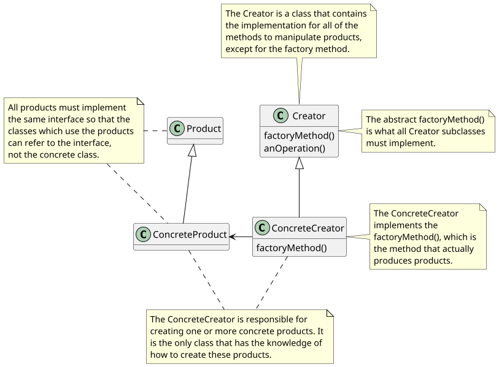

</details>
-->

#### Factory method: Ventajas

- Se evita un acoplamiento fuerte entre el creador y los productos concretos.
- SRP: Se puede mover el código de creación de producto a un lugar del programa, haciendo que el código sea más fácil de mantener.
- OCP: Se pueden incorporar nuevos tipos de productos en el programa sin descomponer el código cliente existente.


#### Implementación de `JuegoLaberinto`

```java
public class JuegoLaberinto {
  JuegoLaberinto() {};
  // factory methods:
  Laberinto makeLaberinto() { return new Laberinto(); }
  Sala makeSala(int numSala) { return new Sala(numSala); }
  Pared makePared() { return new Pared(); }
  Puerta makePuerta(Sala sala1, Sala sala2) {
    return new Puerta(sala1, sala2);
  }
  Laberinto crearLaberinto () { ... }
}
```


```java
Laberinto crearLaberinto () {
  Laberinto miLab = makeLaberinto();
  Sala hab1 = makeSala(1);
  Sala hab2 = makeSala(2);
  Puerta unaPuerta = makePuerta(hab1, hab2);
  miLab.agregarSala(hab1);
  miLab.agregarSala(hab2);
  hab1.setLado(Direccion.NORTE, makePared());
  hab1.setLado(Direccion.ESTE, unaPuerta);
  hab1.setLado(Direccion.SUR, makePared());
  hab1.setLado(Direccion.OESTE, makePared());
  hab2.setLado(Direccion.NORTE, makePared());
  hab2.setLado(Direccion.ESTE, makePared());
  hab2.setLado(Direccion.SUR, makePared());
  hab2.setLado(Direccion.OESTE, unaPuerta);
  return miLab;
}
```


```java
public class JuegoLaberintoMinado extends JuegoLaberinto {
  Pared makePared() {
    return new ParedMinada();
  }
  Sala makeSala(int numSala) {
    return new SalaMinada(numSala);
  }
}

public class JuegoLaberintoHechizado extends JuegoLaberinto {
  Sala makeSala(int numSala) {
    return new SalaHechizada(numSala, lanzarHechizo());
  }
  Puerta makePuerta(Sala sala1, Sala sala2) {
    return new PuertaHechizada(sala1, sala2);
  }
  private Hechizo lanzarHechizo() { ... }
}
```


### [Strategy](https://refactoring.guru/es/design-patterns/strategy)


#### Strategy: Estructura


#### Strategy

- Define una familia de algoritmos, encapsula cada uno de ellos y los hace intercambiables
- Permite que el algoritmo varíe de forma independiente a quienes lo usan (el **Contexto**)

**Ventajas:**

- Ayuda a sacar factor común (factorizar) funcionalidades
- La estrategia es sustituible en tiempo de ejecución
- Alternativa a la herencia estática

**Desventajas:**

- Sobrecarga de la comunicación _Context_-_Strategy_


### [Command](https://refactoring.guru/es/design-patterns/command)


<!--


<details>
<summary>PlantUML source</summary>

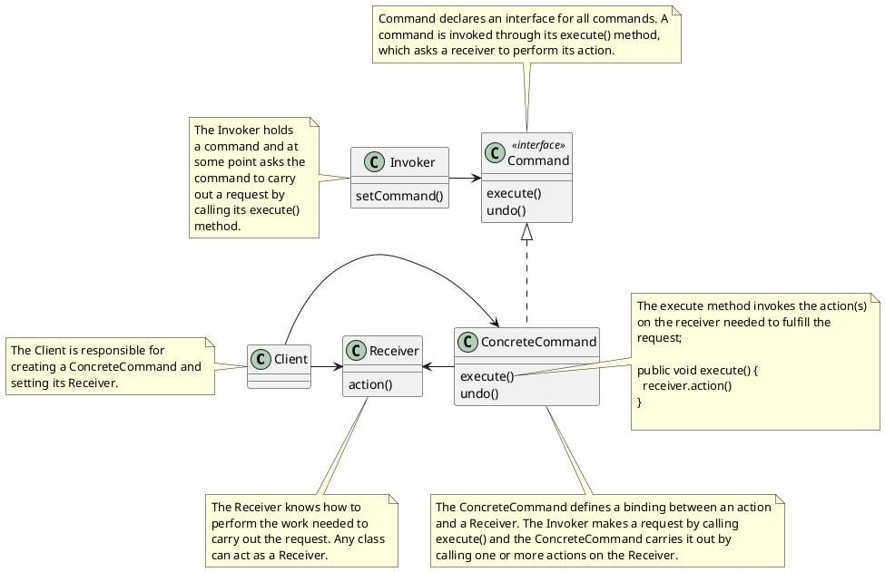

</details>
-->


#### Command: Estructura


#### Command: Comportamiento


<details>
<summary>PlantUML source</summary>

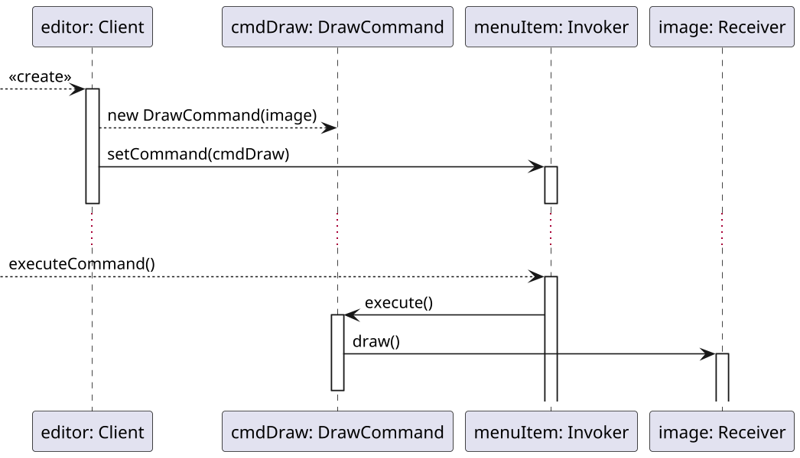

</details>


#### Versión cliente/servidor


<details>
<summary>PlantUML source</summary>

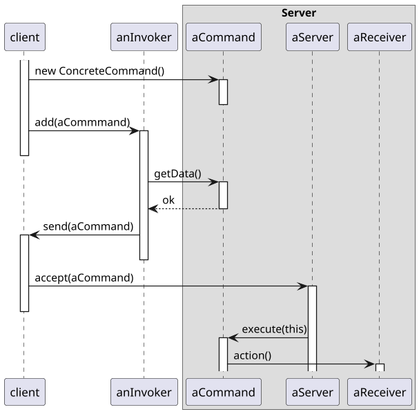

</details>


### [Adapter](https://refactoring.guru/es/design-patterns/adapter)


<!--


<details>
<summary>PlantUML source</summary>

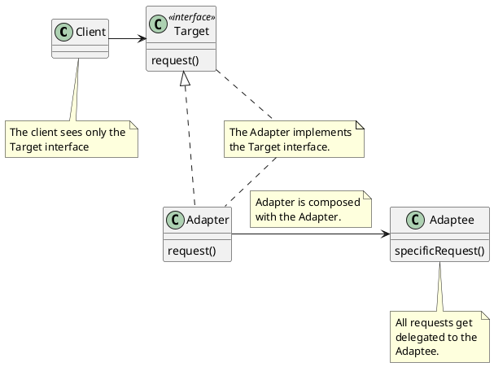

</details>
-->


#### Adaptador de objetos: Estructura


#### Adaptador de clases: Estructura


#### Adaptador de clases vs. objetos

**Class adapter:**

- No sirve para adaptar una clase y sus subclases
- Se crea un único objeto, sin indirecciones adicionales

**Object adapter:**

- Un adapter puede funcionar con varios objetos _Service_ o _Adaptee_
- Es más complicado heredar el comportamiento del objeto adaptado


### [Composite](https://refactoring.guru/es/design-patterns/composite)


<!--


<details>
<summary>PlantUML source</summary>

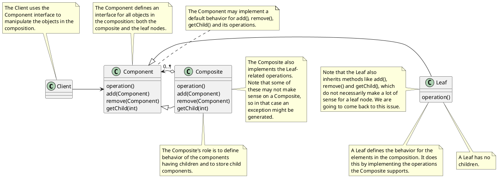

</details>
-->


#### Composite: Estructura


#### Composite

- Permite construir objetos complejos componiendo de forma recursiva objetos similares en una estructura de **árbol**.
- Permite manipular **uniformemente** todos los objetos contenidos en el árbol, ya que todos ellos poseen una interfaz común definida en la clase raíz.

**Ventajas:**

- El cliente trata a todos los objetos de la misma forma
- La inclusión de nuevos tipos de hojas o compuestos no afecta a la estructura anterior

**Desventajas:**

- Si se desea restringir el tipo de objetos que pueden formar parte de otros $\Rightarrow$ Necesidad de comprobaciones dinámicas


### [Decorator](https://refactoring.guru/es/design-patterns/decorator)


<!--


<details>
<summary>PlantUML source</summary>

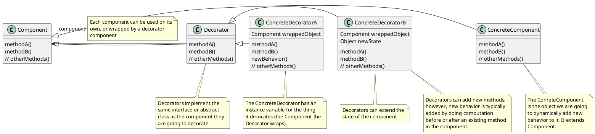

</details>
-->


#### Decorator: Estructura


#### Ejemplo: `EnhancedWriter` original


<details>
<summary>PlantUML source</summary>

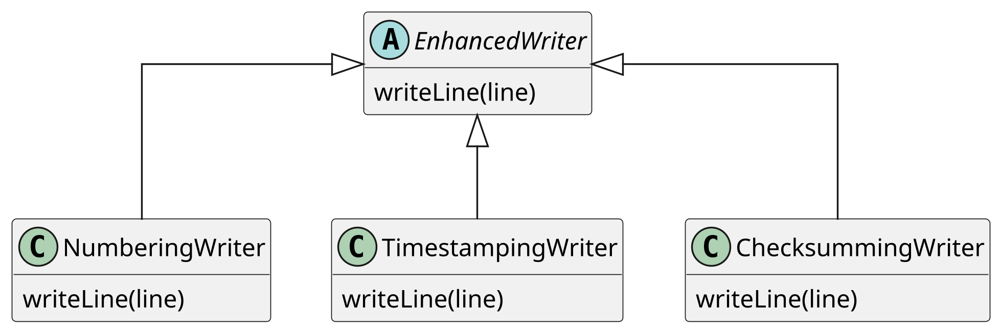

</details>


#### Ejemplo: `EnhancedWriter` ampliado – herencia fuera de control


<details>
<summary>PlantUML source</summary>

```plantuml
@startuml
top to bottom direction
scale 1024 width
scale 650 height
skinparam linetype ortho
skinparam classAttributeIconSize 0

abstract class EnhancedWriter {
  {method} writeLine(line)
}

class NumberingWriter {
  {method} writeLine(line)
}

class TimestampingWriter {
  {method} writeLine(line)
}

class ChecksummingWriter {
  {method} writeLine(line)
}

EnhancedWriter <|-- NumberingWriter
EnhancedWriter <|-- TimestampingWriter
EnhancedWriter <|-- ChecksummingWriter

NumberingWriter <|-- NumberingCheksummingWriter
ChecksummingWriter <|.. NumberingCheksummingWriter
TimestampingWriter <|-- TimestampingNumberingWriter
NumberingWriter <|.. TimestampingNumberingWriter
ChecksummingWriter <|-- ChecksummingNumberingWriter
NumberingWriter <|.. ChecksummingNumberingWriter


hide members
show methods

@enduml
```

</details>


#### Ejemplo: `EnhancedWriter` ampliado –  herencia fuera de control


<details>
<summary>PlantUML source</summary>

```plantuml
@startuml
top to bottom direction
scale 1024 width
scale 650 height
skinparam linetype ortho
skinparam classAttributeIconSize 0

abstract class EnhancedWriter {
  {method} writeLine(line)
}

class NumberingWriter {
  {method} writeLine(line)
}

class TimestampingWriter {
  {method} writeLine(line)
}

class ChecksummingWriter {
  {method} writeLine(line)
}

EnhancedWriter <|-- NumberingWriter
EnhancedWriter <|-- TimestampingWriter
EnhancedWriter <|-- ChecksummingWriter

NumberingWriter <|-- NumberingChecksummingWriter
ChecksummingWriter <|.. NumberingChecksummingWriter
TimestampingWriter <|-- TimestampingNumberingWriter
NumberingWriter <|.. TimestampingNumberingWriter
ChecksummingWriter <|-- ChecksummingNumberingWriter
NumberingWriter <|.. ChecksummingNumberingWriter

NumberingChecksummingWriter <|-- NumberingChecksummingTimestampingWriter
TimestampingWriter <|.. NumberingChecksummingTimestampingWriter

TimestampingWriter <|-- TimestampingNumberingWriter
NumberingWriter <|.. TimestampingNumberingWriter

ChecksummingNumberingWriter <|-- ChecksummingNumberingTimestampingWriter
TimestampingWriter <|.. ChecksummingNumberingTimestampingWriter


hide members
show methods

@enduml
```

</details>


#### Decorator

- El patrón decorator permite añadir responsabilidades a objetos concretos de forma **dinámica**.
- Los decoradores ofrecen una **alternativa** más flexible que la herencia para extender funcionalidades.

**Ventajas:**
- Permite añadir o quitar responsabilidades a los objetos sin afectar a otros objetos

**Desventajas:**
- Rompe la identidad de objetos: un componente y su decorador no son el mismo objeto
- Provoca la creación de muchos objetos pequeños y complica la depuración


#### ¿Diferencia entre Strategy y Decorator?


#### Diferencia entre Strategy y Decorator

El _decorator_ cambia la piel, el _strategy_ cambia las tripas


### [Observer](https://refactoring.guru/es/design-patterns/observer)


<!--


<details>
<summary>PlantUML source</summary>

```plantuml
@startuml
class Client
class Invoker
class Command <<interface>>
class Receiver
class ConcreteCommand

Invoker : setCommand()
Command : execute()
Command : undo()
Receiver : action()
ConcreteCommand : execute()
ConcreteCommand : undo()

Client -> Receiver
Client -> ConcreteCommand
Receiver <- ConcreteCommand
Invoker -> Command
Command <|.. ConcreteCommand

note left of Client
The Client is responsible for
creating a ConcreteCommand and
setting its Receiver.
end note

note bottom of Receiver
The Receiver knows how to
perform the work needed to
carry out the request. Any class
can act as a Receiver.
end note

note bottom of ConcreteCommand
The ConcreteCommand defines a binding between an action
and a Receiver. The Invoker makes a request by calling
execute() and the ConcreteCommand carries it out by
calling one or more actions on the Receiver.
end note

note left of Invoker
The Invoker holds
a command and at
some point asks the
command to carry
out a request by
calling its execute()
method.
end note

note top of Command
Command declares an interface for all commands. A
command is invoked through its execute() method,
which asks a receiver to perform its action.
end note

note right of ConcreteCommand::execute()
The execute method invokes the action(s)
on the receiver needed to fulfill the
request;

public void execute() {
 receiver.action()
}

end note
@enduml
```

</details>
-->

#### Observer

- Define una dependencia 1:N entre objetos de modo que cuando el estado de un objeto cambia, se les notifica el cambio a todos los que de él dependen y estos se actualizan de forma automática.


#### Observer: Estructura


#### Observer: roles

Sin distinguir entre `Observable` y `Subject`:
- `Publisher` = `Observable` = `Subject`
- `ConcreteSubscriber` $\dashrightarrow$ `Subject`

Con `Subject` separado:
- `Subscriber` = `Observer`
- Distinguir entre `Observable` y `Subject`
- Definir `Subscriber.update(Observable, Subject)`
  - `ConcreteSubscriber` $\dashrightarrow$ `Observable`
  - `ConcreteSubscriber` $\dashrightarrow$ `Subject`


#### Observer: Detalles de implementación

- ¿Quién dispara la actualización?
    - El publicador, tras cambiar de estado: menos eficiente si hay muchas notificaciones
    - El cliente, tras una serie de cambios de estado: si se olvida puede provocar inconsistencias


#### Oberver: Comportamiento (síncrono) – disparo externo


<details>
<summary>PlantUML source</summary>

```plantuml
@startuml
scale 450 width
scale 500 height

participant "anObservable: Publisher" as anObservable
participant "anObserver: Subscriber" as anObserver
participant "anotherObserver: Subscriber" as anotherObserver

anObserver -> anObservable : subscribe(this)
activate anObserver
deactivate anObserver

anotherObserver -> anObservable : subscribe(this)
activate anotherObserver
deactivate anotherObserver

...

?-> anObservable: notify()
activate anObservable

anObservable -> anObserver : update(this)
activate anObserver
anObservable <- anObserver : getState()
deactivate anObserver

anObservable -> anotherObserver : update(this)
activate anotherObserver
anObservable <- anotherObserver : getState()
deactivate anotherObserver

@enduml
```

</details>


#### Oberver: Comportamiento (síncrono) – autodisparo


<details>
<summary>PlantUML source</summary>

```plantuml
@startuml
scale 450 width
scale 500 height

participant "anObservable: Publisher" as anObservable
participant "anObserver: Subscriber" as anObserver
participant "anotherObserver: Subscriber" as anotherObserver

anObserver -> anObservable : subscribe(this)
activate anObserver
deactivate anObserver

anotherObserver -> anObservable : subscribe(this)
activate anotherObserver
deactivate anotherObserver

...

?-> anObservable : setState()
activate anObservable
anObservable -> anObservable: notify()

anObservable -> anObserver : update(this)
activate anObserver
anObservable <- anObserver : getState()
deactivate anObserver

anObservable -> anotherObserver : update(this)
activate anotherObserver
anObservable <- anotherObserver : getState()
deactivate anotherObserver

deactivate anObservable

@enduml
```

</details>


#### Observer: Detalles de implementación

- Los suscriptores necesitan información para hacer la actualización:
  - `update(context)` para pasar la información necesaria al suscriptor
  - `update(this)` para que el suscriptor extraiga la información necesaria pidiéndosela al publicador
  - `ConcreteSubscriber.setPublisher()` para vincularlos permanentemente (opción menos flexible)


### [Visitor](https://refactoring.guru/es/design-patterns/visitor)


#### Visitor

- Representa una **operación** que se lleva a cabo sobre los elementos de una **estructura** de objetos
- Permite **definir nuevas** operaciones sin modificar las clases de los **elementos** sobre las que opera.


#### Visitor: Estructura


#### Visitor: Comportamiento


<details>
<summary>PlantUML source</summary>

```plantuml
@startuml
scale 450 width
scale 500 height

participant anObjectStructure
participant "anElementA: ElementA" as anElementA
participant "anElementB: ElementB" as anElementB
participant "aVisitor1: ConcreteVisitor1" as aVisitor1

?-> anObjectStructure : operation()
activate anObjectStructure

anObjectStructure -> anElementA : accept(aVisitor1)
activate anElementA
anElementA -> aVisitor1 : visitElementA(this)
deactivate anElementA
activate aVisitor1

anElementA <- aVisitor1 : operationA()
activate anElementA
deactivate aVisitor1
deactivate anElementA

anObjectStructure -> anElementB : accept(aVisitor1)
activate anElementB
anElementB -> aVisitor1 : visitElementB(this)
deactivate anElementB
activate aVisitor1

anElementB <- aVisitor1 : operationB()
activate anElementB
deactivate aVisitor1
deactivate anElementB

@enduml
```

</details>


**Ventajas:**
- Permite implementar el _double dispatch_: la operación que se ejecuta tras el `accept()` depende del tipo de `Visitor` y del tipo de `Element`
- Separa los datos y las operaciones de los elementos visitados, facilitando la inclusión de nuevas operaciones sin tener que cambiar las clases
- Permite acumular el estado de una operación global sobre una estructura

**Desventajas:**
- Rompe la encapsulación (?)
- Los tipos de `Element` visitados deben ser estables


### [State](https://refactoring.guru/design-patterns/state)


#### State: Ejemplo


```scala
class Document {
  var state: String = _
  var expirationDate: Date = _
  // ...

  def publish(currentUser: User): Unit = state match {
    case "draft" =>
      if (currentUser.role == "admin") {
        state = "published"
      } else {
        state = "moderation"
      }
    case "moderation" =>
      if (currentUser.role == "admin") {
        state = "published"
      }
    case "published" =>
      if (new Date().after(expirationDate)) {
        state = "draft"
      }
    case _ =>
      // Handle any unexpected state.
      throw new IllegalStateException(s"Invalid document state: $state")
  }
}
```


#### State: Estructura


#### Diferencia con Strategy

- Cada estado puede ser consciente de la existencia de otros estados e iniciar transiciones de estado
- Cada estrategia desconoce a las otras

## Otros patrones específicos


### Data Acess Object (DAO)

- Se usa para abstraer y encapsular los accesos a las fuentes de datos, con independencia del soporte concreto de almacenamiento. Su alternativa es el patrón *Active Record*.


<!--
-

-->

### Data Transfer Object (DTO)

- Se usa para crear objetos planos (POJO) que puedan ser enviados o recuperados desde servidores remotos en una única invocación. Un DTO no tiene más comportamiento que almacenar y entregar sus propios datos (métodos *getters* y *setters*).


<!--
-

-->


# Para profundizar sobre patrones
- Martin Fowler – [Patterns in Enterprise Software](https://martinfowler.com/articles/enterprisePatterns.html): Catálogos de patrones a distintos niveles
    - Martin Fowler – [Patterns of Enterprise Application Architecture (EAA)](https://martinfowler.com/eaaCatalog/)
    - Hohpe y Woolf – [Enterprise Integration Patterns (EIP)](http://www.enterpriseintegrationpatterns.com/)
    - Buschmann y otros – [Pattern-Oriented Software Architecture (POSA)](http://www.amazon.com/exec/obidos/ASIN/0471958697) Volume 1: A system of patterns
- Peter Norvig – [Design Patterns in Dynamic Programming](http://www.norvig.com/design-patterns/design-patterns.pdf): Implementaciones más simples para los patrones de diseño del GoF en lenguajes dinámicos

# Para profundizar sobre patrones

- David Arno – [Are design patterns compatible with modern software techniques?](http://www.davidarno.org/2013/06/17/are-design-patterns-compatible-with-modern-software-techniques/)
- Implementaciones de los patrones de diseño del GoF en diversos lenguajes de programación:
    - Kamran Ahmed – [Design Patterns for Humans!](https://github.com/kamranahmedse/design-patterns-for-humans/blob/master/README.md): Explicación de los patrones de diseño del GoF implementados en PHP
    - Márk Török – [Design Patterns in TypeScript](https://github.com/torokmark/design_patterns_in_typescript)
    - Bogdab Vliv - [Design Patterns in Ruby](https://bogdanvlviv.com/posts/ruby/patterns/design-patterns-in-ruby.html)
- Lewis y Fowler – [Microservicios](https://martinfowler.com/articles/microservices.html)
- Chris Richardson - [Microservices patterns](https://microservices.io/)
