<!-- size: 16:9 -->
<!-- theme: default -->

<style>
h1 {
  text-align: center;
  color: #005877;
}
h2 {
  color: #E87B00;
}
h3 {
  color: #005877;
}
img[alt~="center"] {
  display: block;
  margin: 0 auto;
}
emph {
  color: #E87B00;
}
.cols {
  display: grid;
  grid-template-columns: repeat(2, 1fr);
  gap: 1rem;
}
.cols > div {
  align-self: start;
}
</style>

<style scoped>
h2 {
  color: #005877;
  text-align: center;
}
</style>

# PATRONES DE DISEÑO

1. Introducción
2. Patrones del GoF
3. Otros patrones específicos

---
<!-- paginate: true -->

<style scoped>
h2 {
  text-align: center;
}
</style>

## Introducción

---

<style scoped>
section { text-align: center; }
</style>

### Origen de los patrones de diseño

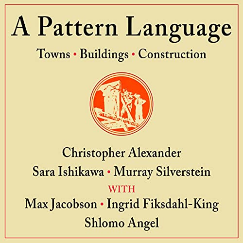

<!--

- Los patrones de diseño surgen a partir del libro *A Pattern Language: Towns, Buildings, Construction* de Cristopher Alexander.

- La inspiración del libro fueron las ciudades medievales, atractivas y armoniosas, que fueron construidas según regulaciones locales que requerían ciertas características, pero que permitían al arquitecto adaptarlas a situaciones particulares.

- En el libro se suministran reglas e imágenes y  se describen métodos exactos para construir diseños prácticos, seguros y atractivos a cualquier escala. También recopila modelos anteriores (con ventajas/desventajas) con el fin de usarlos en un futuro.

- El libro recomienda que las decisiones sobre la construcción de edificios se tomen de acuerdo al entorno preciso de cada proyecto. 

-->

---

### Diseño de software con patrones

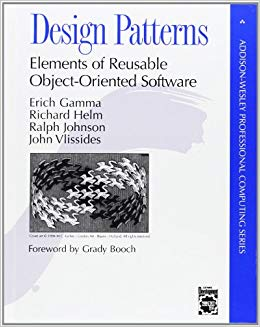

- Conocer un lenguaje OO no te hace un buen diseñador. ¿Qué diferencia hay entre los diseñadores expertos y los novatos? Los primeros usan recetas exitosas para los problemas habituales y no reinventan la rueda continuamente.

- Un grupo de expertos (_Gang of Four_) se basó en el trabajo de Alexander y lo aplicó al diseño de software, presentando el libro *Design Patterns* con un total de 23 patrones.

---

### Patrones de diseño

- Patrón de diseño: Una **solución general** a un **problema general** que puede adaptarse a un problema concreto

- La aplicación de patrones depende del **contexto**.

- Ofrece un **vocabulario** de patrones (una jerga entre ingenieros de software)

- Los patrones **clásicos** son ampliamente conocidos: algunos muy aceptados y otros más discutidos...

- Deben usarse con cuidado. Deben simplificar el modelo, **no complicarlo**, por lo que deben surgir de manera natural.

- Han surgido nuevos patrones **específicos** de dominio: patrones de interfaces de usuario, patrones para la integración de aplicaciones empresariales, patrones de flujos de trabajo BPMN, patrones de concurrencia, etc.

---

<style scoped>
section { text-align: center; }
</style>

## Patrones del Gang of Four


---

### Patrones creacionales

Corresponden a patrones de diseño de software que solucionan problemas de creación de instancias. Nos ayudan a encapsular y abstraer dicha creación. Vamos a ver:

- Factory Method
- Abstract Factory

Pero hay más...

- *Prototype*
- *Builder*
- *Singleton*

---

### Patrones estructurales

Son los patrones de diseño software que solucionan problemas de composición/agregación de clases y objetos. Vamos a ver:

- Composite
- Decorator
- Adapter

Pero hay más...

- *Facade*
- *Bridge*
- *Flyweight*
- *Proxy*

---

### Patrones de comportamiento

Son los relativos a la interacción y responsabilidades entre clases y objetos. Vamos a ver:

- Command
- Observer
- Strategy
- Visitor

Pero hay más...

- *Template method*, *Chain of Responsibility*, *Interpreter*
- *Iterator*, *Mediator*, *Memento*, *State*

---

<style scoped>
section { text-align: center; }
</style>

### [Factory Method](https://refactoring.guru/es/design-patterns/factory-method)


---
<style>
section > img {
  align-self: flex-start;
}
</style>

#### Ejemplo: Juego de laberinto

@startuml
top to bottom direction
scale 1024 width
scale 650 height
skinparam linetype ortho
skinparam classAttributeIconSize 0

enum Direccion {
  NORTE
  SUR
  ESTE
  OESTE
  {method} indice(): int
}

class JuegoLaberinto {
  {method} main()
  {method} crearLaberinto()
}

abstract class Sitio{
  {method} entrar()
}

class Sala{
  {field} numSala
  {method} getLado(Direccion): Sitio
  {method} setLado(Direccion, Sitio)
  {method} entrar()
}

class Puerta{
  {field} estaAbierta
  {field} sala1
  {field} sala2
  {method} otroLadoDesde(Sala)
  {method} entrar()
}

class Pared{
  {method} entrar()
}

class Laberinto{
  {method} agregarSala(Sala)
  {method} getSalaNum(int)
}

JuegoLaberinto .down.> Laberinto

Sala "lados" *-up-> Sitio
Sitio <|-left- Pared
Sitio <|-right- Puerta
Sitio <|-down- Sala
Laberinto "salas"*-right-> Sala

hide members
show methods
show Direccion members
show Sala members
show Puerta members

@enduml

---

<div class="cols">
<div>

```java
public enum Direccion {

  NORTE(0), ESTE(1), SUR(2), OESTE(3);

  private final int indice;

  Direccion(int indice) {
    this.indice = indice;
  }

  int indice() {
    return indice;
  }

}
```

</div>
<div>

```java
public class Laberinto {
    Laberinto() {};
    void agregarSala(Sala sala) { ... };
    Sala getSalaNum(int numSala) { ... };
}
```

```java
public abstract class Sitio {
    boolean entrar() { ... };
}
```

</div>
</div>

---

<div class="cols">
<div>

```java
public class Sala extends Sitio {
    private Sitio lados[];
    int numSala;

    Sala() {};
    Sala(int numSala) {};
    Sitio getLado(Direccion dir) {
      return lados[dir.indice()];
    };
    void setLado(Direccion dir, Sitio sitio) {
      lados[dir.indice()] = sitio;
    };
    boolean entrar() { ... };
}
```

</div>
<div>

```java
public class Pared extends Sitio {
    Pared() {};
    boolean entrar() { ... };
}

public class Puerta extends Sitio {
    private Sala sala1;
    private Sala sala2;
    boolean estaAbierta;

    Puerta(Sala sala1, Sala sala2) { ... };
    boolean entrar() { ... };
    Sala otroLadoDesde(Sala unaSala) { ... };
}
```

</div>
</div>

---
<style scoped>
h5 {
  text-align: center;
  color: red;
}
</style>

##### ¿Cómo se crean los laberintos?

---

```java
Laberinto crearLaberinto () {
  Laberinto miLab = new Laberinto();
  Sala hab1 = new Sala(1);
  Sala hab2 = new Sala(2);
  Puerta unaPuerta = new Puerta(hab1, hab2);
  miLab.agregarSala(hab1);
  miLab.agregarSala(hab2);
  hab1.setLado(Direccion.NORTE, new Pared());
  hab1.setLado(Direccion.ESTE, unaPuerta);
  hab1.setLado(Direccion.SUR, new Pared());
  hab1.setLado(Direccion.OESTE, new Pared());
  hab2.setLado(Direccion.NORTE, new Pared());
  hab2.setLado(Direccion.ESTE, new Pared());
  hab2.setLado(Direccion.SUR, new Pared());
  hab2.setLado(Direccion.OESTE, unaPuerta);
  return miLab;
}
```

---

#### Críticas

- Creación poco flexible: instancias concretas cableadas.
- Supongamos $\exists$ `SalaHechizada`, `PuertaHechizada`. ¿Cómo cambiamos `crearLaberinto`?

---

#### Método de factoría

- El patrón _factory method_ define una interfaz para la creación de un objeto, pero dejando en manos de las subclases la decisión de qué clase concreta instanciar.

- Permite que una clase delegue en sus subclases las instanciaciones.

---

#### Factory method: Estructura

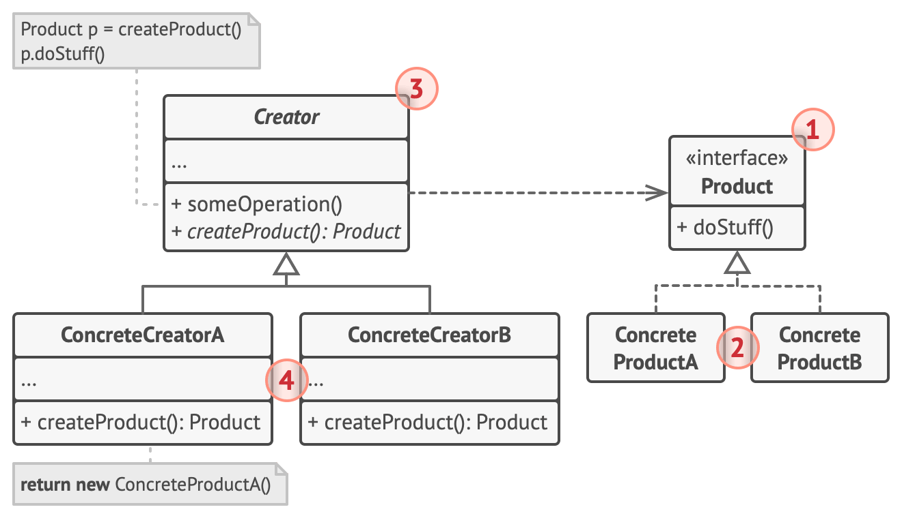

---

1. El **Producto** declara la interfaz, que es común a todos los objetos que puede producir la clase creadora y sus subclases.

2. Los **Productos Concretos** son distintas implementaciones de la interfaz de producto.

3. La clase **Creadora** declara el método fábrica que devuelve nuevos objetos de producto. Es importante que el tipo de retorno de este método coincida con la interfaz de producto.

4. Los **Creadores Concretos** sobrescriben el Factory Method base, de modo que devuelva un tipo diferente de producto.

---

<style>
section > img {
  align-self: flex-start;
}
</style>

<!--

@startuml
top to bottom direction
scale 700 width
scale 600 height

class Product
class Creator
class ConcreteProduct
class ConcreteCreator

Creator : factoryMethod()
Creator : anOperation()
ConcreteCreator : factoryMethod()

Creator <|–down- ConcreteCreator
Product <|–down- ConcreteProduct
ConcreteProduct <- ConcreteCreator

hide members
show methods

note top of Creator
The Creator is a class that contains
the implementation for all of the
methods to manipulate products,
except for the factory method.
end note

note right of Creator
The abstract factoryMethod()
is what all Creator subclasses
must implement.
end note

note right of ConcreteCreator
The ConcreteCreator
implements the
factoryMethod(), which is
the method that actually
produces products.
end note

note “The ConcreteCreator is responsible for\ncreating one or more concrete products. It\nis the only class that has the knowledge of\nhow to create these products.” as n1
ConcreteProduct .. n1
ConcreteCreator .. n1

note “All products must implement\nthe same interface so that the\nclasses which use the products\ncan refer to the interface,\nnot the concrete class.” as n2
n2 . ConcreteProduct
n2 . Product

@enduml

---

-->

#### Factory method: Ventajas

- Se evita un acoplamiento fuerte entre el creador y los productos concretos.
- SRP: Se puede mover el código de creación de producto a un lugar del programa, haciendo que el código sea más fácil de mantener.
- OCP: Se pueden incorporar nuevos tipos de productos en el programa sin descomponer el código cliente existente.

---

#### Implementación de `JuegoLaberinto`

```java
public class JuegoLaberinto {
  JuegoLaberinto() {};
  // factory methods:
  Laberinto makeLaberinto() { return new Laberinto(); }
  Sala makeSala(int numSala) { return new Sala(numSala); }
  Pared makePared() { return new Pared(); }
  Puerta makePuerta(Sala sala1, Sala sala2) {
    return new Puerta(sala1, sala2);
  }
  Laberinto crearLaberinto () { ... }
}
```

---

```java
Laberinto crearLaberinto () {
  Laberinto miLab = makeLaberinto();
  Sala hab1 = makeSala(1);
  Sala hab2 = makeSala(2);
  Puerta unaPuerta = makePuerta(hab1, hab2);
  miLab.agregarSala(hab1);
  miLab.agregarSala(hab2);
  hab1.setLado(Direccion.NORTE, makePared());
  hab1.setLado(Direccion.ESTE, unaPuerta);
  hab1.setLado(Direccion.SUR, makePared());
  hab1.setLado(Direccion.OESTE, makePared());
  hab2.setLado(Direccion.NORTE, makePared());
  hab2.setLado(Direccion.ESTE, makePared());
  hab2.setLado(Direccion.SUR, makePared());
  hab2.setLado(Direccion.OESTE, unaPuerta);
  return miLab;
}
```

---

```java
public class JuegoLaberintoMinado extends JuegoLaberinto {
  Pared makePared() {
    return new ParedMinada();
  }
  Sala makeSala(int numSala) {
    return new SalaMinada(numSala);
  }
}

public class JuegoLaberintoHechizado extends JuegoLaberinto {
  Sala makeSala(int numSala) {
    return new SalaHechizada(numSala, lanzarHechizo());
  }
  Puerta makePuerta(Sala sala1, Sala sala2) {
    return new PuertaHechizada(sala1, sala2);
  }
  private Hechizo lanzarHechizo() { ... }
}
```

---
<style scoped>
section { text-align: center; }
</style>

### [Strategy](https://refactoring.guru/es/design-patterns/strategy)

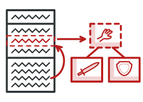

---
<style scoped>
.cols {
  display: grid;
  grid-template-columns: 30% 70%;
}
</style>

<div class="cols">
<div>

#### Strategy: Estructura

</div>
<div>

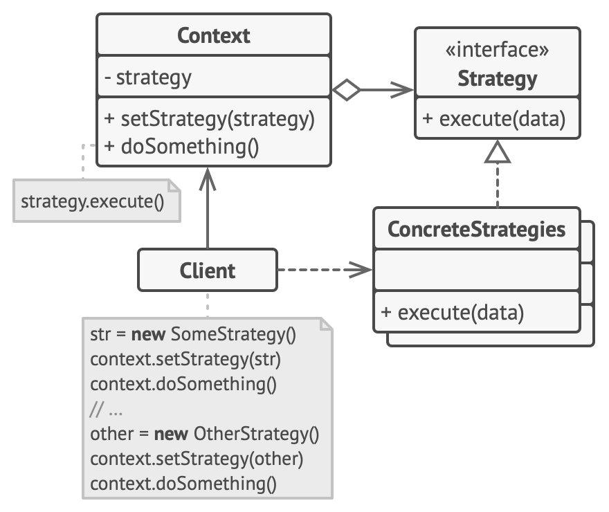

</div>
</div>

---

#### Strategy

- Define una familia de algoritmos, encapsula cada uno de ellos y los hace intercambiables
- Permite que el algoritmo varíe de forma independiente a quienes lo usan (el **Contexto**)

**Ventajas:**

- Ayuda a sacar factor común (factorizar) funcionalidades
- La estrategia es sustituible en tiempo de ejecución
- Alternativa a la herencia estática

**Desventajas:**

- Sobrecarga de la comunicación _Context_-_Strategy_

---
<style scoped>
section { text-align: center; }
</style>

### [Command](https://refactoring.guru/es/design-patterns/command)


<!--

@startuml
class Client
class Invoker
class Command <<interface>>
class Receiver
class ConcreteCommand

Invoker : setCommand()
Command : execute()
Command : undo()
Receiver : action()
ConcreteCommand : execute()
ConcreteCommand : undo()

Client -> Receiver
Client -> ConcreteCommand
Receiver <- ConcreteCommand
Invoker -> Command
Command <|.. ConcreteCommand

note left of Client
The Client is responsible for
creating a ConcreteCommand and
setting its Receiver.
end note

note bottom of Receiver
The Receiver knows how to
perform the work needed to
carry out the request. Any class
can act as a Receiver.
end note

note bottom of ConcreteCommand
The ConcreteCommand defines a binding between an action
and a Receiver. The Invoker makes a request by calling
execute() and the ConcreteCommand carries it out by
calling one or more actions on the Receiver.
end note

note left of Invoker
The Invoker holds
a command and at
some point asks the
command to carry
out a request by
calling its execute()
method.
end note

note top of Command
Command declares an interface for all commands. A
command is invoked through its execute() method,
which asks a receiver to perform its action.
end note

note right of ConcreteCommand::execute()
The execute method invokes the action(s)
on the receiver needed to fulfill the
request;

public void execute() {
  receiver.action()
}

end note
@enduml
-->

---

#### Command: Estructura

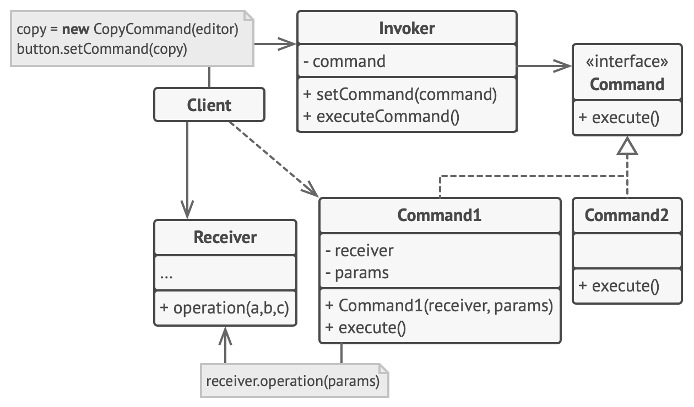

---

#### Command: Comportamiento

@startuml
scale 700 width
scale 600 height

participant "editor: Client" as editor
participant "cmdDraw: DrawCommand" as cmdDraw
participant "menuItem: Invoker" as menuItem
participant "image: Receiver" as image

[--> editor: <<create>>
activate editor
editor --> cmdDraw : new DrawCommand(image)
editor -> menuItem: setCommand(cmdDraw)
activate menuItem
deactivate editor
deactivate menuItem

...

[--> menuItem: executeCommand()
activate menuItem

menuItem -> cmdDraw: execute()
activate cmdDraw
cmdDraw -> image: draw()
activate image
deactivate cmdDraw

@enduml

---
<style scoped>
.cols {
  display: grid;
  grid-template-columns: 30% 70%;
}
</style>

<div class="cols">
<div>

#### Versión cliente/servidor

</div>
<div>

@startuml
scale 700 width
scale 600 height

participant client
participant anInvoker

box "Server"
participant aCommand
participant aServer
participant aReceiver
end box

activate client
client -> aCommand: new ConcreteCommand()
activate aCommand
deactivate aCommand

client -> anInvoker: add(aCommmand)
activate anInvoker
deactivate client

anInvoker -> aCommand: getData()
activate aCommand

anInvoker <-- aCommand  : ok
deactivate aCommand

client <- anInvoker : send(aCommand)
activate client
deactivate anInvoker

client -> aServer : accept(aCommand)
activate aServer
deactivate client

aCommand <- aServer: execute(this)
activate aCommand

aCommand -> aReceiver: action()
activate aReceiver

@enduml

</div>
</div>

---
<style scoped>
section { text-align: center; }
</style>

### [Adapter](https://refactoring.guru/es/design-patterns/adapter)

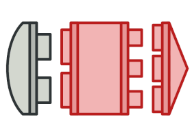

<!--
@startuml
class Client
class Target <<interface>>
class Adapter
class Adaptee
Target : request()
Adapter : request()
Adaptee : specificRequest()

Client -> Target
Target <|.. Adapter
Adapter -> Adaptee
note on link
Adapter is composed
with the Adapter.
end note

note bottom of Client
The client sees only the
Target interface
end note

note “The Adapter implements\nthe Target interface.” as n1
Target .. n1
n1 .. Adapter

note bottom of Adaptee
All requests get
delegated to the
Adaptee.
end note
@enduml
-->

---

#### Adaptador de objetos: Estructura


---

#### Adaptador de clases: Estructura


---

#### Adaptador de clases vs. objetos

**Class adapter:**

- No sirve para adaptar una clase y sus subclases
- Se crea un único objeto, sin indirecciones adicionales

**Object adapter:**

- Un adapter puede funcionar con varios objetos _Service_ o _Adaptee_
- Es más complicado heredar el comportamiento del objeto adaptado

---
<style scoped>
section { text-align: center; }
</style>

### [Composite](https://refactoring.guru/es/design-patterns/composite)

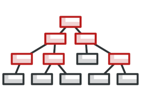

<!--
@startuml
class Client
class Component
class Leaf
class Composite

Component : operation()
Component : add(Component)
Component : remove(Component)
Component : getChild(int)

Leaf : operation()

Composite : operation()
Composite : add(Component)
Composite : remove(Component)
Composite : getChild(int)

Client -> Component
Component <|– Leaf
Component <|– Composite
Component “0..*” <–o “1” Composite

note top of Client
The Client uses the
Component interface to
manipulate the objects in the
composition.
end note

note top of Component
The Component defines an
interface for all objects in
the composition: both the
composite and the leaf nodes.
end note

note top of Component
The Component may implement a
default behavior for add(), remove(),
getChild() and its operations.
end note

note bottom of Leaf
A Leaf has no
children.
end note

note left of Leaf
Note that the Leaf also
inherits methods like add(),
remove() and getChild(), which
do not necessarily make a lot of
sense for a leaf node. We are
going to come back to this issue.
end note

note bottom of Leaf
A Leaf defines the behavior for the
elements in the composition. It does
this by implementing the operations
the Composite supports.
end note

note bottom of Composite
The Composite’s role is to define
behavior of the components
having children and to store child
components.
end note

note right of Composite
The Composite also
implements the Leaf-
related operations.
Note that some of
these may not make
sense on a Composite,
so in that case an
exception might be
generated.
end note
@enduml

-->

---
<style scoped>
.cols {
  display: grid;
  grid-template-columns: 30% 70%;
}
</style>

<div class="cols">
<div>

#### Composite: Estructura

</div>
<div>

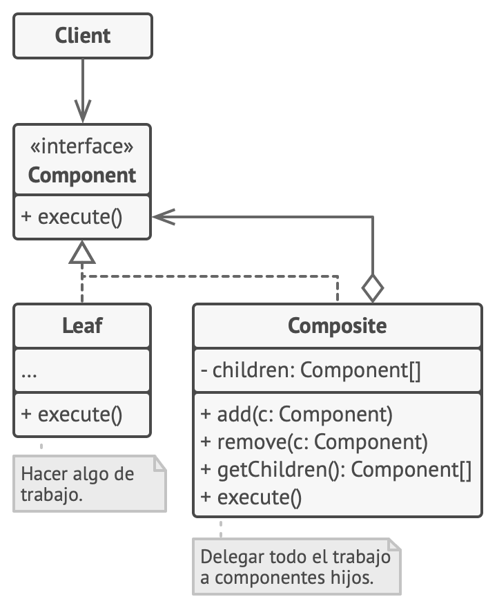

</div>
</div>

---

#### Composite

- Permite construir objetos complejos componiendo de forma recursiva objetos similares en una estructura de **árbol**.
- Permite manipular **uniformemente** todos los objetos contenidos en el árbol, ya que todos ellos poseen una interfaz común definida en la clase raíz.

**Ventajas:**

- El cliente trata a todos los objetos de la misma forma
- La inclusión de nuevos tipos de hojas o compuestos no afecta a la estructura anterior

**Desventajas:**

- Si se desea restringir el tipo de objetos que pueden formar parte de otros $\Rightarrow$ Necesidad de comprobaciones dinámicas

---
<style scoped>
section { text-align: center; }
</style>

### [Decorator](https://refactoring.guru/es/design-patterns/decorator)

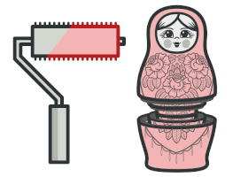

<!--
@startuml
skinparam componentStyle uml2

class Component
class ConcreteComponent
class Decorator
class ConcreteDecoratorA
class ConcreteDecoratorB

Component : methodA()
Component : methodB()
Component : // otherMethods()

ConcreteComponent : methodA()
ConcreteComponent : methodB()
ConcreteComponent : // otherMethods()

Decorator : methodA()
Decorator : methodB()
Decorator : // otherMethods()

ConcreteDecoratorA : Component wrappedObject
ConcreteDecoratorA : methodA()
ConcreteDecoratorA : methodB()
ConcreteDecoratorA : newBehavior()
ConcreteDecoratorA : // otherMethods()

ConcreteDecoratorB : Component wrappedObject
ConcreteDecoratorB : Object newState
ConcreteDecoratorB : methodA()
ConcreteDecoratorB : methodB()
ConcreteDecoratorB : // otherMethods()

Component <|– ConcreteComponent
Component <|– Decorator
Decorator <|– ConcreteDecoratorA
Decorator <|– ConcreteDecoratorB
Decorator –> Component : component
note right on link
Each component can be used on its
own, or wrapped by a decorator
component
end note

note bottom of ConcreteComponent
The ConreteComponent
is the object we are going
to dynamically add new
behavior to it. It extends
Component.
end note

note bottom of Decorator
Decorators implement the
same interface or abstract
class as the component they
are going to decorate.
end note

note bottom of ConcreteDecoratorB
Decorators can extend the
state of the component
end note

note bottom of ConcreteDecoratorB
Decorators can add new methods;
however, new behavior is typically
added by doing computation
before or after an existing method
in the component.
end note

note bottom of ConcreteDecoratorA
The ConcreteDecorator has an
instance variable for the thing
it decorates (the Component the
Decorator wraps).
end note
@enduml
-->

---
<style scoped>
.cols {
  display: grid;
  grid-template-columns: 30% 70%;
}
</style>

<div class="cols">
<div>

#### Decorator: Estructura

</div>
<div>


</div>
</div>

---

#### Ejemplo: `EnhancedWriter` original

@startuml
top to bottom direction
scale 1024 width
scale 650 height
skinparam linetype ortho
skinparam classAttributeIconSize 0

abstract class EnhancedWriter {
  {method} writeLine(line)
}

class NumberingWriter {
  {method} writeLine(line)
}

class TimestampingWriter {
  {method} writeLine(line)
}

class ChecksummingWriter {
  {method} writeLine(line)
}

EnhancedWriter <|-- NumberingWriter
EnhancedWriter <|-- TimestampingWriter
EnhancedWriter <|-- ChecksummingWriter

hide members
show methods

@enduml

---

#### Ejemplo: `EnhancedWriter` ampliado – herencia fuera de control

@startuml
top to bottom direction
scale 1024 width
scale 650 height
skinparam linetype ortho
skinparam classAttributeIconSize 0

abstract class EnhancedWriter {
  {method} writeLine(line)
}

class NumberingWriter {
  {method} writeLine(line)
}

class TimestampingWriter {
  {method} writeLine(line)
}

class ChecksummingWriter {
  {method} writeLine(line)
}

EnhancedWriter <|-- NumberingWriter
EnhancedWriter <|-- TimestampingWriter
EnhancedWriter <|-- ChecksummingWriter

NumberingWriter <|-- NumberingCheksummingWriter
ChecksummingWriter <|.. NumberingCheksummingWriter
TimestampingWriter <|-- TimestampingNumberingWriter
NumberingWriter <|.. TimestampingNumberingWriter
ChecksummingWriter <|-- ChecksummingNumberingWriter
NumberingWriter <|.. ChecksummingNumberingWriter

hide members
show methods

@enduml

---

#### Ejemplo: `EnhancedWriter` ampliado –  herencia fuera de control

@startuml
top to bottom direction
scale 1024 width
scale 650 height
skinparam linetype ortho
skinparam classAttributeIconSize 0

abstract class EnhancedWriter {
  {method} writeLine(line)
}

class NumberingWriter {
  {method} writeLine(line)
}

class TimestampingWriter {
  {method} writeLine(line)
}

class ChecksummingWriter {
  {method} writeLine(line)
}

EnhancedWriter <|-- NumberingWriter
EnhancedWriter <|-- TimestampingWriter
EnhancedWriter <|-- ChecksummingWriter

NumberingWriter <|-- NumberingChecksummingWriter
ChecksummingWriter <|.. NumberingChecksummingWriter
TimestampingWriter <|-- TimestampingNumberingWriter
NumberingWriter <|.. TimestampingNumberingWriter
ChecksummingWriter <|-- ChecksummingNumberingWriter
NumberingWriter <|.. ChecksummingNumberingWriter

NumberingChecksummingWriter <|-- NumberingChecksummingTimestampingWriter
TimestampingWriter <|.. NumberingChecksummingTimestampingWriter

TimestampingWriter <|-- TimestampingNumberingWriter
NumberingWriter <|.. TimestampingNumberingWriter

ChecksummingNumberingWriter <|-- ChecksummingNumberingTimestampingWriter
TimestampingWriter <|.. ChecksummingNumberingTimestampingWriter

hide members
show methods

@enduml

---

#### Decorator

- El patrón decorator permite añadir responsabilidades a objetos concretos de forma **dinámica**.
- Los decoradores ofrecen una **alternativa** más flexible que la herencia para extender funcionalidades.

**Ventajas:**

- Permite añadir o quitar responsabilidades a los objetos sin afectar a otros objetos

**Desventajas:**

- Rompe la identidad de objetos: un componente y su decorador no son el mismo objeto
- Provoca la creación de muchos objetos pequeños y complica la depuración

---
<style scoped>
h4 {
  text-align: center;
  color: red;
}
</style>

#### ¿Diferencia entre Strategy y Decorator?

---
<style scoped>
h4, p {
  text-align: center;
}
</style>

#### Diferencia entre Strategy y Decorator

El _decorator_ cambia la piel, el _strategy_ cambia las tripas

---
<style scoped>
section { text-align: center; }
</style>

### [Observer](https://refactoring.guru/es/design-patterns/observer)


---

<!--
@startuml
class Client
class Invoker
class Command <<interface>>
class Receiver
class ConcreteCommand

Invoker : setCommand()
Command : execute()
Command : undo()
Receiver : action()
ConcreteCommand : execute()
ConcreteCommand : undo()

Client -> Receiver
Client -> ConcreteCommand
Receiver <- ConcreteCommand
Invoker -> Command
Command <|.. ConcreteCommand

note left of Client
The Client is responsible for
creating a ConcreteCommand and
setting its Receiver.
end note

note bottom of Receiver
The Receiver knows how to
perform the work needed to
carry out the request. Any class
can act as a Receiver.
end note

note bottom of ConcreteCommand
The ConcreteCommand defines a binding between an action
and a Receiver. The Invoker makes a request by calling
execute() and the ConcreteCommand carries it out by
calling one or more actions on the Receiver.
end note

note left of Invoker
The Invoker holds
a command and at
some point asks the
command to carry
out a request by
calling its execute()
method.
end note

note top of Command
Command declares an interface for all commands. A
command is invoked through its execute() method,
which asks a receiver to perform its action.
end note

note right of ConcreteCommand::execute()
The execute method invokes the action(s)
on the receiver needed to fulfill the
request;

public void execute() {
 receiver.action()
}

end note
@enduml
-->

#### Observer

- Define una dependencia 1:N entre objetos de modo que cuando el estado de un objeto cambia, se les notifica el cambio a todos los que de él dependen y estos se actualizan de forma automática.

---

#### Observer: Estructura

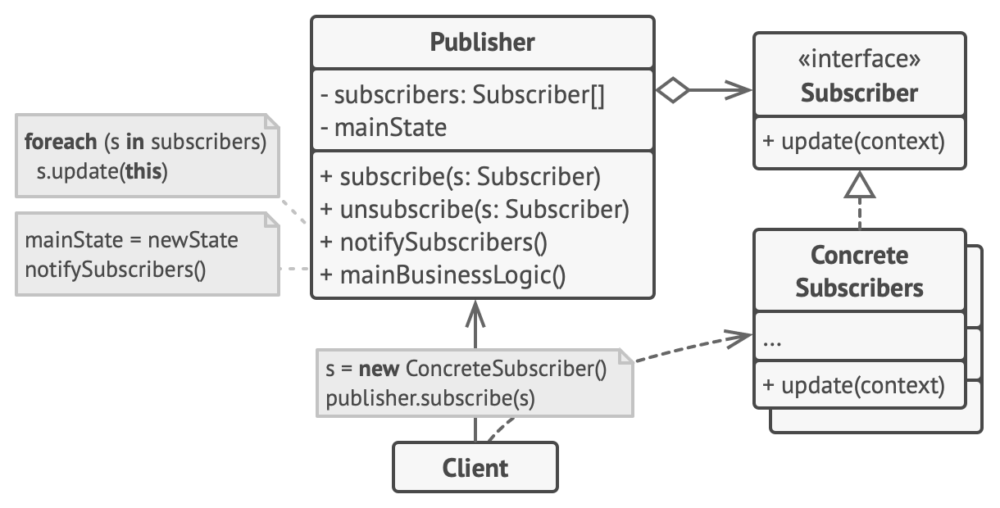

---

#### Observer: Estructura (según GoF)

@startuml
scale 420 height

skinparam classAttributeIconSize 0

abstract class Subject {
  +attach(o: Observer)
  +detach(o: Observer)
  +notify()
}

abstract class Observer {
  +update()
}

class ConcreteSubject {
  -subjectState
  +getState()
  +setState(state)
}

class ConcreteObserver {
  -observerState
  -subject: ConcreteSubject
  +update()
}

ConcreteSubject -up-|> Subject
ConcreteObserver -up-|> Observer

Subject "1" o-right- "*" Observer : observers
ConcreteObserver --> ConcreteSubject : subject

@enduml

---

#### Observer: roles

Sin distinguir entre `Observable` y `Subject`:

- `Publisher` = `Observable` = `Subject`
- `ConcreteSubscriber` $\dashrightarrow$ `Subject`

Con `Subject` separado:

- `Subscriber` = `Observer`
- Distinguir entre `Observable` y `Subject`
- Definir `Observer.update()`
  - `ConcreteObserver` mantiene referencia a `ConcreteSubject`
  - El estado se recupera desde `ConcreteSubject.getState()` (pull)

---

#### Observer: Detalles de implementación

- ¿Quién dispara la actualización?
  - El publicador, tras cambiar de estado: menos eficiente si hay muchas notificaciones
  - El cliente, tras una serie de cambios de estado: si se olvida puede provocar inconsistencias

---

#### Observer: Comportamiento (síncrono) – disparo externo

@startuml
scale 700 width

participant "anObservable: Publisher" as anObservable
participant "anObserver: Subscriber" as anObserver
participant "anotherObserver: Subscriber" as anotherObserver

anObserver -> anObservable : subscribe(this)
activate anObserver
deactivate anObserver

anotherObserver -> anObservable : subscribe(this)
activate anotherObserver
deactivate anotherObserver

...

?-> anObservable: notify()
activate anObservable

anObservable -> anObserver : update(this)
activate anObserver
anObservable <- anObserver : getState()
deactivate anObserver

anObservable -> anotherObserver : update(this)
activate anotherObserver
anObservable <- anotherObserver : getState()
deactivate anotherObserver

@enduml

---

#### Observer: Comportamiento (síncrono) – autodisparo

@startuml
scale 700 width

participant "anObservable: Publisher" as anObservable
participant "anObserver: Subscriber" as anObserver
participant "anotherObserver: Subscriber" as anotherObserver

anObserver -> anObservable : subscribe(this)
activate anObserver
deactivate anObserver

anotherObserver -> anObservable : subscribe(this)
activate anotherObserver
deactivate anotherObserver

...

?-> anObservable : setState()
activate anObservable
anObservable -> anObservable: notify()

anObservable -> anObserver : update(this)
activate anObserver
anObservable <- anObserver : getState()
deactivate anObserver

anObservable -> anotherObserver : update(this)
activate anotherObserver
anObservable <- anotherObserver : getState()
deactivate anotherObserver

deactivate anObservable

@enduml

---

#### Observer: Detalles de implementación

- Los suscriptores necesitan información para hacer la actualización:
  - `update(context)` para pasar la información necesaria al suscriptor
  - `update(this)` para que el suscriptor extraiga la información necesaria pidiéndosela al publicador
  - `ConcreteSubscriber.setPublisher()` para vincularlos permanentemente (opción menos flexible)

---
<style scoped>
section { text-align: center; }
</style>

### [Visitor](https://refactoring.guru/es/design-patterns/visitor)

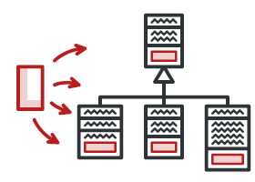

---

#### Visitor

- Representa una **operación** que se lleva a cabo sobre los elementos de una **estructura** de objetos
- Permite **definir nuevas** operaciones sin modificar las clases de los **elementos** sobre las que opera.

---
<style scoped>
.cols {
  display: grid;
  grid-template-columns: 30% 70%;
}
</style>

<div class="cols">
<div>

#### Visitor: <emph>Estructura</emph>

</div>
<div>

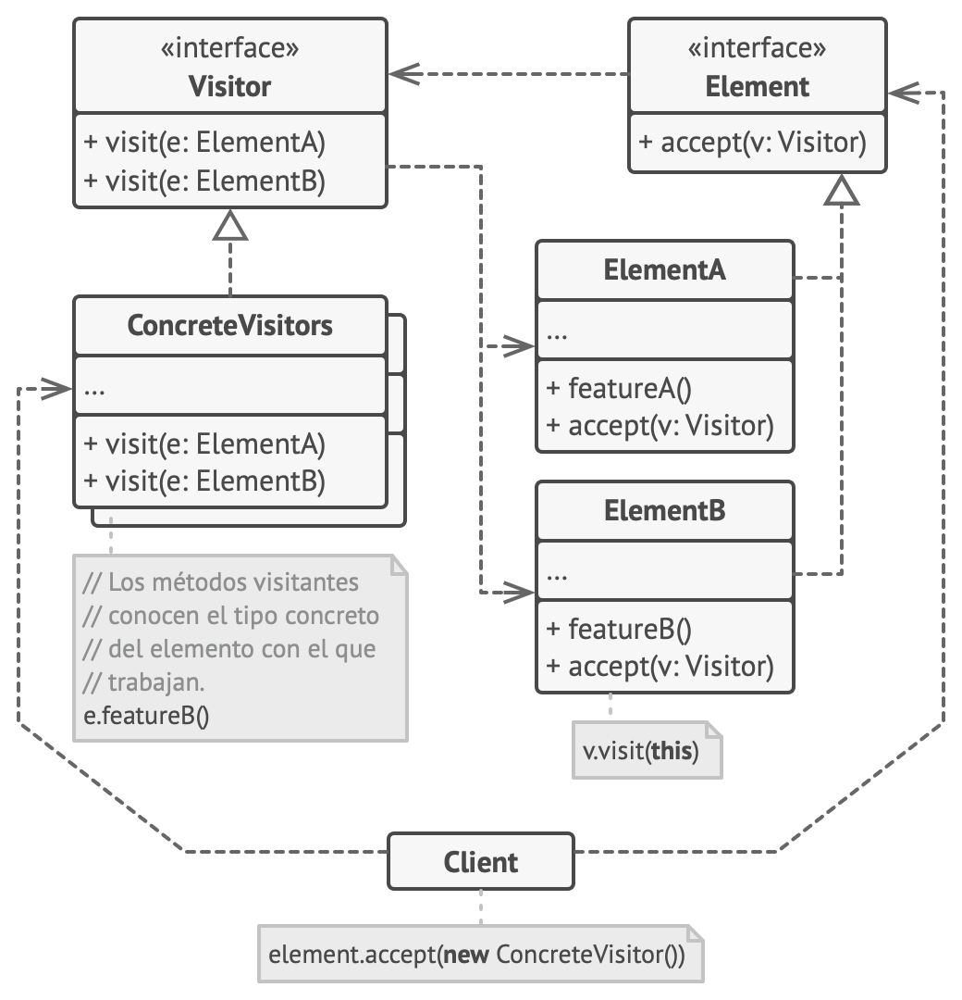

</div>
</div>

---

#### Visitor: <emph>Comportamiento</emph>

@startuml
scale 450 width
scale 500 height

participant anObjectStructure
participant "anElementA: ElementA" as anElementA
participant "anElementB: ElementB" as anElementB
participant "aVisitor1: ConcreteVisitor1" as aVisitor1

?-> anObjectStructure : operation()
activate anObjectStructure

anObjectStructure -> anElementA : accept(aVisitor1)
activate anElementA
anElementA -> aVisitor1 : visitElementA(this)
deactivate anElementA
activate aVisitor1

anElementA <- aVisitor1 : operationA()
activate anElementA
deactivate aVisitor1
deactivate anElementA

anObjectStructure -> anElementB : accept(aVisitor1)
activate anElementB
anElementB -> aVisitor1 : visitElementB(this)
deactivate anElementB
activate aVisitor1

anElementB <- aVisitor1 : operationB()
activate anElementB
deactivate aVisitor1
deactivate anElementB

@enduml

---

**Ventajas:**

- Permite implementar el _double dispatch_: la operación que se ejecuta tras el `accept()` depende del tipo de `Visitor` y del tipo de `Element`
- Separa los datos y las operaciones de los elementos visitados, facilitando la inclusión de nuevas operaciones sin tener que cambiar las clases
- Permite acumular el estado de una operación global sobre una estructura

**Desventajas:**

- Rompe la encapsulación (?)
- Los tipos de `Element` visitados deben ser estables

---
<style scoped>
section { text-align: center; }
</style>

### [State](https://refactoring.guru/design-patterns/state)

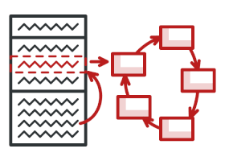

---
<style scoped>
.cols {
  display: grid;
  grid-template-columns: 40% 60%;
}
</style>

#### State: Ejemplo

<div class="cols">
<div>

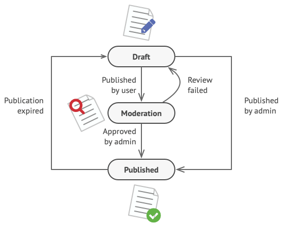

</div>
<div>

```scala
class Document {
  var state: String = _
  var expirationDate: Date = _
  // ...

  def publish(currentUser: User): Unit = state match {
    case "draft" =>
      if (currentUser.role == "admin") {
        state = "published"
      } else {
        state = "moderation"
      }
    case "moderation" =>
      if (currentUser.role == "admin") {
        state = "published"
      }
    case "published" =>
      if (new Date().after(expirationDate)) {
        state = "draft"
      }
    case _ =>
      // Handle any unexpected state.
      throw new IllegalStateException(s"Invalid document state: $state")
  }
}
```

</div>
</div>

---
<style scoped>
.cols {
  display: grid;
  grid-template-columns: 30% 70%;
}
</style>

<div class="cols">
<div>

#### State: Estructura

</div>
<div>

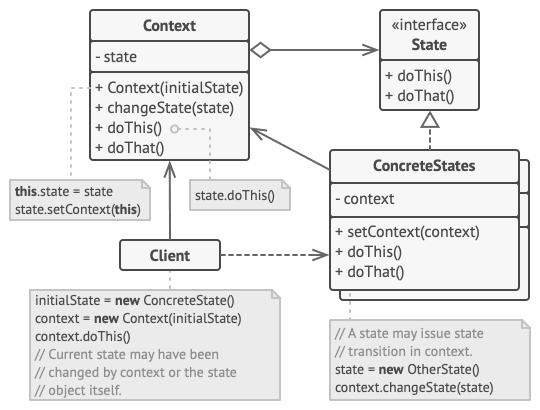

</div>
</div>

---

#### Diferencia de State con Strategy

- Cada estado puede ser consciente de la existencia de otros estados e iniciar transiciones de estado
- Cada estrategia desconoce a las otras

---
<style scoped>
section { text-align: center; }
</style>

## Otros patrones específicos

---
<style scoped>
.cols {
  display: grid;
  grid-template-columns: 65% 35%;
}
</style>

### Patrón _Data Access Object_ (DAO)

<div class="cols">
<div>

El patrón **Data Access Object** se usa para abstraer y encapsular los accesos a las fuentes de datos, proporcionando una **capa de persistencia** con independencia del soporte concreto de almacenamiento (BD relacional, NoSQL, ficheros, etc.).

**Problemas (sin DAO):**

- Lógica de acceso a datos dispersa por la aplicación
- Acoplamiento dependencias concretas (JDBC, Hibernate, etc.) en el código de negocio
- Difícil cambiar la implementación de persistencia sin modificar todo el código

</div>
<div>

#### DAO: Estructura

@startuml
top to bottom direction
scale 600 width
skinparam linetype ortho
skinparam classAttributeIconSize 0

interface DataAccessObject {
  {method} create(entity): void
  {method} read(id): Entity
  {method} update(entity): void
  {method} delete(id): void
  {method} findAll(): List<Entity>
}

class EntityDAO {
  {field} connection: Connection
  {method} create(entity): void
  {method} read(id): Entity
  {method} update(entity): void
  {method} delete(id): void
  {method} findAll(): List<Entity>
}

class Entity {
  {field} id: int
  {field} nombre: String
  {field} email: String
}

DataAccessObject <|.. EntityDAO
EntityDAO -right-> Entity

hide members
show methods
show Entity members

@enduml

</div>
</div>

---
<style scoped>
.cols {
  display: grid;
  grid-template-columns: 52% 43%;
}
</style>

#### Ejemplo: Usuario DAO (enfoque clásico)

<div class="cols">
<div>

```java
// Interfaz DAO - define el contrato
public interface UsuarioDAO {
  void create(Usuario usuario);
  Usuario read(int id);
  void update(Usuario usuario);
  void delete(int id);
  List<Usuario> findAll();
}

// Implementación JDBC
public class UsuarioDAOImpl implements UsuarioDAO {
  private Connection connection;

  public UsuarioDAOImpl(Connection connection) {
    this.connection = connection;
  }

  @Override
  public void create(Usuario usuario) {
    String sql =
      "INSERT INTO usuarios (nombre, email) VALUES (?, ?)";
    try (PreparedStatement stmt =
            connection.prepareStatement(sql)) {
      stmt.setString(1, usuario.getNombre());
      stmt.setString(2, usuario.getEmail());
      stmt.executeUpdate();
    } catch (SQLException e) {
      throw new PersistenceException(e);
    }
  }
  ...
```

</div>
<div>

```java
  ...
  @Override
  public Usuario read(int id) {
    String sql =
      "SELECT * FROM usuarios WHERE id = ?";
    try (PreparedStatement stmt =
            connection.prepareStatement(sql)) {
      stmt.setInt(1, id);
      try (ResultSet rs = stmt.executeQuery()) {
        if (rs.next()) {
          return new Usuario(
            rs.getInt("id"),
            rs.getString("nombre"),
            rs.getString("email")
          );
        }
      }
    } catch (SQLException e) {
      throw new PersistenceException(e);
    }
    return null;
  }

  // ... otros métodos (update, delete, findAll)
}
```

</div>
</div>

---

#### DAO: Ventajas y Desventajas

<div class="cols">
<div>

**Ventajas:**

- **Separación de responsabilidades**: lógica de negocio desacoplada del acceso a datos
- **Cambios de persistencia**: cambiar BD sin modificar la lógica de negocio
- **Testabilidad**: fácil crear mocks del DAO para pruebas unitarias
- **Centralización**: código de SQL/queries concentrado en una única ubicación

</div>
<div>

**Desventajas:**

- **Boilerplate**: mucho código repetitivo (CRUD methods en cada DAO)
- **Mantenimiento**: cambios en la entidad requieren actualizar el DAO
- **Inflexibilidad**: las consultas complejas requieren nuevos métodos en la interfaz

</div>
</div>

---

### Patrón _Repository_

Evolución moderna del DAO que surge con la popularidad de frameworks como _Spring Data JPA_. Ofrece una abstracción de más alto nivel que el DAO tradicional, proporcionando operaciones CRUD genéricas sin necesidad de implementación manual.

**Relación Repository $\leftrightarrow$ DAO:**

- Repository = DAO de alto nivel + convenciones + derivación de consultas
- Ambos abstraen la persistencia, pero Repository reduce boilerplate

---

#### Repository vs DAO

<div class="cols">
<div>

<emph>DAO (clásico)</emph>

- Interfaz + Implementación explícita
- Métodos CRUD manuales
- Control total sobre SQL
- Verboso, bajo nivel

</div>
<div>

<emph>Repository (moderno)</emph>

- Hereda de interfaz genérica
- Métodos CRUD automáticos
- Queries derivadas del método
- Conciso, alto nivel

</div>
</div>

---

#### Repository: Estructura (Spring Data JPA)

@startuml
top to bottom direction
scale 1024 width
scale 700 height
skinparam linetype ortho
skinparam classAttributeIconSize 0

interface CrudRepository {
  {method} save(Entity): Entity
  {method} findById(id): Optional<Entity>
  {method} findAll(): Iterable<Entity>
  {method} delete(Entity): void
  {method} deleteById(id): void
}

interface JpaRepository {
  {method} saveAndFlush(Entity): Entity
  {method} deleteInBatch(Entities): void
  {method} flush(): void
}

interface UsuarioRepository {
  {method} findByEmail(email): Optional<Usuario>
  {method} findByNombreContaining(nombre): List<Usuario>
}

class Usuario {
  {field} id: Long
  {field} nombre: String
  {field} email: String
  {field} createdAt: LocalDateTime
}

CrudRepository <|-- JpaRepository
CrudRepository <|-- UsuarioRepository
UsuarioRepository -right-> Usuario

' Anclas de layout (solo para posicionar)
JpaRepository -[hidden]right- UsuarioRepository
UsuarioRepository -[hidden]right- Usuario

hide members
show methods
show Usuario members

@enduml

---

#### Ejemplo: Usuario Repository (Spring Data JPA)

<div class="cols">
<div>

```java
// Interfaz Repository - hereda CRUD automático
@Repository
public interface UsuarioRepository extends JpaRepository<Usuario, Long> {
  // Métodos derivados (queries generadas automáticamente)
  Optional<Usuario> findByEmail(String email);
  List<Usuario> findByNombreContainingIgnoreCase(String nombre);
  List<Usuario> findByCreatedAtAfter(LocalDateTime fecha);
  boolean existsByEmail(String email);
}

// Entity con JPA
@Entity
@Table(name = "usuarios")
@Data
@NoArgsConstructor
public class Usuario {
  @Id
  @GeneratedValue(strategy = GenerationType.IDENTITY)
  private Long id;
  
  @Column(nullable = false)
  private String nombre;
  
  @Column(unique = true, nullable = false)
  private String email;
  
  @CreationTimestamp
  private LocalDateTime createdAt;
}
```

</div>
<div>

```java
// Usando el Repository en un Servicio
@Service
public class UsuarioService {
  private final UsuarioRepository usuarioRepository;

  @Autowired
  public UsuarioService(UsuarioRepository usuarioRepository) {
    this.usuarioRepository = usuarioRepository;
  }

  public Usuario crearUsuario(Usuario usuario) {
    if (usuarioRepository.existsByEmail(usuario.getEmail())) {
      throw new EmailYaExisteException();
    }
    return usuarioRepository.save(usuario);
  }

  public Usuario obtenerPorId(Long id) {
    return usuarioRepository.findById(id)
      .orElseThrow(() -> new UsuarioNoEncontradoException());
  }

  public List<Usuario> buscarPorNombre(String nombre) {
    return usuarioRepository.
             findByNombreContainingIgnoreCase(nombre);
  }
}
```

</div>
</div>

---

#### Repository: Ventajas respecto a DAO

- **Menos boilerplate**: Métodos CRUD heredados automáticamente de `CrudRepository`
- **Query derivadas**: Métodos generados a partir del nombre (método query method)
- **Transacciones automáticas**: Spring maneja `@Transactional` por defecto
- **Testabilidad**: Fácil crear mocks con Mockito o usar `@DataJpaTest`
- **Integración Spring**: Inyección de dependencias, AOP, etc.
- **Convenciones**: Desarrollo más rápido siguiendo estándares

---

### Data Transfer Object (DTO)

Sirve para crear objetos planos o _Plain Old Java Objects_ (POJO) que se envían entre aplicaciones, capas, o servidores remotos. Un DTO <emph>no tiene comportamiento</emph> de negocio, solo almacena y entrega datos (*value object*).

**Problema a resolver:**

- Exponer entidades de BD directamente en APIs REST crea acoplamiento
- Cambios en la BD obligan a cambios en clientes API
- Puede exponerse información sensible (contraseñas, datos internos)
- Diferentes vistas de datos requieren múltiples selecciones/proyecciones

---

#### DTO: Estructura

@startuml
left to right direction
scale 600 width
skinparam linetype ortho
skinparam classAttributeIconSize 0

class Entity {
  {field} id: Long
  {field} nombre: String
  {field} email: String
  {field} passwordHash: String
  {field} interno: boolean
}

class DTO {
  {field} id: Long
  {field} nombre: String
  {field} email: String
}

class Mapper {
  {method} toDTO(entity): DTO
  {method} toEntity(dto): Entity
}

Mapper -left-> DTO: genera
Mapper -right-> Entity: transforma

Entity ..> DTO

hide members
show methods
show Entity members
show DTO members
show Mapper members

@enduml

---
<style scoped>
.cols {
  display: grid;
  grid-template-columns: 33% 33% 33%;
}
</style>

#### Ejemplo: Usuario DTO (con ModelMapper)

<div class="cols">
<div>

```java
// Entity JPA (contiene datos + lógica de negocio)
@Entity
@Table(name = "usuarios")
@Data
@NoArgsConstructor
public class Usuario {
  @Id
  @GeneratedValue(strategy = GenerationType.IDENTITY)
  private Long id;
  
  @Column(nullable = false)
  private String nombre;
  
  @Column(unique = true, nullable = false)
  private String email;
  
  @JsonIgnore // No serializar en JSON
  private String passwordHash;
  
  @CreationTimestamp
  private LocalDateTime createdAt;
  
  // Métodos de negocio
  public boolean validarPassword(String rawPassword) {
    return BCrypt.checkpw(rawPassword, this.passwordHash);
  }
}
```

</div>
<div>

```java
// DTO - solo datos públicos (sin contraseña)
@Data
@NoArgsConstructor
@AllArgsConstructor
public class UsuarioDTO {
  private Long id;
  private String nombre;
  private String email;
  private LocalDateTime createdAt;
}

// Mapper usando ModelMapper (spring-boot-starter-modelmapper)
@Component
public class UsuarioMapper {
  private final ModelMapper modelMapper;

  @Autowired
  public UsuarioMapper(ModelMapper modelMapper) {
    this.modelMapper = modelMapper;
  }

  public UsuarioDTO toDTO(Usuario usuario) {
    return modelMapper.map(usuario, UsuarioDTO.class);
  }

  public Usuario toEntity(UsuarioDTO usuarioDTO) {
    return modelMapper.map(usuarioDTO, Usuario.class);
  }

  public List<UsuarioDTO> toDTOList(List<Usuario> usuarios) {
    return usuarios.stream()
      .map(this::toDTO)
      .collect(Collectors.toList());
  }
}
```

</div>
<div>

```java
// Controlador REST usando DTO
@RestController
@RequestMapping("/api/usuarios")
public class UsuarioController {
  private final UsuarioService usuarioService;
  private final UsuarioMapper usuarioMapper;

  @GetMapping("/{id}")
  public ResponseEntity<UsuarioDTO>
            obtenerUsuario(@PathVariable Long id) {
    Usuario usuario = usuarioService.obtenerPorId(id);
    return ResponseEntity.ok(usuarioMapper.toDTO(usuario));
  }

  @GetMapping
  public ResponseEntity<List<UsuarioDTO>>
            listarUsuarios() {
    List<Usuario> usuarios = usuarioService.listarTodos();
    return ResponseEntity.ok(usuarioMapper.toDTOList(usuarios));
  }

  @PostMapping
  public ResponseEntity<UsuarioDTO>
            crearUsuario(@RequestBody UsuarioDTO usuarioDTO) {
    Usuario usuario = usuarioMapper.toEntity(usuarioDTO);
    Usuario creado = usuarioService.crearUsuario(usuario);
    return ResponseEntity.created(URI.create("/api/usuarios/" +
                                  creado.getId()))
      .body(usuarioMapper.toDTO(creado));
  }
}
```

</div>
</div>

---

#### DTO: Ventajas y desventajas

**Ventajas:**

- **Separación de responsabilidades**: Entidad y DTO pueden evolucionar independientemente
- **Seguridad**: control sobre qué datos se exponen (ej: no exponer contraseñas)
- **Versionado API**: diferentes versiones de DTO para diferentes clientes
- **Performance**: seleccionar solo datos necesarios (proyecciones)
- **Contrato de API**: DTOs actúan como contrato entre cliente-servidor

**Desventajas:**

- **Duplicación**: mantener Entity y DTO con mapeos entre ambos
- **Boilerplate**: código repetitivo si hay muchos DTOs
- **Overhead**: conversión Entity $\leftrightarrow$ DTO tiene coste de CPU/memoria

---

#### Repository + DTO + Servicio integrados

```java
@Service
public class UsuarioService {
    private final UsuarioRepository usuarioRepository;
    private final UsuarioMapper usuarioMapper;

    @Autowired
    public UsuarioService(UsuarioRepository usuarioRepository, 
                         UsuarioMapper usuarioMapper) {
        this.usuarioRepository = usuarioRepository;
        this.usuarioMapper = usuarioMapper;
    }

    public UsuarioDTO obtenerPorId(Long id) {
        Usuario usuario = usuarioRepository.findById(id)
            .orElseThrow(() -> new UsuarioNoEncontradoException());
        return usuarioMapper.toDTO(usuario);  // Entity → DTO
    }

    public List<UsuarioDTO> buscarPorNombre(String nombre) {
        List<Usuario> usuarios = usuarioRepository
            .findByNombreContainingIgnoreCase(nombre);
        return usuarioMapper.toDTOList(usuarios);  // List<Entity> → List<DTO>
    }

    public UsuarioDTO crearUsuario(UsuarioDTO usuarioDTO) {
        Usuario usuario = usuarioMapper.toEntity(usuarioDTO);  // DTO → Entity
        Usuario creado = usuarioRepository.save(usuario);
        return usuarioMapper.toDTO(creado);  // Entity → DTO
    }
}
```

---

## Para profundizar sobre patrones

- Martin Fowler – [Patterns in Enterprise Software](https://martinfowler.com/articles/enterprisePatterns.html): Catálogos de patrones a distintos niveles
  - Martin Fowler – [Patterns of Enterprise Application Architecture (EAA)](https://martinfowler.com/eaaCatalog/)
  - Hohpe y Woolf – [Enterprise Integration Patterns (EIP)](http://www.enterpriseintegrationpatterns.com/)
  - Buschmann y otros – [Pattern-Oriented Software Architecture (POSA)](http://www.amazon.com/exec/obidos/ASIN/0471958697) Volume 1: A system of patterns
- Peter Norvig – [Design Patterns in Dynamic Programming](http://www.norvig.com/design-patterns/design-patterns.pdf): Implementaciones más simples para los patrones de diseño del GoF en lenguajes dinámicos

---

## Para profundizar sobre patrones

- David Arno – [Are design patterns compatible with modern software techniques?](http://www.davidarno.org/2013/06/17/are-design-patterns-compatible-with-modern-software-techniques/)
- Implementaciones de los patrones de diseño del GoF en diversos lenguajes de programación:
  - Kamran Ahmed – [Design Patterns for Humans!](https://github.com/kamranahmedse/design-patterns-for-humans/blob/master/README.md): Explicación de los patrones de diseño del GoF implementados en PHP
  - Márk Török – [Design Patterns in TypeScript](https://github.com/torokmark/design_patterns_in_typescript)
  - Bogdab Vliv - [Design Patterns in Ruby](https://bogdanvlviv.com/posts/ruby/patterns/design-patterns-in-ruby.html)
- Lewis y Fowler – [Microservicios](https://martinfowler.com/articles/microservices.html)
- Chris Richardson - [Microservices patterns](https://microservices.io/)
- Spring Data JPA – [Query Methods Documentation](https://docs.spring.io/spring-data/jpa/docs/current/reference/html/#jpa.query-methods)
- ModelMapper – [Documentation and Examples](http://modelmapper.org/)
