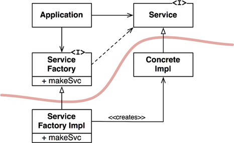
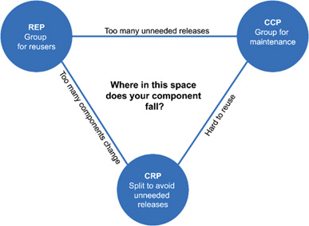
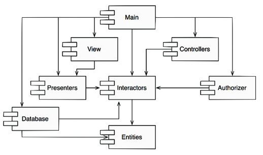
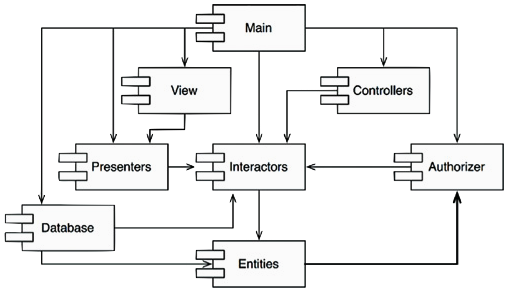
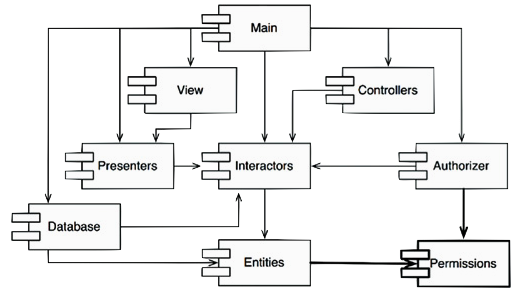

# Arquitectura Software

## Terminología

### Arquitectura

- La arquitectura de un sistema software es el conjunto de __decisiones de diseño__ principales realizadas sobre el sistema.
- Son los planos para la __construcción__ y la __evolución__ de un sistema software.

### Arquitectura de referencia

- Una arquitectura de referencia es el conjunto de decisiones principales de diseño que se pueden aplicar simultáneamente a varios sistemas relacionados, dentro de un __dominio__ de aplicación, con puntos de __variación__ definidos explícitamente.
- Las decisiones de diseño engloban varios aspectos:
  - **Estructura** del sistema: v.g. "Los elementos arquitectónicos se organizarán y compondrán exactamente de forma que..."
  - Comportamiento **funcional**: v.g. "El procesado, almacenamiento y visualización de datos se realizarán en estricta secuencia"
  - **Interacción**: v.g. "La comunicación entre los elementos del sistema se hará mediante notificaciones de eventos"
  - Propiedades **no funcionales** del sistema: v.g. "La confiabilidad del sistema se asegurará mediante módulos de procesamiento duplicados"
  - La **implementación** del sistema: v.g. "Los componentes de interfaz de usuario se construirán usando Java Swing"

### Granularidad

- Las aplicaciones crecen en tamaño y complejidad
- Se requiere algún tipo de organización
- La _clase_ es de un grano demasiado fino como unidad de organización

- En UML, Java y otros lenguajes se da el concepto de __paquete__ (*package*)
- En general puede hablarse de "agrupaciones lógicas de declaraciones que pueden importarse en otros programas" (__módulos__ o __componentes__)

### Componente software

Un componente software es una entidad arquitectónica que:

  1. Encapsula un subconjunto de las __funciones__ y/o __datos__ (i.e. computación + estado) del sistema
  2. Restringe el acceso a dicho subconjunto vía una __interfaz__ explícitamente definida
  3. Tiene __dependencias__ explícitamente definidas de su __contexto__ de ejecución requerido.

- Son la expresión tangible de los principios de encapsulación, abstracción y modularidad.

#### Contexto

El contexto de ejecución requerido consta de:

- La interfaz requerida (proporcionada por otros componentes)
- La disponibilidad de recursos específicos (v.g. ficheros de datos, directorios, etc.)
- El software de sistema requerido (v.g. runtime del lenguaje de programación, middleware, sistema operativo, protocolos de red, drivers de dispositivos, etc.)
- Las configuraciones hardware necesarias.

#### <span style="color:red;">Preguntas</span>

- ¿Mejor criterio de partición?
- ¿Qué relaciones hay entre componentes y qué principios de diseño gobiernan su uso?
- En diseño OO, ¿los componentes deben diseñarse antes que las clases, o al revés?
- ¿Cómo se representan físicamente los componentes?
- ¿Para qué usaremos esos componentes?

### Patrón arquitectónico

Un patrón arquitectónico es una colección (con nombre) de decisiones de diseño arquitectónico que son aplicables a un problema recurrente de diseño que tienen en cuenta diferentes contextos de desarrollo de software en los que aparece el problema.

Ejemplo: patrón "arquitectura en 3 capas"


_**Lectura recomendada**_: Buschman et al.: [Pattern-Oriented Software Architecture (POSA)](bibliografia.html#posa), chapters 1-2.

## Principios de Diseño Arquitectónico


> La arquitectura de un sistema software es la forma dada al sistema por aquellos que lo construyen. La forma es la división del sistema en componentes, la disposición de esos componentes y la manera en que se comunican entre sí.
>
> <small><cite>Bob Martin</cite></small>

La finalidad de la arquitectura es facilitar el __desarrollo__, __despliegue__, __operación__ y __mantenimiento__ del sistema software.

### Implicaciones de SOLID en arquitectura

#### SRP en arquitectura

> A module should be responsible to one, and only one, user / stakeholder / **actor**.
> <cite>––Robert C. Martin (2018): [Clean Architecture: A Craftsman's Guide to Software Structure and Design](bibliografia.html#cleanarch)</cite>. 

- No malinterpretar SRP como "cada módulo debe hacer una sola cosa"

_**Lectura recomendada**_: Bob Martin: [Clean Architecture](bibliografia.html#cleanarch), chapter 7

#### OCP en arquitectura

> The behavior of a software artifact ought to be extendible, without having to modify that artifact.
> <cite>––Robert C. Martin (2018): [Clean Architecture: A Craftsman's Guide to Software Structure and Design](bibliografia.html#cleanarch)</cite>. 

- A nivel arquitectónico, la aplicación de OCP separa las funcionalidades a partir de cómo, por qué y cuándo éstas pueden cambiar, y luego organiza cada funcionalidad separada en una jerarquía de componentes.
- Los componentes de mayor nivel en la jerarquía deben quedar protegidos de los cambios en los componentes de nivel inferior.

_**Lectura recomendada**_: Bob Martin: [Clean Architecture](bibliografia.html#cleanarch) chapter 8

##### Ejemplo de OCP: Financial reporter


#### LSP en arquitectura

_**Lectura recomendada**_: Bob Martin: [Clean Architecture](bibliografia.html#cleanarch) chapter 9

En OO, el principio LSP nació ligado al uso de la **herencia** para el diseño software.
Hoy día, se considera más ligado al diseño de **interfaces** e **implementaciones**. Por ejemplo:

- Una interfaz Java implementada por varias clases
- Varias clases Ruby con las mismas signaturas
- Un conjunto de servicios con la misma interfaz ReST

LSP es aplicable porque habrá usuarios que dependan de interfaces bien definidas y de poder sustituir las implementaciones de estas interfaces.

##### Ejemplo de violación arquitectónica de LSP

- Un servicio agregador de taxis (uber, cabify, mitaxi, acme, etc.)
- La URI con que se llama al taxi se guarda en la base de datos en formato ReST:
    `mitaxi.com/driver/Bob`
- El agregador añade la información de pedido y hace PUT a la URI:
    ```text
    mitaxi.com/driver/Bob
      /pickupAddress/24 Maple St.
      /pickupTime/153
      /destination/ORD
    ```
- Todos los taxis de diferentes compañías deben cumplir la misma interfaz ReST.
- La compañía ACME abrevia el destino con `dest`
- Ahora la petición hay que construirla siguiendo una reglas distintas para cada conductor:
    `if (driver.getDispatchUri().startsWith("acme.com")) ...`
- Pero meter "`acme.com`" en el código puede ser origen de fallos y brechas de seguridad.
- Aún peor: ACME compra a MiTaxi y unifica los sistemas informáticos.
- El arquitecto define entonces un módulo adicional que decide el formato en función de la URI:

 URI   |  Dispatch format
:-------------------------:|:-------------------------:
`acme.com` | `pickupAddress/%s/pickupTime/%s/dest/%s`
`*.*`      | `pickupAddress/%s/pickupTime/%s/destination/%s`

- Ha habido que añadir un mecanismo complejo porque las interfaces de los servicios ReST no son sustituibles.

La LSP debería extenderse hasta el nivel arquitectónico. Una violación de la posibilidad de sustitución puede contaminar la arquitectura de un sistema con mecanismos extra.

#### ISP en arquitectura

ISP = es pernicioso depender de módulos que contienen más de lo que se necesita. Esto es cierto también a nivel arquitectónico

_**Lectura recomendada**_: Bob Martin: [Clean Architecture](bibliografia.html#cleanarch) chapter 10

Supongamos que un sistema $S$ quiere incluir un framework $F$ y que los creadores de $F$ lo han acoplado a una base de datos $D$:

$S \rightarrow F \rightarrow D$

Si $D$ contiene características que $F$ no usa y que a $S$ tampoco le interesan;

- los cambios en esas características de $D$ forzarán un redespliegue de $F$ y de $S$;
- los fallos en $D$ causarán fallos en $F$ y $S$.

Depender de algo que trae "equipaje" que no se necesita puede ser origen de problemas.

#### DIP en arquitectura

Los sistemas más flexibles son aquellos en que las dependencias en el código fuente se refieren solo a abstracciones y no a cosas concretas.

_**Lectura recomendada**_: Bob Martin: [Clean Architecture](bibliografia.html#cleanarch) chapter 11

##### Prácticas de codificación

- No referirse a clases concretas volátiles (v.g. usar abstract factories).
  - Corolario: no derivar de clases concretas volátiles.
- No redefinir (override) una función concreta.
  - En su lugar, hacer la función abstracta y crear varias implementaciones.
- Conclusión: no mencionar nunca el nombre de algo concreto y volátil

###### Ejemplo de DIP: factoría abstracta



**Inversión de control**: las dependencias están invertidas con respecto al flujo de control

### Principios de Cohesión de Componentes


- **REP**: _Reuse/Release Equivalente Principle_ 
- **CCP**: _Common Closure Principle_
- **CRP**: _Common Reuse Principle_

#### Principio REP: Equivalencia de Reutilización/Entrega


> _The granule of reuse is the granule of release.
Only components that are released through a tracking system can be effectively reused._
>
> <small><cite>Robert C. Martin</cite></small>

$\implies$ Las clases y módulos de un componente deben formar un grupo cohesionado

¿Se reutiliza código cuando se hace copia-pega? ¡No!

- Se reutiliza código si y sólo si no hace falta mirar el código fuente más allá de la parte pública del componente/biblioteca (ficheros de cabecera, etc.)
- Hay muchas herramientas de gestión de módulos y sus dependencias (v.g. Maven, Gradle, Apache Ivy, RubyGems, etc.) que permiten reutilizar **componentes** y **bibliotecas** creadas por otros
- El código a reutilizar se debe tratar como un __producto__ en sí mismo, que no es mantenido ni distribuido por el consumidor o cliente, sino por el autor (o alguien delegado) responsable.

$\implies$ El autor debe **distribuir/hacer entregas** regulares de distintas **versiones** del componente/biblioteca.

- No se puede reutilizar algo que no haya sido liberado/entregado.
- Un cliente de una biblioteca liberada lo es __de toda la biblioteca__, no de parte de ella.
- El **grano de reutilización** no puede ser menor que el **grano de entrega**

#### Principio CCP: Clausura Común

> Reunir en componentes aquellas clases que cambian por los mismos motivos y al mismo tiempo.
> Separar en componentes distintos aquellas clases que cambian en momentos distintos y por motivos diferentes.
>
> <small><cite>Robert C. Martin</cite></small>

La __mantenibilidad__ suele ser más importante que la __reusabilidad__

- Si hay que cambiar el código, ¿dónde es mejor que estén los cambios? ¿en un mismo componente, o repartidos por varios componentes?

CCP es un intento de tener junto todo lo que es probable que cambie por una misma razón

- Es un SRP para componentes
- CCP está conectado con OCP

Como no es posible garantizar al 100% el _cierre_ de OCP $\implies$ el _cierre_ debe ser estratégico $\implies$ diseñar los sistemas para que estén **cerrados** a los **cambios más probables** que podamos anticipar.

- CCP amplía la estrategia de cierre, juntando en un mismo componente todas las clases **cerradas** para un mismo tipo de cambios.

#### Principio CRP: Reutilización en Común

> No obligar a los usuarios de un componente a depender de cosas que no necesitan
> 
> <small><cite>Robert C. Martin</cite></small>

> _The classes in a package are reused together. If you reuse one of the classes in a package, you reuse them all._
> 
> <small><cite>Robert C. Martin</cite></small>

¿Qué clases ubicar en cada componente?

- Las clases casi no se usan por separado, sino como parte de una __abstracción reutilizable__ (de colaboración entre clases)
- La abstracción donde ubicar dichas clases debe ser un mismo componente

__Ejemplo__: contenedor + iteradores

Cuando alguien decide usar un componente, se crea una dependencia __sobre todo el componente__.

- No es bueno tener que revalidar una aplicación porque hay que liberar o entregar una versión del componente provocada por cambios hechos en clases que no importaban.
- CRP dice más sobre qué clases _no deben_ ir juntas que sobre las que _deben_ ir juntas.

CRP es la versión genérica del ISP:

- ISP aconseja no depender de clases con métodos que no usamos
- CRP aconseja no depender de componentes con clases que no usamos

#### Tensión entre principios de cohesión de componentes

- REP y CCP son _inclusivos_: incrementan el tamaño de los componentes
- CRP es _exclusivo_: reduce el tamaño de los componentes



Cada arco describe el coste de abandonar el principio del vértice opuesto:

- ¿Hay demasiados componentes cambiando al mismo tiempo? $\implies$ consolidar mejor las clases (CCP)
- ¿Hay demasiadas versiones/entregas? $\implies$ minimizar las dependencias (CRP)
- ¿Es difícil reutilizar el código? $\implies$ mejorar los artefactos que se liberan (REP)

La postura en el _triángulo de tensiones_ debe ser coyuntural, pues las preocupaciones del equipo de desarrollo pueden cambiar con el tiempo.

- CCP es más importante que REP al principio de un desarrollo (cuando liberar es más importante que reutilizar) - YAGNI

### Principios de Acoplamiento entre Componentes

- __ADPP__: *Acyclic Dependencies Principle*

#### Principio de Dependencias Acíclicas

> _There must be no cycles in the coimponent dependency graph_
>
> <small><cite>Robert C. Martin</cite></small>

El grafo de dependencias entre components debe ser un DAG (_Directed Acyclic Graph_)

Hay que particionar el entorno de desarrollo en componentes "liberables" por separado.

Varios equipos de trabajo distribuidos pueden hacer cambios a cada componente por separado, lo que puede inducir nuevas dependencias entre componentes.

$\implies$ Hay que __gestionar__ la estructura de dependencias de los componentes

##### Ejemplo: estructura de un sistema

###### Diagrama sin ciclos



- La estructura es un DAG:

```plantuml
@startuml
skinparam component {
   backgroundColor white
   borderColor #FF6655
   FontName Consolas
   ArrowColor #FF6655
}
[Main] as Main
[Database] as Database
[View] as View
[Presenters] as Presenters
[Interactors] as Interactors
[Controllers] as Controllers
[Authorizer] as Authorizer
[Entities] as Entities
Main --> Database
Main --> Presenters
Main --> View
View --> Presenters
Main --> Interactors
Main --> Controllers
Main --> Authorizer
Presenters --> Interactors
Authorizer --> Interactors
Database --> Interactors
Database --> Entities
Interactors --> Entities
Controllers --> Interactors
@enduml
```

- ¿A quién afecta la liberación de una nueva versión de `Presenters` por sus responsables? \
    Solo `Main`y `View` se ven afectadas

- ¿A quiénes afecta la ejecución de un test en `Presenters`? \
    `Interactors` y `Entities` (deberían ser _mocked_)

- ¿En qué orden se libera una nueva versión del sistema? \
    `Entities`, `Database` & `Interactors`, `Presenters`, `View` & `Controllers` & `Authorizer`

###### Diagrama con ciclos

- Un cambio de requisitos fuerza a introducir una nueva dependencia \
    `Entities` $\rightarrow$ `Authorizer` \
(por ejemplo, la clase `Entities::User` usa la clase `Autohizer::Permissions`)



Problemas:

- Los desarrolladores de `Database` saben que para liberarla, deben hacerla compatible con `Entities`
- `Database` debe ser ahora compatible también con `Authorizer`
- Pero `Authorizer` depende de `Interactors`

:one: $\implies$ ahora `Database` es mucho más difícil de **liberar**, porque:

- `Entities` + `Authorizer` + `Interactors` se convierten en un solo componente
- Los cambios que haga cualquier responsable de alguno de estos tres componentes afectarán al resto

:two: $\implies$ el desarrollo de **pruebas** es más difícil:

- si se quiere probar `Entities`, antes hay que construir e integrar `Authorizer` y `Interactors` (más _mocks_!)

###### Ruptura de ciclos

Dos posibles mecanismos:

1. Aplicar el principio DIP
    - Crear una interfaz con los métodos que necesita la clase `User`
    - Incluir la interfaz en `Entities`
    - Heredar de la interfaz desde `Authorizer`


2. Crear un componente nuevo (`Permissions`) del que dependan ambos (`Authorizer` y `Entities`)



La segunda alternativa puede provocar _jitters_ (lo que hacen los _gremlins_) en presencia de requisitos cambiantes: la estructura de dependencia _jitters and grows_

### Información adicional

Leer más sobre [continuous delivery](https://en.wikipedia.org/wiki/Continuous_delivery) y herramientas de [continuous integration](https://en.wikipedia.org/wiki/Continuous_integration):

- Ejemplo: [Jenkins](https://jenkins.io/), etc.

## Modelos y lenguajes

Un **modelo arquitectónico** es un artefacto que captura, total o parcialmente, las decisiones de diseño de la arquitectura de un sistema.
- Una **notación** de modelado arquitectónico es un lenguaje para capturar las decisiones de diseño.
- ADL = Architecture Description Language
- Los lenguajes pueden ser gráficos, textuales, informales, específicos de dominio, etc.

Ejemplos: UML, [C4Model](https://c4model.com/)
