# DISEÑO DE SISTEMAS SOFTWARE

## Bloques

1. Principios de diseño OO
2. Patrones de diseño
3. Arquitectura de software

<a id="clase01"></a>

## <span style="color:blue;">Introducción</span>

### Problemáticas

- Variabilidad
- Acoplamiento
- Complejidad
- Robustez
- Reutilización
- Flexibilidad

### Principios

- Ocultación: OCP, ISP, LSP
- Cohesión: SRP
- Ortogonalidad: ISP
- Delegación

### Técnicas

- Refactoring
- Bibliotecas y frameworks
- Contratos
- Inyección de dependencias
- Patrones

### Paradigmas

- Estructurado (E. W. Dijsktra)
- Objetos (O. J. Dahl & K. Nygaard)
- Funcional (J. McCarthy)
- Aspectos (G. Kiczales)
- Eventos

#### Pregunta

<span style="color:red;">_¿De qué fecha data cada paradigma?_
_¿Cuál diríais que es el más antiguo?_</span>

#### Respuesta

_¿De qué fecha data cada paradigma?_

- Estructurado (E. W. Dijsktra, 1968)
- Objetos (O. J. Dahl & K. Nygaard, 1966)
- Funcional (J. McCarthy, 1958)
- Aspectos (G. Kiczales, 1997)
- Eventos

## <span style="color:blue;">Casos prácticos</span>

1. [Identificadores](#handler)
2. [Framework de pruebas unitarias](#junit)
3. [Caballeros de la mesa redonda](#knights)
4. [Guitarras Paco](#guitarras)
5. [Figuras geométricas](#figuras)

# CASO PRÁCTICO 1: identificadores

<a id="handler"></a>

## Identificadores

### Versión inicial: Identificadores v0.1

```java
  class Empleado {
    private int dni;
    Empleado (String dni) throws NumberFormatException {
      this.dni = new Integer(dni).intValue();
    }
    int getDni() {
      return dni;
    }
    public String toString() {
      return new Integer(dni).toString();
    }
    public int compareTo(Empleado otro) {
       return this.dni - otro.getDni();
    }
    public boolean equals(Empleado otro) {
       return dni==otro.getDni();
    }
  }
```

#### Críticas:

- __Flexibilidad__: El Real Decreto 338/1990 regula el uso de NIFs en lugar de DNIs. ¡Hay que cambiar toda la implementación!

### Implementación alternativa: Identificadores v0.2

```java
  class Empleado {
    private String nif;
    Empleado (String nif) {
      this.nif = nif
    }
    String getNif() { return id; }
    public String toString() { return nif; }
    public int compareTo(Empleado otro) {
       return nif.compareTo(otro.getNif());
    }
    public boolean equals(Empleado otro) {
       return nif.equals(otro.getId());
    }
  }
```

#### Críticas:

- __Reutilización__: Posiblemente haya más situaciones (algunas futuras) donde hagan falta _identificadores_ que incluso pueden cambiar. Por ejemplo: números de la seguridad social, tarjetas de identidad, números de cuenta corriente, IBAN, etc.

### Hacemos refactoring: patrón *handler*

-   Manejo de *identificadores* de forma independiente de la
    implementación del objeto identificado.

-   Cambio fácil de implementación de los identificadores (`int`,
    `String`, etc.) hacia cualquier tipo básico o clase primitiva,
    sencilla o compuesta.

## <span style="color:blue;">Patrón Handler</span>

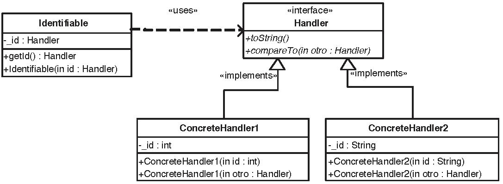

- __Identifiable__: Clase cliente que necesita identificar a sus objetos a través de algún atributo identificador

- __Handler__: Interfaz para declarar los identificadores de los objetos de la clase `Identifiable`

- __ConcreteHandler__: Implementación concreta de la interfaz `Handler`


#### Implementación del patrón

```java
  interface Handler{
      String toString();
      int compareTo(Handler otro);
  }
  class IdentificadorNumerico implements Handler {
    private int id;
    IdentificadorNumerico (String id) throws NumberFormatException {
      this.id = new Integer(id).intValue();
    }
    public String toString() {
      return new Integer(id).toString();
    }
    public int compareTo(Handler otro) {
      return toString().compareTo(otro.toString());
    }
  }
```

### Ejemplo: Identificadores en Java – `java.lang.Comparable`

Implementar un identificador utilizando `java.lang.Comparable` del JDK.

`Comparable` es una interfaz implementada por `String`, `File`, `Date`, etc. y todas las llamadas _clases de envoltura_ del JDK (i.e. `Integer`, `Long`, etc.)

__Métodos de la interfaz__:

```java
  public int compareTo(Object o) throws ClassCastException
```

__Invariantes:__

`sgn(x.compareTo(y)) = -sgn(y.compareTo(x))`

`(x.compareTo(y)>0 and y.compareTo(z)>0)` $\Rightarrow$ `x.compareTo(z)>0`

`x.compareTo(y)=0` $\Rightarrow$ `sgn(x.compareTo(z))=sgn(y.compareTo(z))` $\forall$ `z`

__Consistencia con `equals`__:

`(x.compareTo(y)=0)` $\Leftrightarrow$ `(x.equals(y))`

## <span style="color:blue;">Reutilización y flexibilidad</span>

-  __Flexibilidad__: Adaptarse a cambios de requisitos y construir software fácil de cambiar
-  __Reutilización__: Construir software fácil de reutilizar sin tener que cambiar los módulos ya escritos

# CASO PRÁCTICO 2: pruebas unitarias

<a id="junit"></a>

## Framework de pruebas unitarias

- JUnit es un framework en Java que sirve para diseñar, construir y ejecutar **pruebas unitarias**
- Una prueba unitaria comprueba la corrección de un _módulo_ de software en cuanto a funcionalidades que ofrece.
- En el caso de Java, las pruebas unitarias comprueban la corrección de cada uno de los métodos de _cada clase_.

<span style="color:red;">¿Cómo funciona?</span>

### ¿Cómo probar `Saludo.java`?

Incluir un método `main` que pruebe la funcionalidad de la clase:

```java
class Saludo {
  /**
  * Imprime "Hola Mundo!"
  */
  void saludar() {
    System.out.println("Hola Mundo!");
  }
  /**
  * Imprime un mensaje
  */
  void saludar(String mensaje) {
    System.out.println(mensaje);
  }

  /**
  * Tests
  */
  public static void main( String[] args ) {
    Saludo saludo1 = new Saludo();
    saludo1.saludar();

    Saludo saludo2 = new Saludo("Hola caracola!");
    saludo2.saludar();
  }
}
```

### Pegas

- Cuanto más grande sea la interfaz de la clase, mayor será el main

- El tamaño del código de la clase crece por las pruebas

- Poco fiable, porque main forma parte de la misma clase y tiene acceso a los elementos privados

- Difícil de automatizar las pruebas, incluso pasando argumentos a `main`

### Ejemplo: software _cliente_ del framework

#### Caso de prueba con jUnit 4

```java
  import org.junit.*;
  import static org.junit.Assert.*;

  public class SaludoTest {
    public static void main(String args[]) {
      junit.textui.TestRunner.run(SaludoTest.class);
    }
    @Test
    public void saludar() {
      Saludo hola = new Saludo();
      assert( hola!=null );
      assertEquals("Hola Mundo!", hola.saludar() );
    }
  }
```

Ejecución de los tests:

```java
import org.junit.runner.JUnitCore;
import org.junit.runner.Result;
import org.junit.runner.notification.Failure;

public class MyTestRunner {
  public static void main(String[] args) {
    Result result = JUnitCore.runClasses(SaludoTest.class);
    for (Failure failure : result.getFailures()) {
      System.out.println(failure.toString());
    }
  }
}
```

¿De qué están hechas las anotaciones como `@Test`?
Veamos una versión anterior de jUnit, que expone más claramente las _tripas_ del framework

#### Caso de prueba con jUnit 3

```java
import junit.framework.TestCase;
import junit.framework.Assert;
  
public class SaludoTest extends TestCase {
    public SaludoTest(String nombre) {
      super(nombre);
    }
    public void testSaludar() {
      Saludo hola = new Saludo();
      assert( hola!=null );
      assertEquals("Hola Mundo!", hola.saludar() );
    }
}
```

<a id="clase02"></a>

### Diseño del framework jUnit

#### Estructura de clases:

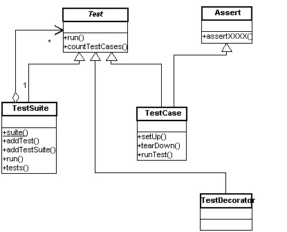

#### Ejecución de casos de prueba:

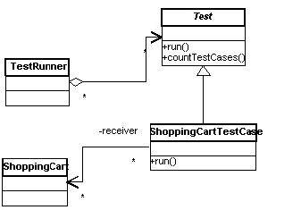

### Ejemplo: aplicación de comercio electrónico

Diseño de una aplicación de comercio electrónico:

- `ShoppingCart` - carrito de la compra
- `CreditCard` - tarjeta de crédito
- `Product`- artículos
- Etc.

Diseño de pruebas unitarias de `ShoppingCart` para:

- Probar carrito de la compra (añadir/eliminar artículos)
- Probar validación de tarjetas de crédito
- Probar manejo de varias monedas
- Etc.

#### ShoppingCart

```java
public class ShoppingCart {
  private ArrayList items;
  public ShoppingCart() { ... }
  public double getBalance() { ... }
  public void addItem(Product p) { ... }
  public void removeItem(Product p)
      throws ProductNotFoundException { ... }
  public int getItemCount() { ... }
  public void empty() { ... }
  public boolean isEmpty() { ... }
}
```

#### ShoppingCartTestCase con jUnit 3

```java
import junit.framework.TestCase;
import junit.framework.TestSuite;
import junit.framework.Assert;

public class ShoppingCartTest extends TestCase {
  private ShoppingCart bookCart;
  private Product defaultBook;
  //...
  protected void setUp() {
      bookCart = new ShoppingCart();
      defaultBook = new Product("Extreme Programming", 23.95);
      bookCart.addItem(defaultBook);
  }
  protected void tearDown() {
      bookCart = null;
  }  
  public void testEmpty() {
      bookCart.empty();
      assertTrue(bookCart.isEmpty());
  }
  public void testProductAdd() {
      Product book = new Product("Refactoring", 53.95);
      bookCart.addItem(book);
      double expectedBalance = defaultBook.getPrice() + book.getPrice();
      assertEquals(expectedBalance, bookCart.getBalance(), 0.0);
      assertEquals(2, bookCart.getItemCount());
  }
  public void testProductRemove() throws ProductNotFoundException {
      bookCart.removeItem(defaultBook);
      assertEquals(0, bookCart.getItemCount());
      assertEquals(0.0, bookCart.getBalance(), 0.0);
  }
  public void testProductNotFound() {
      try {
          Product book = new Product("Ender's Game", 4.95);
          bookCart.removeItem(book);
          fail("Should raise a ProductNotFoundException");
      } catch(ProductNotFoundException success) {
          ...
      }
  }
  public static Test suite() {
      // Use reflection to add all testXXX() methods
         TestSuite suite = new TestSuite(ShoppingCartTest.class);
      // Alternatively, but prone to error when adding more
      // test case methods...
      // TestSuite suite = new TestSuite();
      // suite.addTest(new ShoppingCartTest("testProductAdd"));
      // suite.addTest(new ShoppingCartTest("testEmpty"));
      // suite.addTest(new ShoppingCartTest("testProductRemove"));
      // suite.addTest(new ShoppingCartTestCase("testProductNotFound"));
         return suite;
  }
}
```

Ahora agrupamos varios casos de prueba en una misma _suite_:

```java
import junit.framework.Test;
import junit.framework.TestSuite;
import org.junit.runner.JUnitCore;
import org.junit.runner.Result;
import org.junit.runner.notification.Failure;

public class EcommerceTestSuite extends TestSuite {
    //...
    public static Test suite() {
        TestSuite suite = new TestSuite();
        suite.addTest(ShoppingCartTest.suite());
        return suite;
    }
}

public class MyTestRunner {
  public static void main(String[] args) {
    Result result = JUnitCore.runClasses(EcommerceTestSuite.class);
    for (Failure failure : result.getFailures()) {
      System.out.println(failure.toString());
    }
  }
}
```

#### ShoppingCartTestCase con jUnit 4

```java
import static org.junit.Assert.assertEquals;
import static org.junit.Assert.fail;

import org.junit.After;
import org.junit.Before;
import org.junit.Test;

public class ShoppingCartTest {
  private ShoppingCart bookCart;
  private Product defaultBook;
  //...
  @Before
  protected void setUp() {
      bookCart = new ShoppingCart();
      defaultBook = new Product("Extreme Programming", 23.95);
      bookCart.addItem(defaultBook);
  }
  @After
  protected void tearDown() {
      bookCart = null;
  }
  @Test
  public void testEmpty() {
      bookCart.empty();
      assertTrue(bookCart.isEmpty());
  }
  @Test
  public void testProductAdd() {
      Product book = new Product("Refactoring", 53.95);
      bookCart.addItem(book);
      double expectedBalance = defaultBook.getPrice() + book.getPrice();
      assertEquals(expectedBalance, bookCart.getBalance(), 0.0);
      assertEquals(2, bookCart.getItemCount());
  }
  @Test
  public void testProductRemove() {
      bookCart.removeItem(defaultBook);
      assertEquals(0, bookCart.getItemCount());
      assertEquals(0.0, bookCart.getBalance(), 0.0);
  }
  @Test(expected = ProductNotFoundException.class)
  public void testProductNotFound() {
      Product book = new Product("Ender's Game", 4.95);
      bookCart.removeItem(book);
      fail("Should raise a ProductNotFoundException");
  }
}
```

#### EcommerceTestSuite con jUnit 3

```java
  public class EcommerceTestSuite extends TestSuite {
      //...
      public static Test suite() {
          TestSuite suite = new TestSuite();
          suite.addTest(ShoppingCartTest.suite());
          suite.addTest(CreditCardTest.suite());
          // etc.
          return suite;
      }
  }
```

#### EcommerceTestSuite con jUnit 4

```java
  @RunWith(Suite.class)
  @SuiteClasses({ ShoppingCartTest.class,
                  CreditCardTest.class })
  public class EcommerceTestSuite {
      //...
  }
```

### <span style="color:red;">Ejercicio: CreditCardTest</span>

Diseñar y codificar una suite de casos de prueba unitaria para `CreditCard` usando jUnit 4.

### Arquitectura del framework

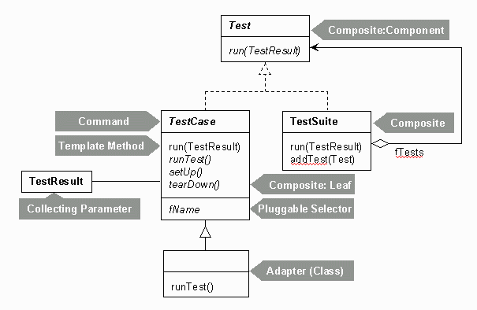

En la arquitectura del framework se observan diversos patrones: Composite, Command, Adapter, Factory, Decorator, etc.

## <span style="color:blue;">Bibliotecas y frameworks</span>

### Biblioteca

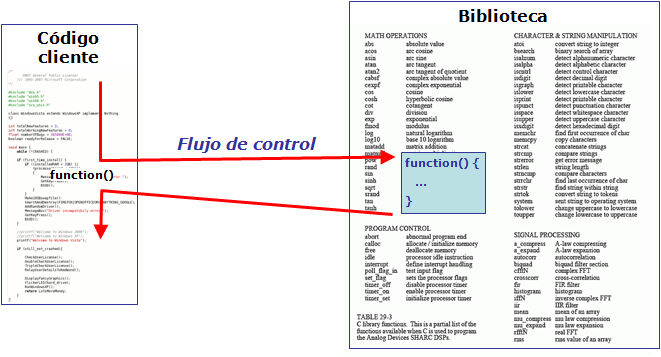

#### Flujo de control en un framework


### <span style="color:blue;">Frameworks</span>

#### Definición de *framework*

> Colección de clases e interfaces que cooperan para formar un diseño reutilizable de un tipo específico de software
> 
> –– <cite>[E. Gamma et al.](bibliografia.html#gamma)</cite>

- El framework proporciona unas guías arquitectónicas (diseño empaquetado) para dividir el diseño en clases abstractas y definir sus _responsabilidades_ y _colaboraciones_.
- El framework se debe personalizar definiendo subclases y combinando instancias, o bien configurando valores que definen el comportamiento por defecto

#### Principios de diseño

- Datos encapsulados
- Interfaces y clases abstractas
- Métodos polimórficos
- Delegación

#### Herramientas de diseño

- __Patrones__: elementos reutilizables de diseño 
- __Frameworks__: colecciones de patrones abstractos a aplicar

#### Framework vs. biblioteca

- API orientado a objetos
- Flujo de control invertido
- Programador cliente (código específico) vs. programador de bibliotecas (código reutilizable)

### Principios y técnicas de un framework

- **Abstracción**
  - Clases y componentes abstractos
  - Interfaces abiertas
  - Uso de patrones de diseño
  - Componentes de un dominio específico

- Máxima **cohesión**, mínimo **acoplamiento**
  - Minimizar dependencias: Una clase presenta una dependencia con otra clase si la primera usa una instancia de la segunda.
  - Cuando no se pueden eliminar las dependencias, mantener las abstractas e _inyectar_ las concretas.

- **Inyección de dependencias**: una clase o módulo no debería configurar sus dependencias estáticamente, sino ser configurada desde fuera

# CASO PRÁCTICO 3: caballeros de la mesa redonda

<a id="knights"></a>

## Ejemplo: Caballeros de la mesa redonda

**Tomado de [Spring in Action](bibliografia.html#spring)**

Añadir pruebas unitarias a la solución siguiente:

```java
public class KnightOfTheRoundTable {
  private String name;
  private HolyGrailQuest quest;
  public KnightOfTheRoundTable(String name) {
    this.name = name;
    quest = new HolyGrailQuest();
  }
  public HolyGrail embarkOnQuest()
      throws GrailNotFoundException {
    return quest.embark();
  }
}

public class HolyGrailQuest {
  public HolyGrailQuest() {}
  public HolyGrail embark()
          throws GrailNotFoundException {
  HolyGrail grail = null;
    // Look for grail
    ...
    return grail;
  }
}
```

### Diseño de pruebas con jUnit 3

<span style="color:red;">¿Dónde está el acoplamiento?</span>

```java
import junit.framework.TestCase;
public class KnightOfTheRoundTableTest extends TestCase {
  public void testEmbarkOnQuest() throws GrailNotFoundException {
    KnightOfTheRoundTable knight =
        new KnightOfTheRoundTable("CruzadoMagico");
    HolyGrail grail = knight.embarkOnQuest();
    assertNotNull(grail);
    assertTrue(grail.isHoly());
  }
}
```

- Instanciación de `HolyGrail`

- Cada vez que se prueba `KnightOfTheRoundTable`, también se prueba `HolyGrailQuest`.

- No se puede pedir a `HolyGrailQuest` que se comporte de otra forma (v.g. devolver null o elevar una excepción)

Ocultar la implementación detrás de una interfaz:

```java
public interface Knight {
  Object embarkOnQuest() throws QuestFailedException;
}

public class KnightOfTheRoundTable implements Knight {
  private String name;
  private Quest quest;
  public KnightOfTheRoundTable(String name) {
    this.name = name;
    quest = new HolyGrailQuest();
  }
  public Object embarkOnQuest() throws QuestFailedException {
    return quest.embark();
  }
}

public interface Quest {
  abstract Object embark()
    throws QuestFailedException;
}

public class HolyGrailQuest implements Quest {
  public HolyGrailQuest() {}
  public Object embark() throws QuestFailedException {
    // Do whatever it means to embark on a quest
    return new HolyGrail();
  }
}
```

- El `Knight` aún recibe un tipo específico de `Quest`
- <span style="color:red;">¿Debe ser el caballero responsable de obtener un desafío?</span>

```java
public class KnightOfTheRoundTable implements Knight {
  private String name;
  private Quest quest;
  public KnightOfTheRoundTable(String name) {
    this.name = name;
  }
  public Object embarkOnQuest() throws QuestFailedException {
    return quest.embark();
  }
  public void setQuest(Quest quest) {
    this.quest = quest;
  }
}
```

- El caballero sólo sabe del desafío a través de su interfaz `Quest`.

- Puede asignársele cualquier implementación de `Quest`
 (`HolyGrailQuest`, `RescueDamselQuest`, etc.)

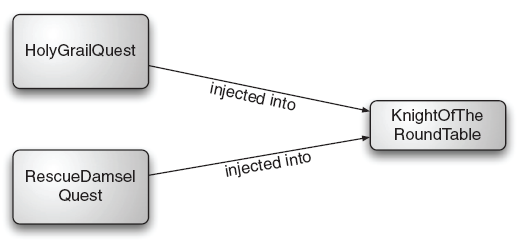

<span style="color:red;">Ejercicio: Discutir el tipo de retorno `Object` de `embarkonQuest`:</span>

- Puede provocar `ClassCastException`
- Solución: rediseñar la interfaz `Quest`

## <span style="color:blue;">Inyección de dependencias</span>

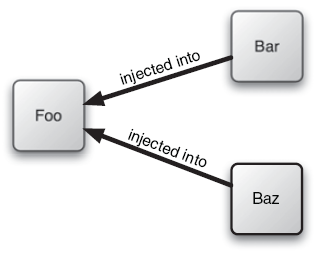

### Inversión de control

- Es la base de la inyección de dependencias

> The question is: _what aspect of control are they inverting?_ [...] Early **user interfaces** were controlled by the application program. You would have a sequence of commands like "Enter name", "enter address"; your program would drive the prompts and pick up a response to each one. With **graphical** (or even screen based) UIs the UI framework would contain this main loop and your program instead provided event handlers for the various fields on the screen. The main control of the program was inverted, moved away from you to the framework.
>
> <cite> Martin Fowler, [IoC containers and the DI pattern](http://martinfowler.com/articles/injection.html) [1]</cite>

[1] http://martinfowler.com/articles/injection.html  

#### IoC–Inversion of Control / DI–Dependency Injection

- Una aplicación está compuesta por dos o más clases que colaboran.
- Los objetos deben recibir las dependencias en su creación, por parte de una entidad externa o **contenedor** que los coordina.
- Inversión de la responsabilidad de cómo un objeto obtiene referencias a los objetos con los que colabora
- Ventaja = __bajo acoplamiento__: un objeto sólo sabe de sus dependencias por su interfaz, no por su implementación, ni por cómo fueron instanciados.
- Entonces la dependencia puede cambiarse por una implementación distinta (incluso en **tiempo de ejecución**)
- _Hollywood Principle: Don't call us, we'll call you"._

### Factorías

Una factoría proporciona un mecanismo de inyección de dependencias, visto desde el lado opuesto (los clientes adquieren las dependencias, no se les inyecta)

Ejemplo: [Spring FactoryBean](http://www.baeldung.com/spring-factorybean)

## <span style="color:blue;">Discusión sobre la reutilización</span>

> We most likely would have been better off not attempting to create a reusable function in the first place 
>
> -- <cite>Roger Sessions, [The Misuse of Reuse](http://simplearchitectures.blogspot.com.es/2012/07/misuse-of-reuse.html) [2]</cite>

[2] http://simplearchitectures.blogspot.com.es/2012/07/misuse-of-reuse.html

### Factorizar una función


### Ventajas (supuestas) de reutilizar:

__Ahorro__:

Si $\exists s$ sistemas $\wedge ~ coste(Function~1) = c$ € $\Rightarrow$ ahorro = $c \times (s-1)$ €

### Amenazas (reales):


- Realmente el ahorro depende de la __complejidad__. Y muchas veces, la complejidad de la función está exponencialmente relacionada con el número de sistemas.
- Con un único punto de fallo, Si la función 1 falla, todos los sistemas pueden fallar a la vez.
- La seguridad es inversamente proporcional a la complejidad del sistema.
- Se incrementan los costes de llevar los sistemas a la nube.

### Conclusión

No crear funciones reutilizables en primer lugar

Aplicar el principio __YAGNI__: __You Ain't Gonna Need It__

# CASO PRÁCTICO 4: guitarras

<a id="guitarras"></a>

## Guitarras Paco

El cliente (Paco) quiere:

- Mantener un inventario de guitarras

- Encontrar guitarras para sus clientes

Problemas de la aplicación heredada:

- Caso de uso: un cliente busca una guitarra flamenca ‘Valeriano Bernal’, pero no encuentra ninguna

- ¿Problemas?

### Una aplicación heredada

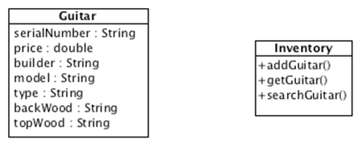


### Implementación: Guitarra

```java
  public class Guitar {
     private String serialNumber, builder, model, type, backWood, topWood;
     private double price;

     public Guitar(String serialNumber, double price,
                        String builder, String model, String type,
                        String backWood, String topWood) {
        this.serialNumber = serialNumber;
        this.price = price;
        this.builder = builder;
        this.model = model;
        this.type = type;
        this.backWood = backWood;
        this.topWood = topWood;
     }

     public String getSerialNumber() {return serialNumber;}
     public double getPrice() {return price;}
     public void setPrice(float newPrice) {
        this.price = newPrice;
     }
     public String getBuilder() {return builder;}
     public String getModel() {return model;}
     public String getType() {return type;}
     public String getBackWood() {return backWood;}
     public String getTopWood() {return topWood;}
  }
```

### Implementación: Inventario

```java
public class Inventory {
  private List guitars;
  public Inventory() { guitars = new LinkedList(); }
  public void addGuitar(String serialNumber, double price,
                        String builder, String model,
                        String type, String backWood, String topWood) {
    Guitar guitar = new Guitar(serialNumber, price, builder,
                               model, type, backWood, topWood);
    guitars.add(guitar);
  }
  public Guitar getGuitar(String serialNumber) {
    for (Iterator i = guitars.iterator(); i.hasNext(); ) {
      Guitar guitar = (Guitar)i.next();
      if (guitar.getSerialNumber().equals(serialNumber)) {
        return guitar;
      }
    }
    return null;
  }
  public Guitar search(Guitar searchGuitar) {
    for (Iterator i = guitars.iterator(); i.hasNext(); ) {
      Guitar guitar = (Guitar)i.next();
      String builder = searchGuitar.getBuilder().toLowerCase();
      if ((builder != null) && (!builder.equals("")) &&
          (!builder.equals(guitar.getBuilder().toLowerCase())))
        continue;
      String model = searchGuitar.getModel().toLowerCase();
      if ((model != null) && (!model.equals("")) &&
          (!model.equals(guitar.getModel().toLowerCase())))
        continue;
      String type = searchGuitar.getType().toLowerCase();
      if ((type != null) && (!searchGuitar.equals("")) &&
          (!type.equals(guitar.getType().toLowerCase())))
        continue;
      String backWood = searchGuitar.getBackWood().toLowerCase();
      if ((backWood != null) && (!backWood.equals("")) &&
          (!backWood.equals(guitar.getBackWood().toLowerCase())))
        continue;
      String topWood = searchGuitar.getTopWood().toLowerCase();
      if ((topWood != null) && (!topWood.equals("")) &&
          (!topWood.equals(guitar.getTopWood().toLowerCase())))
        continue;
      return guitar;
    }
    return null;
  }
}
```

## Algunos problemas

- Se compara el fabricante sin tener en cuenta mayúsculas/minúsculas

- Se comparan todos los campos sin tener en cuenta
    mayúsculas/minúsculas

- No hay definidas constantes para cada fabricante

¿Estas soluciones abordan el verdadero problema?

Preguntar a Paco...

### Preguntar al cliente

Preguntemos a Paco, que no tiene por qué saber nada de objetos ni bases
de datos:

- ¿Sólo vendes guitarras?

- ¿Cómo actualizas el inventario?

- ¿Cómo funciona la búsqueda de guitarras?

- ¿Necesitarás informes de inventario y de ventas?

### Respuestas del cliente

Paco dice que:

- Los clientes no siempre conocen las características exactas de la guitarra que quieren

- Los clientes suelen buscar guitarras dentro de un rango de precios

- Suele haber más de una guitarra que casa con las necesidades del cliente

- Sí, necesito informes y demás, pero ¡la prioridad nº 1 es encontrar las guitarras!

## Ejercicio

Hacer refactoring de la aplicación heredada de Guitarras Paco

# CASO PRÁCTICO 5: figuras geométricas

<a id="figuras"></a>

## <span style="color:blue;">Principios SOLID</span>

Los principios SOLID nos dicen:

- Cómo organizar en _módulos_ (en OO, _clases_) las estructuras de datos y las funciones
- Cómo deben quedar _interconectadas_ las clases

El objetivo de SOLID es crear estructuras software de nivel intermedio que sean:

- tolerantes a los cambios
- fáciles de comprender
- la base de componentes útiles para muchos sistemas software

[Uncle Bob Martin principles](https://en.wikipedia.org/wiki/SOLID_(object-oriented_design))

[comment]: http://butunclebob.com/ArticleS.UncleBob.PrinciplesOfOod

## <span style="color:blue;">Principio de responsabilidad única </span>

__SRP: *Single responsibility Principle*__

> A class should have only one reason to change
> <cite>–– Uncle Bob Martin</cite>

- Una clase que modela múltiples aspectos genera acoplamiento entre los distintos aspectos
- Un cambio en algún aspecto obligará a cambios accidentales en los clientes que no dependen de dicho aspecto

<!-- Los módulos enmarañados que nunca cambian no son problemáticos-->

SRP es lo mismo que el principio de __cohesión__ de [DeMarco](bibliografia.html#demarco)

Consecuencia de la [ley de Conway](http://www.melconway.com/Home/Committees_Paper.html):
> Organizations which design systems [...] are constrained to produce designs which are copies of the communication structures of these organizations.
> <cite>–– M. Conway</cite>

[comment]: http://www.melconway.com/Home/Committees_Paper.html

### Ejemplo: Shapes v1 en Java

<a id="shapesV1"></a>

```java
package shapes;

interface Shape {
  double area();
  void draw();
}

class Point {
  double getX() {...}
  double getY() {...}
}

abstract class Polygon implements Shape {
  Point getVertex(index i) {...}
  void draw() {...}
  String toString() {...}
}

class Triangle extends Polygon {
  double area() {...}
}

abstract class RectParallelogram extends Polygon {
  double area() {...}
}

class Square extends RectParallelogram {...}

class Rectangle extends RectParallelogram {...}

abstract class ClosedCurve implements Shape {...}

class Circle extends ClosedCurve {
  double getRadius() {...}
  Point getCenter() {...}
  double area() {...}
  void draw() {...}
  String toString() {...}
}

class Ellipse extends ClosedCurve {
  double getApogeeRadius() {...}
  double getPerigeeRadius() {...}
  Point getFocus1() {...}
  Point getFocus2() {...}
  Point getCenter() {...}
  double area() {...}
  void draw() {...}
  String toString() {...}
}
```

#### <span style="color:red;">Preguntas</code>

- ¿Cuántas responsabilidades tienen las clases que implementan la interfaz `Shape`?
- ¿Cuáles son estas responsabilidades?
- ¿Qué parte no cumple SRP en el ejemplo? 

#### <span style="color:grey;">Respuestas</code>

- Dos responsabilidades: geometría computacional + dibujo en pantalla
- Todas las figuras tienen métodos `draw` y `toString` (dibujar en pantalla) además del método `area` que calcula el área (geometría computacional) $\rightarrow$ Violación del SRP

#### Solución

Patrones de diseño: _Visitor_

#### Ejercicio

- Buscar información de los patrones _ActiveRecord_ y _Data Access Object (DAO)_.
- Discutir si cumplen o violan el SRP.

## <span style="color:blue;">Principio de Abierto-Cerrado</span>

__OCP: *Open-Closed Principle*__

> Toda clase, módulo, aspecto o función debe quedar abierto para extensiones pero cerrado para modificaciones
> 
> <cite>B. Meyer, [Object Oriented Software Construction](#meyer)</cite>

Para que un sistema software sea fácil de cambiar, debe diseñarse para que permita cambiar el comportamiento del sistema añadiendo código, no cambiando código existente.

- Si un cambio en un sitio origina una cascada de cambios en otros puntos del sistema, el resultado es un sistema frágil y rígido
- Es difícil averiguar todos los puntos que requieren cambios
- Código cerrado para modificaciones, pero abierto para extensión mediante delegación en vertical (subclases) u horizontal (composición)


### Ejemplo: Shapes versión 2 en C++

¿Qué parte no cumple OCP en el ejemplo? 

#### Versión imperativa (sin objetos):

```csharp
enum ShapeType {circle, square};
struct Shape
{
  ShapeType itsType;
};

struct Circle
{
  ShapeType itsType;
  double itsRadius;
  Point itsCenter;
};
void DrawCircle(struct Circle*);

struct Square
{
  ShapeType itsType;
  double itsSide;
  Point itsTopLeft;
};
void DrawSquare(struct Square*);

typedef struct Shape *ShapePointer;
void DrawAllShapes(ShapePointer list[], int n)
{
  int i;
  for (i=0; i<n; i++)
  {
    struct Shape* s = list[i];
    switch (s->itsType)
    {
      case square:
        DrawSquare((struct Square*)s);
        break;
      case circle:
        DrawCircle((struct Circle*)s);
        break;
    }
  }
}
```

- `DrawAllShapes` no está cerrado para modificaciones cuando aparecen nuevos tipos de `Shape`

#### Solución

- __Abstracción__ (ocultación de la implementación): clase abstracta y métodos polimórficos.
- __Patrones de diseño__: _template method_ y/o _strategy_

Aplicando el OCP...

```csharp
public interface Shape
{
  void Draw();
}

public class Square: Shape
{
  public void Draw()
  {
    //draw a square
  }
}

public class Circle: Shape
{
  public void Draw()
  {
    //draw a circle
  }
}

public void DrawAllShapes(IList shapes)
{
  foreach(Shape shape in shapes)
    shape.Draw();
}
```

- Si queremos ampliar el comportamiento de `DrawAllShapes`, solo tenemos que añadir una nueva clase derivada de `Shape`
- Si se aplica bien OCP, los cambios de un cierto tipo obligan a añadir nuevo código, no a modificar el existente

> In general, no matter how _closed_ a module is, there will always be some kind of change against which it is not closed. There is no model that is natural to all contexts!
> 
> Since closure cannot be complete, it must be strategic. That is, the designer must choose the kinds of changes against which to close the design, must guess at the kinds of changes that are most likely, and then construct abstractions to protect against those changes.
> 
> <cite>-- Bob C. Martin</cite>

#### Implicaciones arquitectónicas

OCP es un principio más arquitectónico que de diseño de clases y módulos. Lo veremos más adelante...

## <span style="color:blue;">Principo de segregación de interfaces</span>

__ISP: *Interface Segregation Principle*__

> Los clientes no deben depender de métodos que no usan. 
>
> <cite>Bob C. Martin</cite>

- Las interfaces son para los __clientes__, no para hacer jerarquías
- Evitar interfaces __gruesas__ con muchos métodos (descohesionadas)
- Los cambios en los métodos ignorados pueden provocar cambios en un cliente que no los usa
- La interfaz de una clase puede dividirse en __bloques__ de métodos relacionados. Unos clientes usan un bloque y otros clientes usan otro bloque. Si un cliente necesita conocer una interfaz no cohesionada, debe hacerlo combinando una o más clases (sus interfaces)
- ISP es a las interfaces lo que SRP es a clases y métodos
- Violar el ISP es muy común en lenguajes de tipos estáticos (C++, Java, C#). Los lenguajes dinámicos (Ruby, Scala) ayudan algo más a no violar el ISP (v.g. con los _mixins_)

### Ejemplo: acoplamiento contexto-strategy

- ¿Cómo se comunican _Strategy_ y _Context_ (acoplado/desacoplado)?
- _Context_ Puede definir una interfaz que le permita a _Strategy_ acceder a sus datos

### Ejemplo: puertas de seguridad

Una implementación de puertas de seguridad con temporizador (`TimedDoor`) que hace sonar una alarma cuando la puerta está abierta durante un cierto tiempo.

#### Diseño

- `TimedDoor` se comunica con `Timer` para registrar un temporizador
- Cuando salta el temporizador, avisa a un `TimerClient`
- Con la siguiente solución, un `TimerClient` puede registrarse a sí mismo en un `Timer` y recibir un mensaje `Timeout()`.

  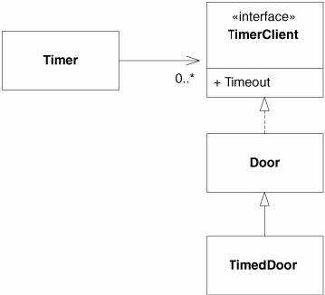

#### Implementación inicial

```csharp
public class Timer {
  public void Register(int timeout, TimerClient client) {
    /*code*/ 
  }
}

public interface TimerClient {
    void TimeOut();
}
```

- Si se cierra la puerta antes de que venza el timeout $t_0$ y se vuelve a abrir, se registra uno nuevo $t_1$ antes de que el antiguo haya expirado.
- Cuando el primer temporizador $t_0$ expira, se produce la llamada a `Timeout()` de `TimedDoor` y no debería.
- Así que cambiamos la implementación:

#### Implementación mejorada

```csharp
public class Timer {
  public void Register(int timeout, int timeOutId, TimerClient client) {
    /*code*/
  }
}
public interface TimerClient {
  void TimeOut(int timeOutID);
}
```

¿En qué ha afectado el __cambio en la implementación__ de `TimerClient`?

- El cambio afecta a los usuarios de `TimerClient`, pero también a `Door` y a los clientes de `Door` (y no debería)
- El problema es que `Door` depende de `TimerClient` y no todas las variedades de puerta son de seguridad (con temporizador)
- Si hacen falta más variedades de puerta, todas ellas deberán implementar implementaciones degeneradas de `Timeout`
- Las interfaces empiezan a engrosarse. Esto puede acabar violando también el LSP

#### Rediseño: puertas de seguridad

__Delegación__ a través del patrón adapter (de objetos o de clases)

- Versión adaptador de clases (por herencia):

   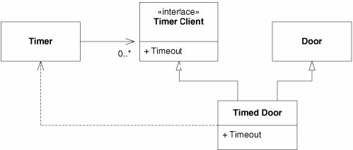

- Versión adaptador de objetos (por composición):

  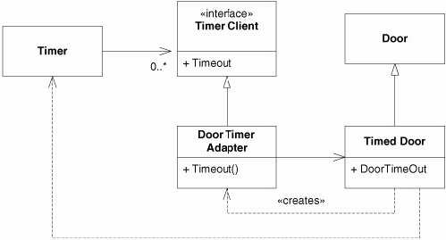  

## Aplicación de OCP y SRP con aspectos

### Ejemplo: [Shapes versión 1](#shapesV1)

```java
package shapes;

interface Shape {
  double area();
  void draw();
}

class Point {
  double getX() {...}
  double getY() {...}
}

abstract class Polygon implements Shape {
  Point getVertex(index i) {...}
  void draw() {...}
  String toString() {...}
}

class Triangle extends Polygon {
  double area() {...}
}

abstract class RectParallelogram extends Polygon {
  double area() {...}
}

class Square extends RectParallelogram {...}

class Rectangle extends RectParallelogram {...}

abstract class ClosedCurve implements Shape {...}

class Circle
    extends ClosedCurve {
  double getRadius() {...}
  Point getCenter() {...}
  double area() {...}
  void draw() {...}
  String toString() {...}
}

class Ellipse extends ClosedCurve {
  double getApogeeRadius() {...}
  double getPerigeeRadius() {...}
  Point getFocus1() {...}
  Point getFocus2() {...}
  Point getCenter() {...}
  double area() {...}
  void draw() {...}
  String toString() {...}
}
```

- Las funcionalidades para pintar (`draw`) y para imprimir (`toString`) pueden descohesionar las clases y atentar contra OCP y SRP.
- Saquémoslas fuera utilizando **aspectos**...

### <span style="color:blue;">Orientación a aspectos</span>

La __Orientación a aspectos__ (_AOD_/_AOP_) es un paradigma cuyo objetivo es incrementar la modularidad (ortogonalidad) de los componentes mediante la separación de aspectos _transversales_ (_cross-cutting concerns_).

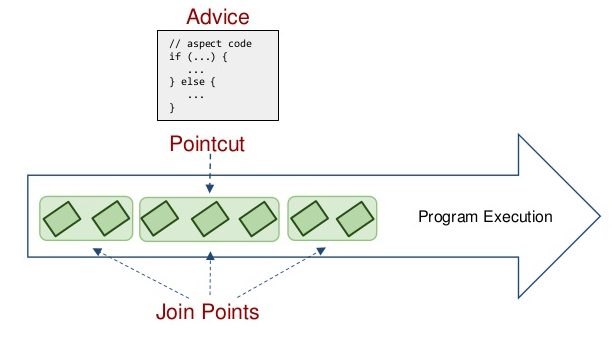

- __aspect__ = modularización de un aspecto de interés (_concern_) que afecta a varias clases o módulos
- __joinpoint__ = especificación declarativa de un punto en la ejecución de un programa (por ejemplo, la ejecución de un método, el manejo de una excepción, etc.)
- __advice__ = acción a tomar por la especificación de un aspecto dado en un determinado _joinpoint_
- __pointcut__ = predicado que define cuándo se aplica un _advice_ de un aspecto en un _jointpoint_ determinado. Se asocia un _advice_ con la expresión de un _pointcut_ y se ejecuta el _advice_ en todos los _joinpoint_ que cumplan la expresión del _pointcut_.

### Ejemplo: [Shapes versión 2](#shapesV2) con aspectos

```java
// Ficheros <X>ToString.aj (uno por aspecto)
package shapes.tostring; // para todos los toString()
aspect PolygonToString {
  String Polygon.toString() {
    StringBuffer buff = new StringBuffer();
    buff.append(getClass().getName());
     //... añadir nombre y área...
     //... añadir cada línea desde un vértice al siguiente
    return buff.toString();
  }
}
aspect CircleToString {
  String Circle.toString() {...}
}
aspect EllipseToString {
  String Ellipse.toString() {...}
}

// Drawable.java
package drawing;
interface Drawable {
  void draw();
}

// Ficheros Drawable<X>.aj
package shapes.drawing; // para todos los draw()...
import drawing.Drawable;
abstract aspect DrawableShape {
  declare parents: Shape implements Drawable;
  void Shape.draw () //template method
  {
    String drawCommand = makeDrawCommand();
    // enviar orden al motor gráfico...
  }
  String Shape.makeDrawCommand() {
    return getClass().getName() + "\n" + makeDetails("\t");
  }
  abstract String Shape.makeDetails (String indent);
}
aspect DrawablePolygon extends DrawableShape {
  String Polygon.makeDetails (String indent){...}
}
aspect DrawableCircle extends DrawableShape {
  String Circle.makeDetails (String indent){...}
}
aspect DrawableEllipse extends DrawableShape {
  String Ellipse. makeDetails (String indent){...} }
```

## <span style="color:blue;">Principio de sustitución de Liskov</span>

__LSP: *Liskov Substitution Principle*__

> Un subtipo debe poder ser sustituible por sus tipos base
> 
> <cite>Barbara Liskov, </cite>

Si una función $f$ depende de una clase base $B$ y hay una $D$ derivada de $B$, las instancias de $D$ no deben alterar el comportamiento definido por $B$ de modo que $f$ deje de funcionar

<!--
-   Posibilidad de sustitución depende del contexto: En otro programa
    P2, los objetos D pueden no ser sustituibles por objetos B
-->

### Ejemplo: Shapes versión 3

```csharp
struct Point {double x, y;}
public enum ShapeType {square, circle};

public class Shape {
  private ShapeType type;
  public Shape(ShapeType t){type = t;}
  public static void DrawShape(Shape s) {
    if(s.type == ShapeType.square)
      (s as Square).Draw();
    else if(s.type == ShapeType.circle)
      (s as Circle).Draw();
  }
}

public class Circle: Shape {
  private Point center;
  private double radius;

  public Circle(): base(ShapeType.circle) {}
  public void Draw() {/* draws the circle */}
}

public class Square: Shape {
  private Point topLeft;
  private double side;
  public Square(): base(ShapeType.square) {}
  public void Draw() {/* draws the square */}
}
```

- `DrawShape` viola claramente el OCP
- Además `Square` y `Circle` no son sustuibles por `Shape`: no redefinen ninguna función de `Shape`, sino que añaden `Draw()` (violación del LSP)
- Esta violación de LSP es la que provoca la violación de OCP en `DrawShape`

- Violación más sutil de LSP...

### Ejemplo: rectángulos versión 1

De momento solo necesitamos rectángulos y escribimos esta versión:

```csharp
public class Rectangle {
  private Point topLeft;
  private double width;
  private double height;

  public double Width {
    get { return width; }
    set { width = value; }
  }

  public double Height {
    get { return height; }
    set { height = value; }
  }
}
```

Un día hace falta manejar cuadrados además de rectángulos.

Geométricamente, un cuadrado es un rectángulo, así que hacemos uso de la herencia (relación **es-un**):

```java
public class Square: Rectangle {
   ...
}
```

#### Problema: cuadrados como rectángulos

- Un cuadrado podría ser un rectángulo, pero definitivamente un objeto `Square` **no es un** objeto `Rectangle`

- Un `Square` no tiene propiedades `height`y `width`. Pero supongamos que no nos importa el desperdicio de memoria.
- `Square` heredará los métodos accesores de `Rectangle`.
- Así que hacemos lo siguiente...

### Ejemplo: rectángulos versión 2

```csharp
public class Square: Rectangle {
  public new double Width
  {
    set {
      base.Width = value;
      base.Height = value;
    }
  }
  public new double Height
  {
    set {
      base.Height = value;
      base.Width = value;
    }
  }
}
```

- El comportamiento de un objeto `Square` no es consistente con el de un objeto `Rectangle`:

  ```csharp
  Square s = new Square();
  s.SetWidth(1);   // fija ambos
  s.SetHeight(2);  // fija ambos

  void f(Rectangle r)
  {
    r.SetWidth(32); // calls Rectangle.SetWidth
  }
  ```

- ¿Qué sucede si pasamos un `Square` a la función `f`?

  ¡No cambia `Height`!

- Podría argumentarse que el error era que los métodos `Width`y `Height` no se declararon `virtual` en `Rectangle`.

#### Extensión y ocultación de métodos

- La [diferencia entre `new` y `override` en un método en C#](https://docs.microsoft.com/en-us/dotnet/csharp/programming-guide/classes-and-structs/knowing-when-to-use-override-and-new-keywords) es que `new` oculta la implementación de la clase base y `override` la extiende.

Sin embargo, cuando la creación de una clase derivada provoca cambios en la clase base, es síntoma de un __mal diseño__.

El LSP pone en evidencia que la relación **es-un** tiene que ver con el comportamiento público extrínseco, del que los clientes dependen.

### Ejemplo: rectángulos versión 3

```csharp
public class Rectangle
{
  private Point topLeft;
  private double width;
  private double height;
  public virtual double Width
  {
    get { return width; }
    set { width = value; }
  }
  public virtual double Height
  {
    get { return height; }
    set { height = value; }
  }
}

public class Square: Rectangle
{
  public override double Width
  {
    set {
      base.Width = value;
      base.Height = value;
    }
  }
  public override double Height
  {
    set {
      base.Height = value;
      base.Width = value;
    }
  }
}
```

Ahora parece que funcionan `Square` y `Rectangle`, que matemáticamente quedan bien definidos.

Pero consideremos esto:

```csharp
void g(Rectangle r)
{
  r.Width = 5;    // cree que es un Rectangle
  r.Height = 4;   // cree que es un Rectangle
  if(r.Area() != 20)
    throw new Exception("Bad area!");
}
```

¿Qué pasa si llamamos a `g(new Square(3))`?

El autor de `g` asumió que cambiar el ancho de un rectángulo deja intacto el alto. Si pasamos un cuadrado esto no es así 

__Violación de LSP__: Si pasamos una instancia de una clase derivada (`Square`), se altera el comportamiento definido por la clase base (`Rectangle`) de forma que `g` deja de funcionar.

¿Quién tiene la culpa?

- ¿El autor de `g` por asumir que "en un rectángulo su ancho y alto son independientes" (_invariante_)?
- ¿El autor de `Square` por violar el invariante?
- ¿De qué clase se ha violado el invariante? ¡De `Rectangle` y no de `Square`!

Para evaluar si un diseño es apropiado, no se debe tener en cuenta la solución por sí sola, sino en términos de los _supuestos razonables_ que hagan los usuarios del diseño.

### Ejercicios de LSP

- Robert C. Martin & Micah Martin: [Agile Principles, Patterns and Practices in C#](#unclebob), Prentice Hall, 2006

### <span style="color:blue;">Diseño por Contrato</span>

Relación entre LSP y el **_Design-By-Contract_** (DBC) de *Bertrand
Meyer*:

> A routine redeclaration [in a derivative] may only replace the original precondition by one equal or weaker, and the original post-condition by one equal or stronger
> 
> –– <cite>B. Meyer</cite>

- Métodos de clase declaran *precondiciones* y *postcondiciones* al redefinir una operación en una subclase derivada
  - las **precondiciones** sólo pueden sustituirse por otras más débiles/laxas
  - las **postcondiciones** sólo pueden sustituirse por otras más fuertes/estrictas

#### Ejemplo: rectángulos

- Postcondición del _setter_ de `Rectangle.Width`
  (En C++ sería `Rectangle::SetWidth(double w)`):
    `assert((Width == w) && (Height == old.Height));`

- Postcondición del setter de `Square.Witdh` 
  En C++ sería `Square::SetWidth(double w)`):
    `assert(Width==w);`

- La postcondición de `Square::SetWidth(double w)` viola el  contrato de la clase base porque es más débil que la de `Rectangle`

## <span style="color:blue;">Principio de Inversión de Dependencias</span>

__DIP: *Dependency Inversion Principle*__

- Los módulos de alto nivel no deben depender de módulos de bajo nivel.
Ambos deben depender de abstracciones.

- Las abstracciones no deben depender de los detalles, sino los detalles de las abstracciones

> Depend on abstractions
> 
> <cite>Robert C. Martin</cite>

###Ejemplo: estructura en capas 

__Diseño inicial__:

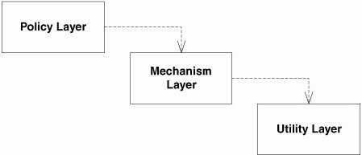

- Las dependencias son transitivas
- _Policy_ depende de todo lo que depende _Mechanism_. 

__Diseño invertido__:

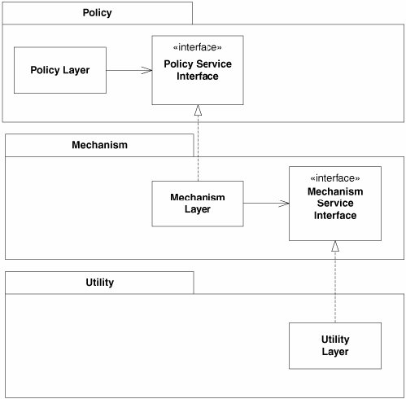

-   Cada nivel declara una interfaz para lo que necesita de otros niveles inferiores
-   Los niveles inferiores dependen de interfaces definidas en los superiores
-   El cliente puede definir la abstracción que necesita (ISP)
-   Cada nivel es intercambiable por un sustituto

### <span style="color:blue;">Heurística _ingenua_</span>:

- Ninguna variable debería guardar una referencia a una clase concreta
- Ninguna clase debería ser derivada de una clase concreta
- Ningún método debería redefinir un método ya implementado de ninguna de sus clases base

Hay que violar alguna vez estas heurísticas, pues alguien tiene que crear las instancias de las clases concretas. El módulo que lo haga presentará una dependencia de dichas clases concretas.

Gracias a la introspección o la carga dinámica de clases, los lenguajes de programación pueden indicar el nombre de la clase a instanciar (por ejemplo, en un fichero de configuración).

Hay clases concretas que no cambian, como `string`, así que no hace ningún daño depender de ellas.

# Para profundizar sobre patrones

- Martin Fowler – [Patterns in Enterprise Software](https://martinfowler.com/articles/enterprisePatterns.html): Catálogos de patrones a distintos niveles
    - Martin Fowler – [Patterns of Enterprise Application Architecture (EAA)](https://martinfowler.com/eaaCatalog/)
    - Hohpe y Woolf – [Enterprise Integration Patterns (EIP)](http://www.enterpriseintegrationpatterns.com/)
    - Buschmann y otros – [Pattern-Oriented Software Architecture (POSA)](http://www.amazon.com/exec/obidos/ASIN/0471958697) Volume 1: A system of patterns
- Peter Norvig – [Design Patterns in Dynamic Programming](http://www.norvig.com/design-patterns/design-patterns.pdf): Implementaciones más simples para los patrones de diseño del GoF en lenguajes dinámicos
- David Arno – [Are design patterns compatible with modern software techniques?](http://www.davidarno.org/2013/06/17/are-design-patterns-compatible-with-modern-software-techniques/)
- Implementaciones de los patrones de diseño del GoF en diversos lenguajes de programación:
    - Kamran Ahmed – [Design Patterns for Humans!](https://github.com/kamranahmedse/design-patterns-for-humans/blob/master/README.md): Explicación de los patrones de diseño del GoF implementados en PHP
    - Márk Török – [Design Patterns in TypeScript](https://github.com/torokmark/design_patterns_in_typescript)
    - Bogdab Vliv - [Design Patterns in Ruby](https://bogdanvlviv.com/posts/ruby/patterns/design-patterns-in-ruby.html)
- Lewis y Fowler – [Microservicios](https://martinfowler.com/articles/microservices.html)
